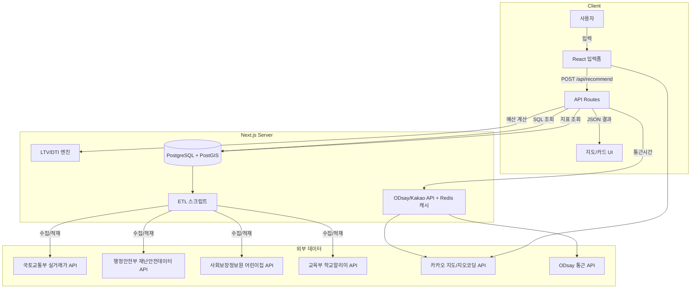

# PHASE 1: DESIGN

> 정본(SoT): DB 스키마(S2)와 스코어링 로직(S4)은 이 문서가 유일한 수정 지점입니다.
> 다른 Phase 문서에서는 "PHASE1 S2/S4 참조"로 링크만 합니다.

### 목표

PHASE0에서 확정된 FR/NFR/KPI를 기술 설계로 구체화한다.

### 범위

시스템 아키텍처(S1), DB 스키마(S2 SoT), 데이터 파이프라인(S3), 스코어링 엔진(S4 SoT), API 설계(S5), UI/UX(S6), 디자인 토큰(S7), 포트폴리오 전략(S8)

### 산출물

S1~S8 각 섹션의 설계 명세. db/schema.sql은 S2에서 파생.

### 게이트 기준

PHASE1 Prompt Pack Verification `verdict == "go"` 또는 `verdict == "pending" AND blockers.length == 0` 시 PHASE2(Build) 진입 가능. (PROMPT_PACK_INDEX 확장 규칙과 동일)

## 1. System Architecture



**기술 스택**:

- Frontend: Next.js + React + TypeScript (strict 모드) + Tailwind CSS + shadcn/ui
- Backend: Next.js API Routes
- DB: PostgreSQL + PostGIS
- Cache: Redis
- Map: Kakao Maps JS SDK
- Deploy: Vercel + Supabase/AWS RDS

### 보안 설계 (NFR-3)

| 영역        | 설계                               | 구현 기준                                                                  |
| ----------- | ---------------------------------- | -------------------------------------------------------------------------- |
| 전송 암호화 | HTTPS/TLS 1.2+ 강제                | CDN/호스팅 레벨 HTTPS + HSTS 헤더                                          |
| 저장 암호화 | DB 저장 데이터 AES-256 이상 암호화 | 관리형 DB의 encryption at rest 활성화                                      |
| 접근 제어   | 최소 권한 원칙                     | DB 서비스 계정 분리 (read-only ETL / read-write API), API 키 환경변수 관리 |
| API 보안    | 레이트 리미팅 + 입력 검증          | Next.js middleware + S5 입력 검증 규칙 연계                                |
| 환경변수    | 시크릿 관리                        | `.env.local` (로컬) + 호스팅 플랫폼 시크릿 관리 (배포)                     |
| CORS        | 허용 오리진 제한                   | Next.js CORS 설정 (자사 도메인만 허용)                                     |

### 모니터링/APM 정책 (NFR-1 연계)

- APM: PII 미수집 정책. 성능 메트릭만 수집
- 에러 트래킹: 사용자 입력값(cash/income/loans/job1/job2) 미포함
  - 스택 트레이스/에러 메타데이터에 PII가 포함될 수 있는 경우 마스킹 처리 필수
  - 에러 컨텍스트에 요청 파라미터 자동 첨부 비활성화
- 로그: 민감 정보 로그 미기록 (-> S5 입력 검증 규칙 참조)
- 전체 파이프라인(DB/로그/APM) PII 비저장 원칙: PHASE0 NFR-1 참조

## 2. DB Schema (유일한 스키마 정본)

> 다른 문서에서 DB 스키마를 참조할 때는 "PHASE1 S2 참조"로만 기재합니다.
> `db/schema.sql`은 이 정의에서 파생됩니다.

```sql
-- 1. 아파트 단지 기본정보
CREATE TABLE apartments (
  id SERIAL PRIMARY KEY,
  apt_code VARCHAR(20) NOT NULL UNIQUE,
  apt_name TEXT NOT NULL,
  address TEXT NOT NULL,
  location GEOMETRY(Point, 4326) NOT NULL,
  built_year INTEGER,
  household_count INTEGER,
  area_min FLOAT,
  area_max FLOAT,
  created_at TIMESTAMPTZ DEFAULT NOW(),
  updated_at TIMESTAMPTZ DEFAULT NOW()
);

-- 2. 실거래가(매매/전세) 요약
CREATE TABLE apartment_prices (
  id SERIAL PRIMARY KEY,
  apt_id INTEGER REFERENCES apartments(id),
  trade_type VARCHAR(10) CHECK (trade_type IN ('sale','jeonse')),
  year INTEGER,
  month INTEGER,
  average_price NUMERIC,
  deal_count INTEGER,
  created_at TIMESTAMPTZ DEFAULT NOW()
);

-- 3. 보육시설 (어린이집) 정보
CREATE TABLE childcare_centers (
  id SERIAL PRIMARY KEY,
  name TEXT NOT NULL,
  address TEXT,
  location GEOMETRY(Point, 4326) NOT NULL,
  capacity INTEGER,
  current_enrollment INTEGER,
  evaluation_grade VARCHAR(10),
  created_at TIMESTAMPTZ DEFAULT NOW()
);

-- 4. 학교 정보 (학군)
CREATE TABLE schools (
  id SERIAL PRIMARY KEY,
  name TEXT NOT NULL,
  school_level VARCHAR(10) CHECK (school_level IN ('elem','middle','high')),
  location GEOMETRY(Point, 4326) NOT NULL,
  achievement_score NUMERIC,
  assignment_area GEOMETRY(Polygon, 4326),
  created_at TIMESTAMPTZ DEFAULT NOW()
);

-- 5. 안전 인프라 (치안) 지표
CREATE TABLE safety_stats (
  id SERIAL PRIMARY KEY,
  region_code VARCHAR(10) NOT NULL,
  region_name TEXT,
  crime_rate NUMERIC,
  cctv_density NUMERIC,
  police_station_distance NUMERIC,
  streetlight_density NUMERIC,
  shelter_count INTEGER,
  calculated_score NUMERIC,
  data_date DATE,
  created_at TIMESTAMPTZ DEFAULT NOW()
);

-- 6. 사전 계산 통근 그리드
CREATE TABLE commute_grid (
  id SERIAL PRIMARY KEY,
  grid_id VARCHAR(20) NOT NULL,
  location GEOMETRY(Point, 4326) NOT NULL,
  to_gbd_time INTEGER,  -- 강남 업무지구
  to_ybd_time INTEGER,  -- 여의도 업무지구
  to_cbd_time INTEGER,  -- 종로 업무지구
  to_pangyo_time INTEGER, -- 판교
  calculated_at TIMESTAMPTZ DEFAULT NOW()
);

-- 인덱스
CREATE INDEX idx_apartments_location ON apartments USING GIST(location);
CREATE INDEX idx_childcare_location ON childcare_centers USING GIST(location);
CREATE INDEX idx_schools_location ON schools USING GIST(location);
CREATE INDEX idx_commute_grid_location ON commute_grid USING GIST(location);
CREATE INDEX idx_apartment_prices_apt_id ON apartment_prices(apt_id);
CREATE INDEX idx_safety_stats_region ON safety_stats(region_code);
```

### 데이터 관계 요약

- `apartments` 1:N `apartment_prices` (단지별 다건 거래 이력)
- `schools.assignment_area` ↔ `apartments.location` (공간 교차: 학군 매핑)
- `childcare_centers.location` ↔ `apartments.location` (반경 800m: `ST_DWithin`)
- `safety_stats.region_code` ↔ `apartments.address` (행정구역 코드 매핑)
- `commute_grid.location` ↔ `apartments.location` (최근접 그리드 포인트)

## 3. Data Pipeline

### ETL 흐름

1. **수집**: Python 스크립트로 공공 API 호출 → CSV/JSON 저장
2. **전처리**: Pandas로 정규화, 지오코딩 (Kakao Geocoding API), 이상치 필터링
3. **적재**: PostGIS에 UPSERT
4. **갱신 주기**: 월 1회 (cron 또는 수동)

### API 키 목록

| 제공자            | 데이터                         | 용도                 | 호출 제한           |
| ----------------- | ------------------------------ | -------------------- | ------------------- |
| 국토교통부        | 실거래가 (매매/전세)           | 가격 데이터          | 일 2,000건          |
| 사회보장정보원    | 어린이집/유치원                | 보육 지표            | 공공데이터포털 기준 |
| 교육부 학교알리미 | 학교 기본정보/성취도           | 학군 지표            | 공공데이터포털 기준 |
| 행정안전부        | 재난안전데이터 (CCTV/대피시설) | 안전 지표            | 공공데이터포털 기준 |
| Kakao             | 지도/지오코딩/주소검색         | 좌표 변환, 지도 표시 | 일 300,000건        |
| ODsay             | 대중교통 경로                  | 통근시간 계산        | 일 1,000건 (무료)   |

### 데이터 소스 거버넌스

- **허용**: 공공데이터 API, 제휴 API, 공식 오픈 API
- **금지**: 웹 크롤링, 무단 수집, 스크래핑 (→ PHASE0 S4 법무 체크리스트 #4 참조)
- **출처 표기**: 모든 공공데이터 사용 시 출처 + 기준일 필수 표기

## 4. Scoring Engine (유일한 스코어링 정본)

> 스코어링 로직 수정 시 이 섹션만 수정합니다.
> 다른 문서에서는 "PHASE1 S4 참조"로만 기재합니다.

### 정규화 함수

```
normalize(value, min, max) = (value - min) / (max - min)    // 0~1 범위
```

### 지표별 정규화 로직

| 지표      | 정규화 방식                                               | 범위                |
| --------- | --------------------------------------------------------- | ------------------- |
| budget    | `max(0, (max_budget - monthly_cost) / max_budget)`        | 0~1 (높을수록 여유) |
| commute   | `max(0, (60 - max(commute1, commute2)) / 60)`             | 0~1 (짧을수록 높음) |
| childcare | `min(childcare_count_800m, 10) / 10`                      | 0~1 (많을수록 높음) |
| safety    | `0.5 * crime_norm + 0.3 * cctv_norm + 0.2 * shelter_norm` | 0~1 (복합)          |
| school    | `achievement_score / 100`                                 | 0~1 (높을수록 높음) |

### Safety 세부 정규화

```
crime_norm    = (10 - crime_level) / 9          // crime_level: 1(안전)~10
cctv_norm     = clamp(cctv_density / 5, 0, 1)   // 5대/km² 기준
shelter_norm  = min(shelter_count, 10) / 10      // 최대 10개소
```

### 가중치 프로필

| 프로필    | budget | commute | childcare | safety | school |
| --------- | ------ | ------- | --------- | ------ | ------ |
| 균형형    | 0.30   | 0.25    | 0.15      | 0.15   | 0.15   |
| 예산 중심 | 0.40   | 0.20    | 0.15      | 0.15   | 0.10   |
| 통근 중심 | 0.20   | 0.40    | 0.15      | 0.15   | 0.10   |

### 최종 점수 산출

```
final_score = round(100 * (
    W_budget * budget_norm +
    W_commute * commute_norm +
    W_childcare * childcare_norm +
    W_safety * safety_norm +
    W_school * school_norm
), 1)
```

결과: 0~100점 스케일. 상위 10개 단지를 추천 결과로 반환.

## 5. API Design

### 엔드포인트 명세

| Method | Path                  | 설명           | 인증 |
| ------ | --------------------- | -------------- | ---- |
| POST   | `/api/recommend`      | 추천 결과 반환 | 없음 |
| GET    | `/api/apartments/:id` | 단지 상세 정보 | 없음 |
| GET    | `/api/health`         | 서버 상태 확인 | 없음 |

### POST /api/recommend

**Request Body**:

```json
{
  "cash": 30000,
  "income": 8000,
  "loans": 5000,
  "monthlyBudget": 150,
  "job1": "서울 강남구 역삼동",
  "job2": "서울 영등포구 여의도동",
  "tradeType": "jeonse",
  "weightProfile": "balanced"
}
```

**Response**:

```json
{
  "recommendations": [
    {
      "rank": 1,
      "aptId": 123,
      "aptName": "래미안 OO",
      "address": "경기도 성남시 ...",
      "monthlyCost": 120,
      "commuteTime1": 35,
      "commuteTime2": 45,
      "childcareCount": 7,
      "schoolScore": 82,
      "safetyScore": 0.78,
      "finalScore": 76.3,
      "reason": "예산 여유 + 통근 45분 이내 + 보육시설 7곳",
      "whyNot": "학군 점수가 평균 이하",
      "sources": { "priceDate": "2026-01", "safetyDate": "2025-12" },
      "outlink": "https://..."
    }
  ],
  "meta": {
    "totalCandidates": 342,
    "computedAt": "2026-02-14T12:00:00Z"
  }
}
```

### 입력값 검증 규칙

- 숫자값 음수 금지, 합리적 범위 체크
- 주소 문자열 길이 제한 (최대 200자)
- 민감 정보 로그 미기록 (→ PHASE0 NFR-1 참조)

## 6. UI/UX Design

### 3단 퍼널

```
[1단계: 입력]  →  [2단계: 결과]  →  [3단계: 상세/문의]
 최소 입력         Top10 리포트       단지 상세 + 아웃링크
 (정밀은 선택)     지도 + 카드         외부 매물 이동 고지
```

### 페이지 구성

| 페이지       | 주요 컴포넌트                            | 비고           |
| ------------ | ---------------------------------------- | -------------- |
| 랜딩         | 서비스 소개, CTA, 면책/포지셔닝 고지     | 하단 고정      |
| 입력 폼      | StepForm (3단계), 동의 체크박스          | 최소/정밀 분리 |
| 결과 페이지  | KakaoMap, ResultCardList, ScoreBreakdown | Top10          |
| 단지 상세    | DetailCard, SourceInfo, OutlinkCTA       | 외부 이동 고지 |
| 컨시어지     | ConciergeReport, ContactCTA              | 문의 흐름      |
| 컴플라이언스 | 이용약관, 개인정보처리방침, 출처 표기    | footer 링크    |

### 컴포넌트 목록

- `StepForm` — 단계별 입력 폼 (최소/정밀)
- `BudgetInput` — 보유현금/연소득/대출/월상한
- `JobInput` — 직장 주소 입력 (Kakao 주소 검색)
- `WeightSelector` — 가중치 프로필 선택
- `KakaoMap` — 지도 + 단지 마커
- `ResultCard` — 단지 카드 (점수/사유/Why-Not)
- `ScoreBreakdown` — 점수 분해 시각화
- `SourceBadge` — 출처/기준일 표시
- `ConsentForm` — 필수/선택 동의 분리
- `DisclaimerBanner` — 면책/포지셔닝 고지
- `OutlinkButton` — 외부 매물 이동 (이동 고지 포함)

## 7. Design Tokens (요약)

> **상세 명세**: `docs/design-system/DESIGN_SYSTEM.md` 참조
> **구현 파일**: `docs/design-system/design-tokens.css` (런타임 변수 + Tailwind v4 `@theme`)

### 핵심 토큰 (리서치 기반 확정)

```
colors:
  primary:    '#0891B2'  (Warm Teal Blue 500 — 신뢰+따뜻함)
  accent:     '#F97316'  (Coral Orange — CTA·하이라이트)
  accent-dark:'#C2410C'  (텍스트용 AA 준수)
  background: '#FAFAF9'  (Stone 50 — 웜 뉴트럴)
  surface:    '#FFFFFF'
  text:       '#1C1917'  (웜 다크)
  muted:      '#78716C'  (Stone 500)
  success:    '#059669'  (Emerald 600)
  warning:    '#D97706'  (Amber 600)
  error:      '#DC2626'  (Red 600)

spacing:
  base-unit:     '4px'
  card-padding:  '16px'   (p-4)
  section-gap:   '48px'
  container-max: '1280px'

typography:
  font-family: '"Pretendard Variable", "Noto Sans KR", system-ui, sans-serif'
  heading:     '24px / 700 weight / lh 1.25'
  title:       '20px / 600 weight / lh 1.3'
  body:        '16px / 400 weight / lh 1.6'

breakpoints:
  design-base: '390px'   (360–430px 가변 대응)
  split-view:  '1024px'  (바텀시트 → 사이드 패널)
  desktop:     '>= 1280px'

border-radius:
  card:   '16px'  (rounded-2xl)
  button: '12px'  (rounded-xl)
  bar:    '9999px' (pill)
```

### 변경 이력

| 항목         | 변경 전               | 변경 후                    | 근거                                  |
| ------------ | --------------------- | -------------------------- | ------------------------------------- |
| Primary      | `#1E40AF` (Blue 800)  | `#0891B2` (Warm Teal Blue) | 디자인 리서치 step3/design_brief 확정 |
| Secondary    | `#059669` (Emerald)   | `#F97316` (Coral Orange)   | 리서치 결과 — accent로 역할 변경      |
| Background   | `#F8FAFC` (Slate 50)  | `#FAFAF9` (Stone 50)       | 웜 뉴트럴 톤 채택                     |
| Text         | `#1E293B` (Slate 800) | `#1C1917` (웜 다크)        | 순흑 대체, 따뜻한 톤                  |
| card-padding | 24px                  | 16px (p-4)                 | 리서치 결과 우선 (step3/design_brief) |

## 8. Portfolio Strategy

### 강조 포인트

1. **시장 공백 해결** — 예산 역산 + 2직장 통근 + 보육/치안 통합 랭킹 (기존 플랫폼 미제공)
2. **데이터 엔지니어링** — 5개 공공 API ETL + PostGIS 공간 연산 + Redis 캐시
3. **스코어링 설계** — 설명 가능한 가중치 기반 점수 체계 + Why-Not 표시
4. **컴플라이언스 준수** — 법무 체크리스트 10항목, 중개 회피 설계, 개인정보 비저장
5. **1인 개발 풀스택** — Next.js + TypeScript + PostgreSQL + Vercel 배포

---

**입력 소스** (병합 완료):

- `legacy_docs/merged/detailed_plan.md`
- `legacy_docs/merged/implementation_plan.md`
- `legacy_docs/merged/portfolio_direction_plan.md`
