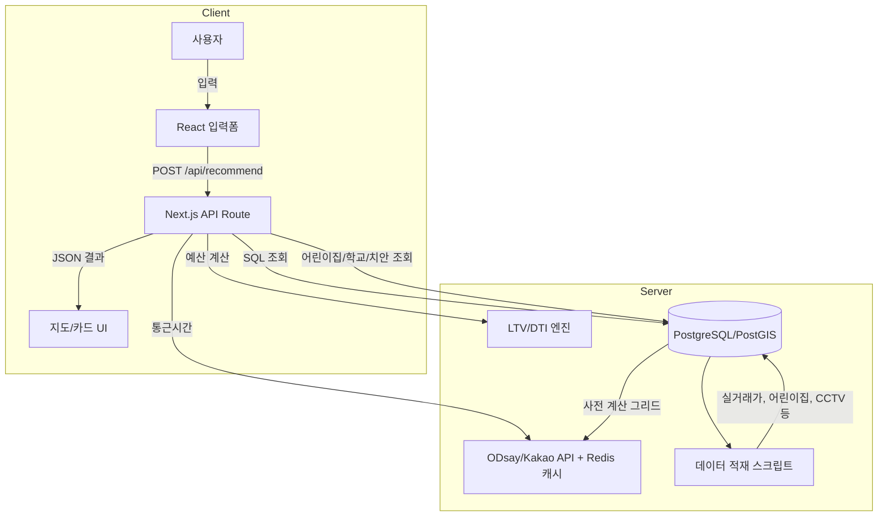

# 신혼부부 주거 추천 서비스 – 청사진 구체화

이 문서는 앞서 작성한 청사진과 구현 계획을 바탕으로 1인 개발자가 서비스를 구체적으로 설계하고 실행할 수 있도록 돕기 위해 작성되었습니다. 2025~2026년에 업데이트된 데이터셋과 법제도 변화를 고려하여 기존 계획을 보완하며, 각 기능의 단계별 구현 세부사항과 참고 자료를 제시합니다.

## 1. 개선된 데이터 수집 전략

### 1.1 안전 인프라 데이터 최신화

* **CCTV 통합관제센터 데이터 활용** – 행정안전부 재난안전데이터 공유플랫폼은 2025년 12월 31일 기준 전국 지방정부 통합관제센터의 CCTV 수량 정보를 시·군·구별로 제공하며, 2026년 2월 5일에 갱신된 오픈 API를 통해 데이터를 내려받을 수 있습니다【784864165518395†L74-L91】. 신청 후 API 키를 발급받아 `safety_stats` 테이블의 `cctv_density` 지표 산출에 활용합니다. 지역별 CCTV 설치 대수는 인구 및 면적과 결합해 밀도 지표로 변환하세요.

* **생활편의 통합 데이터** – 2025년부터 행정안전부가 지방행정 인허가 정보와 생활편의 데이터를 통합해 공공데이터 포털에서 제공하고 있습니다. 14종의 생활편의 데이터에는 민방위 대피시설, 공중화장실, CCTV, 무인민원발급기 등이 포함되어 있어 향후 추가 지표로 확장할 수 있습니다. 현재 포털 접속에 제약이 있지만, 사업이 안정화되면 이 데이터를 도입해 안전·편의 인프라 지표를 풍부하게 만들 수 있습니다.

### 1.2 보육·학군 데이터 갱신

* **어린이집/유치원 현황** – 사회보장정보원과 교육부는 2025년에 어린이집·유치원 기본 정보 API를 통합하여 개편했습니다. 기존 API의 엔드포인트가 변경될 수 있으므로 공공데이터포털의 최신 문서를 확인하고 스크립트를 업데이트하세요. 수집 시 현재 정원과 교직원 수, 평가등급 등 추가 속성을 내려받을 수 있다면 `childcare_centers` 테이블에 컬럼을 확장합니다.

* **학교 학업 성취도** – 학교알리미의 2025 학업 성취도 지표(예: 학업성취도평가 등급)가 공표되면 `schools` 테이블의 `achievement_score` 필드를 업데이트합니다. 이전 계획에서 제시한 정규화 로직을 유지하되, 지표 구조가 변경되었는지 확인하고 미리 매핑 규칙을 정해야 합니다.

### 1.3 실거래가 및 주택 공급 정책 정보

* **실거래가 API 상한 확대** – 국토교통부는 2025년 하반기부터 실거래가 오픈API의 호출 제한을 일 1,000건에서 2,000건으로 확대했습니다. 데이터 수집 주기를 단축해 월별이 아닌 분기별 수준으로 업데이트할 수 있습니다. 단, 포트폴리오에서는 호출 제한을 넘지 않도록 일정과 캐싱을 관리해야 합니다.

* **주거 지원 정책 소개** – 2026년부터 청년·신혼부부 대상 주거지원 정책(예: 신생아 특례 대출, 청년 월세 상시 지원 등)이 확대됩니다. 서비스에 법령 정보와 정책 링크를 소개하는 정적 페이지를 추가해 사용자에게 추가적인 가치를 제공할 수 있습니다. 이는 실제 중개행위와 무관하며, 정보 제공 플랫폼의 성격을 강화합니다.

## 2. 시스템 아키텍처 구체화

### 2.1 전체 흐름 요약

1. **사용자 입력** – 사용자는 자산/대출 정보, 월 주거비 상한, 두 직장 주소, 가중치 프로필을 입력합니다. 서버는 이 데이터를 메모리 상에서만 처리한 후 폐기합니다.
2. **예산 계산** – 입력 값을 기반으로 가용 예산과 월 고정비를 계산합니다. LTV/DTI 모델은 단순화된 공식을 사용하며, 최신 주택담보대출 규제(2026년 신생아 특례대출, 청년드림대출 등)에 대한 안내를 함께 보여줍니다.
3. **후보 단지 필터링** – 아파트 테이블에서 예산 범위와 최소 면적, 준공년도 등 기본 조건을 만족하는 단지를 SQL로 추출합니다. 이 단계에서 반경 30km 이내 등 통근 범위를 1차 필터로 적용합니다.
4. **지표 계산** – 각 단지에 대해 통근시간(사전 계산+ODsay API), 어린이집/학교/안전 인프라 지표, 최근 실거래 가격을 조합해 `compute_scores()` 함수를 호출합니다. CCTV 데이터 업데이트에 맞춰 `safety_norm` 계산식에 `cctv_density`를 반영합니다.
5. **결과 생성 및 전달** – 종합점수 순으로 상위 10개 단지와 추천 사유를 JSON 응답으로 반환합니다. 프런트엔드는 지도에 마커를 표시하고 카드 리스트를 렌더링합니다.

### 2.2 아키텍처 다이어그램

아래 Mermaid 다이어그램은 서비스의 주요 구성 요소를 시각적으로 나타낸 것입니다. [Mermaid.js](https://mermaid.js.org/)를 지원하는 문서 뷰어에서 볼 수 있습니다.



### 2.3 데이터 파이프라인 상세

1. **수집 스크립트 업데이트** – Python 스크립트를 개선하여 API 키 만료, 호출 제한, JSON 구조 변경에 대비한 예외 처리를 추가합니다. `requests` 호출 시 타임아웃을 설정하고, 호출 실패 시 재시도 로직을 구현합니다.
2. **정규화 및 조인** – 수집된 데이터는 Pandas에서 정규화 후 PostGIS로 적재합니다. CCTV, 대피시설 등 추가 지표는 면적·인구 기준으로 정규화해야 합니다.
3. **주기적 갱신** – Airflow나 간단한 cron 작업으로 월 1회 데이터 갱신 스크립트를 실행합니다. 포트폴리오용 데모에서는 수동 실행도 충분하지만, 지속적인 업데이트를 염두에 둔 구조를 설계하세요.

## 3. 기능 세분화 및 할 일 목록

| 기능 | 작업 항목 | 세부 설명 |
| --- | --- | --- |
| **데이터 수집/ETL** | API 키 발급 및 문서 확인 | 2025~2026년에 변경된 엔드포인트 및 호출 제한을 확인 후 환경 변수에 저장 |
|  | 수집 스크립트 개발 | 매매/전세 거래, 어린이집·학교, CCTV·치안 데이터를 API로 수집하고 CSV로 저장 |
|  | 지오코딩 및 전처리 | 주소를 Kakao Geocoder로 좌표 변환, 이상치 필터링 및 결측치 처리 |
|  | PostGIS 적재 | 정규화된 데이터를 `apartments`, `childcare_centers`, `safety_stats` 등 테이블에 삽입 |
| **백엔드 로직** | 예산 계산 모듈 | LTV/DTI 공식 구현, 2026년 주거정책에 따른 정보성 메시지 출력 |
|  | 통근시간 모듈 | 사전 계산 그리드 + ODsay API + Redis 캐시 조합; API 오류 시 직선거리 근사 |
|  | 종합 점수 함수 | CCTV 밀도, 대피시설, 공중화장실 등의 추가 지표 반영; 가중치 파라미터화 |
|  | API 엔드포인트 개발 | `/api/recommend` 요청 처리 및 입력 검증, `/api/apartments/:id` 등 추가 엔드포인트 |
| **프런트엔드** | 입력 폼 컴포넌트 | 단계별 폼 구현 및 유효성 검증; Tailwind로 스타일 적용 |
|  | 결과 페이지 | 카카오 맵 마커, 카드 UI, 가중치 수정 UI, 정책 정보 링크 |
|  | 컴플라이언스 UI | 이용약관/개인정보처리방침 페이지 작성, 동의 체크 박스 구현 |
| **배포 및 테스트** | 로컬 테스트 | Jest/React Testing Library로 단위 테스트; Postman으로 API 검증 |
|  | 배포 자동화 | GitHub Actions를 이용해 push 시 Vercel 배포, DB 스키마 마이그레이션 |
|  | 포트폴리오 문서화 | README 작성, 서비스 소개, 기술 스택, 사용법, 컴플라이언스 설명 |

## 4. 스코어링 로직 세부 개선

아래 예시는 안전 지표를 강화하여 CCTV 밀도와 대피시설 수를 함께 고려한 Python 함수입니다.

```python
def compute_safety_score(crime_level, cctv_density, shelter_count):
    # 범죄 등급(1=안전)을 역수로 정규화
    crime_score = (10 - crime_level) / 9
    # CCTV 밀도는 0~1 사이로 클리핑
    cctv_score = min(max(cctv_density / 5, 0), 1)  # 예: 5대/km²를 기준으로 정규화
    # 대피시설 수는 0~10 범위로 제한
    shelter_score = min(shelter_count, 10) / 10
    # 안전 지표의 가중치 조합 (임의 비율; 사용자 조정 가능)
    return 0.5 * crime_score + 0.3 * cctv_score + 0.2 * shelter_score

def compute_final_score(candidate, weights):
    budget_norm = max(0, (candidate['max_budget'] - candidate['monthly_cost']) / candidate['max_budget'])
    commute_norm = max(0, (60 - max(candidate['commute1'], candidate['commute2'])) / 60)
    childcare_norm = min(candidate['childcare_count'], 10) / 10
    safety_norm = compute_safety_score(candidate['crime_level'], candidate['cctv_density'], candidate['shelter_count'])
    school_norm = candidate['school_score'] / 100
    return round(100 * (
        weights['budget'] * budget_norm +
        weights['commute'] * commute_norm +
        weights['childcare'] * childcare_norm +
        weights['safety'] * safety_norm +
        weights['school'] * school_norm
    ), 1)

# 기본 가중치 설정 예
default_weights = {
    'budget': 0.30,
    'commute': 0.25,
    'childcare': 0.15,
    'safety': 0.15,
    'school': 0.15,
}

# 예제 사용
score = compute_final_score(candidate_data, default_weights)
```

> **참고:** CCTV와 대피시설 등 새로운 변수의 분포를 분석하여 정규화 기준(분모)을 조정해야 합니다. 데이터가 편중되어 있으면 로그 스케일 등을 고려할 수 있습니다.

## 5. 법·규제 준수 및 윤리적 고려사항

1. **온라인 플랫폼 중개거래 공정화법** – 2026년 시행 예정인 온라인 플랫폼 공정화법은 일정 규모 이상의 중개플랫폼에 계약서 작성·교부 의무 등을 부과합니다. 본 서비스는 중개행위 없이 정보를 제공하므로 법 적용 대상이 아니지만, 가이드라인을 참고해 *중개사 연결이나 거래 기능을 추가하지 않도록 주의*해야 합니다.
2. **개인정보보호법 개정** – 2025년 개정안에서는 소셜미디어가 신분증 이미지 인증 요구를 금지하는 등 개인정보 처리 제한이 강화됩니다. 사용자의 주민등록번호, 신분증 이미지 등 민감 정보를 수집하지 않고, IP·위치 정보도 저장하지 않도록 백엔드 로깅을 구성하세요.
3. **지역 낙인 방지** – 치안 데이터를 시각화할 때 특정 지역을 위험하다고 명시하지 않고, CCTV·가로등·대피시설 등 **인프라 정보**와 ‘안전 인프라 수준’ 같이 중립적인 표현을 사용합니다【543942488311355†L41-L49】.
4. **공공데이터 저작권 및 출처 표기** – 2025년 이후 개방된 공공데이터는 출처 표기를 요구합니다. 지도 아래나 결과 페이지에 “데이터 출처: 국토교통부 실거래가, 행정안전부 재난안전데이터, 사회보장정보원 어린이집 정보, 교육부 학교알리미 등”과 같이 명시하세요【543942488311355†L82-L100】.
5. **정보 제공 플랫폼이라는 명시** – 약관과 UI에 “본 서비스는 부동산 중개가 아닌 정보 제공 플랫폼이며, 제시된 정보는 참고용입니다”라고 명시하여 법적 책임을 최소화합니다【543942488311355†L15-L21】.

## 6. 포트폴리오 관점의 추천

* **범위와 완성도** – 구현 계획을 그대로 따르되, P0 범위에 집중해 완성도 높은 프로토타입을 만듭니다. 안전 인프라 데이터 업데이트와 주거 정책 안내 페이지는 포트폴리오의 신선한 요소가 될 수 있으므로 우선순위를 조정해 포함하는 것을 권장합니다.
* **도메인 지식 강조** – 보고서와 웹 서비스에서 통근·보육·치안 데이터의 중요성을 강조하고, 데이터 출처 및 해석 방법을 상세히 설명하면 평가자의 신뢰를 높일 수 있습니다.
* **데모 제작** – 시나리오에 기반한 데모 영상을 제작하여 사용자가 어떻게 입력하고 결과를 얻는지 보여줍니다. 동영상을 GitHub 리포지토리나 포트폴리오 사이트에 포함하면 가독성이 향상됩니다.
* **향후 계획** – 정부 정책 변화나 데이터 갱신 주기를 추적해 서비스가 어떻게 발전할 수 있는지 Roadmap을 작성하세요. 이는 채용 담당자에게 장기적인 사고를 보여줍니다.

---

위의 상세화 문서는 2025~2026년에 발표된 데이터 갱신과 정책 변화를 반영하여 기존 청사진을 보완한 것입니다. CCTV 통합관제센터 데이터와 생활편의 데이터 통합 등 새로운 공공 데이터의 활용법을 추가하고, 추가 지표를 반영한 점수계산 함수를 제시했습니다. 이를 참고해 서비스를 구체적으로 구현하시기 바랍니다.