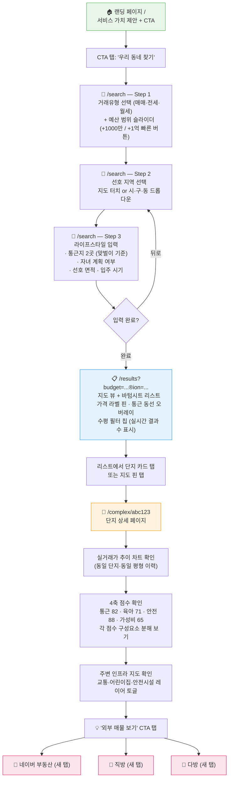
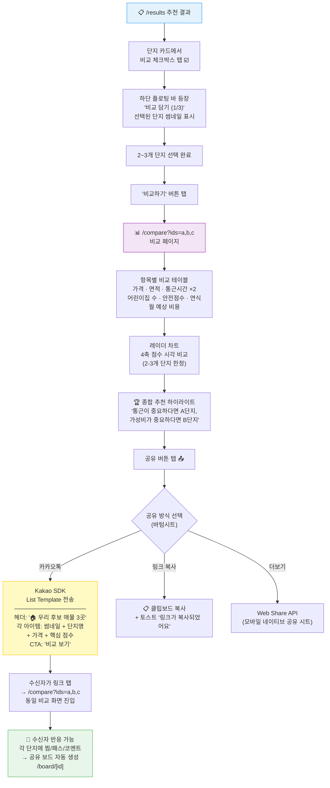
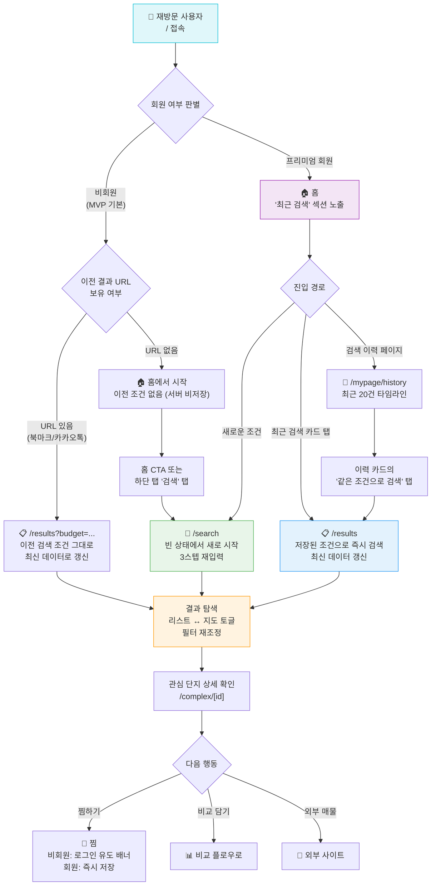

# 🏠 사이트맵 & 라우팅 아키텍처

> **서비스**: 수도권 신혼부부 주거 추천 서비스  
> **기술 스택**: React + Next.js (App Router), 모바일 우선 반응형  
> **설계 기반**: step2_ux_principle.md (UX 전략 리서치 보고서)  
> **최종 수정**: 2026-02-13

---

## 설계 원칙 — UX 전략과의 연결

이 사이트맵은 UX 리서치에서 도출된 핵심 원칙들을 구조적으로 반영한다.

| UX 원칙 | 사이트맵 반영 |
|---|---|
| **점진적 몰입 (Progressive Commitment)** | 탐색→찜→비교→공유→외부 연결까지 비로그인으로 완주 가능. 로그인은 저장·알림·파트너 초대 등 고가치 행동에서만 유도 |
| **3입력 내 첫 가치 전달** | `/search`를 3스텝 위저드로 설계, 완료 즉시 `/results`로 이동하여 추천 결과 노출 |
| **지도가 곧 검색** | `/results`에서 리스트/지도를 토글이 아닌 동시 표시 (바텀시트 구조), URL query로 지도 상태 보존 |
| **비동기 커플 협업** | `/board/[id]`(공유 보드)를 독립 경로로 분리, 카카오톡 딥링크 수신 시 직접 진입 가능 |
| **카카오톡 공유 = 서비스 경험** | 모든 공유 가능 페이지(`/complex`, `/compare`, `/board`)에 OG + Kakao SDK 메타데이터 내장 |
| **멀티세션 지원** | 프리미엄 회원의 검색 이력·찜 목록 영속, 비회원은 URL 공유로 상태 보존 |

---

## 1. 사이트맵 (트리 구조)

```
🌐 루트 (/)
│
├─ 🟢 퍼블릭 페이지 ──── 비회원 접근 가능, 핵심 플로우 전체 포함
│  │
│  ├─ /                          홈 (랜딩)
│  │     └─ CTA → /search
│  │
│  ├─ /search                    조건 입력 (스텝 위저드)
│  │     ├─ Step 1: 거래유형 + 예산 범위
│  │     ├─ Step 2: 선호 지역 (지도 or 구/동 선택)
│  │     └─ Step 3: 라이프스타일 (통근지, 자녀계획, 면적·입주시기)
│  │
│  ├─ /results                   추천 결과 (지도 + 바텀시트 리스트)
│  │     ├─ ?view=map             지도 중심 뷰 (기본)
│  │     ├─ ?view=list            리스트 중심 뷰
│  │     └─ ?budget=...&region=...&type=...  필터 상태 URL 보존
│  │
│  ├─ /complex/[id]              단지 상세
│  │     ├─ 가격 추이 (실거래가 차트)
│  │     ├─ 4축 점수 (통근·육아·안전·가성비)
│  │     ├─ 평면도 갤러리
│  │     ├─ 주변 인프라 (지도 오버레이)
│  │     └─ 외부 매물 링크 (네이버부동산, 직방, 다방)
│  │
│  ├─ /compare                   단지 비교 (최대 3개)
│  │     └─ ?ids=abc,def,ghi     비교 대상 URL 파라미터
│  │
│  ├─ /board/[id]                공유 보드 (커플 협업)
│  │     ├─ 공유된 찜 목록
│  │     ├─ 매칭 표시 (둘 다 찜 / 한 명만 찜)
│  │     └─ 인라인 코멘트·이모지 반응
│  │
│  └─ /guide                     신혼부부 주거 가이드
│        ├─ /guide/budget         예산 계산 가이드
│        ├─ /guide/loan           대출·DSR 가이드
│        └─ /guide/checklist      입주 체크리스트
│
├─ 🔐 인증 필요 페이지 ──── 프리미엄 구독 또는 로그인 필요
│  │
│  ├─ /auth
│  │     ├─ /auth/login           로그인 (카카오·네이버·구글)
│  │     ├─ /auth/signup          회원가입 + 약관 동의
│  │     └─ /auth/callback        OAuth 콜백 핸들러
│  │
│  └─ /mypage                    마이페이지
│        ├─ /mypage/saved         저장한 단지 (찜 목록)
│        ├─ /mypage/history       검색 이력 (조건 재사용 가능)
│        ├─ /mypage/alerts        가격 변동 알림 설정
│        ├─ /mypage/partner       파트너 연결 관리
│        └─ /mypage/subscription  구독·결제 관리
│
└─ 📄 유틸리티 페이지 ──── 법적 필수 + 시스템
      ├─ /terms                   이용약관
      ├─ /privacy                 개인정보처리방침
      ├─ /location-terms          위치정보 이용약관
      └─ (not-found)              404 페이지
```

---

## 2. 라우팅 테이블

### 2-1. 퍼블릭 페이지

| 경로 | 페이지 제목 | 렌더링 | 핵심 컴포넌트 | 데이터 소스 | 비고 |
|---|---|---|---|---|---|
| `/` | 집콕신혼 — 수도권 신혼부부 주거 추천 | SSG | `HeroBanner`, `QuickStartCTA`, `PopularAreaCards`, `ServiceValueProps`, `TestimonialCarousel` | Static + ISR(1h) | CTA 클릭 시 `/search`로 이동 |
| `/search` | 조건 입력 | CSR | `StepWizard`, `TransactionTypeSelector`, `BudgetRangeSlider` (+1000만/+1억 빠른버튼), `RegionMapPicker`, `LifestyleTags`, `CommuteLocationInput` ×2, `ProgressBar` | Client State | 3스텝 완료 시 query string으로 `/results` 이동. 스텝별 원퀘스천퍼스크린(토스 패턴) |
| `/results` | {지역명} {거래유형} 추천 결과 | SSR | `KakaoMapView` (가격 라벨 핀), `BottomSheet3Stage` (Peek/Half/Full), `ComplexCard`, `HorizontalFilterChips`, `SortDropdown`, `CompareFloatingBar`, `CommuteOverlay`, `ZeroResultRecovery` | SSR + Query Params | 바운딩박스 자동검색, 양방향 싱크(Airbnb 패턴), 필터 실시간 결과 수 표시 |
| `/complex/[id]` | {단지명} — {동/구} {거래유형} {대표가격} | ISR | `ComplexHero`, `RealTransactionChart`, `ScoreCard4Axis` (통근/육아/안전/가성비, 각 0-100), `ScoreBreakdown` (요인 기여도), `FloorPlanGallery`, `NearbyInfraMap` (토글 레이어), `ExternalListingCTA`, `ShareButton`, `FavoriteButton`, `InlineTermTooltip` | ISR(1h) + Client | 실거래가 차트 필수 배치. 점수 방법론 ⓘ → 1줄 요약 → 상세 페이지. JSON-LD 구조화 데이터 |
| `/compare` | {단지A} vs {단지B} 비교 | CSR | `CompareTable` (가격·면적·교통·학군·연식), `RadarChart` (2-3개 한정), `MonthlyEstimateCompare`, `CommuteTimeCompare`, `ShareButton` (카카오 List Template) | Client (Query) | `?ids=abc,def,ghi` 최대 3개. URL 공유 시 동일 비교 화면 재현 |
| `/board/[id]` | 우리의 후보 매물 | SSR | `SharedFavoriteList`, `MatchIndicator` (둘 다 찜/한 명만 찜), `BlindVotePanel`, `InlineComment`, `EmojiReaction`, `PartnerInviteCTA` | Auth API + Realtime | 커플 비동기 협업 허브. 카카오톡 딥링크 수신 진입점. 비회원은 읽기 전용 |
| `/guide` | 신혼부부 주거 가이드 | ISR | `ArticleList`, `CategoryTabs`, `InlineTermTooltip` | ISR(24h) | SEO 콘텐츠 허브 |
| `/guide/[slug]` | {가이드 제목} | ISR | `ArticleBody`, `RelatedArticles`, `BudgetCalculatorEmbed` | ISR(24h) | 개별 가이드 글 |

### 2-2. 인증 필요 페이지

| 경로 | 페이지 제목 | 렌더링 | 핵심 컴포넌트 | 인증 | 비고 |
|---|---|---|---|---|---|
| `/auth/login` | 로그인 | CSR | `SocialLoginButtons` (카카오 우선, 네이버, 구글), `EmailLoginForm`, `RedirectHandler` | — | `?redirect={path}`로 원래 페이지 복귀 |
| `/auth/signup` | 회원가입 | CSR | `SocialSignupFlow`, `TermsAgreementCheckbox` (필수 3개 + 마케팅 선택), `PhoneVerification` | — | 카카오 로그인 한 번에 완료 목표 |
| `/auth/callback` | 인증 처리 중 | CSR | `OAuthCallbackHandler`, `LoadingSpinner` | — | 토큰 교환 후 리다이렉트 |
| `/mypage` | 마이페이지 | CSR | `ProfileCard`, `SubscriptionBadge`, `MenuGrid`, `PartnerStatus` | 🔐 | 인증 가드 레이아웃 |
| `/mypage/saved` | 저장한 단지 | CSR | `SavedComplexList`, `MatchFilter` (파트너와 겹치는 항목 필터), `RemoveButton` | 🔐 | — |
| `/mypage/history` | 검색 이력 | CSR | `HistoryTimeline`, `ReSearchButton` (동일 조건 재검색) | 🔐 | 최근 20건 유지 |
| `/mypage/alerts` | 가격 변동 알림 | CSR | `AlertList`, `PriceThresholdSetter`, `NotificationToggle` | 🔐 프리미엄 | 찜한 단지 실거래가 변동 시 푸시 |
| `/mypage/partner` | 파트너 연결 | CSR | `PartnerInviteLink`, `PartnerStatus`, `PrivacyControl` (총액만/세부/비공개) | 🔐 | Honeydue식 프라이버시 3단계 |
| `/mypage/subscription` | 구독 관리 | CSR | `PlanSelector`, `PaymentHistory`, `CancelFlow` | 🔐 | — |

### 2-3. 유틸리티 페이지

| 경로 | 페이지 제목 | 렌더링 | 비고 |
|---|---|---|---|
| `/terms` | 이용약관 | SSG | `LegalDocument` 공통 컴포넌트 |
| `/privacy` | 개인정보처리방침 | SSG | 동일 |
| `/location-terms` | 위치정보 이용약관 | SSG | 동일 |
| `not-found.tsx` | 페이지를 찾을 수 없습니다 | SSG | `NotFoundIllustration`, `BackHomeCTA`, `PopularSearchLinks` |

### 2-4. 라우팅 규칙

```
인증 미들웨어 (middleware.ts)
─────────────────────────────────────────────────────────
/mypage/**          → 세션 체크 → 미인증 시 /auth/login?redirect={현재경로}
/mypage/alerts      → 세션 + 구독 체크 → 미구독 시 /mypage/subscription으로 안내
/board/[id] (쓰기)  → 세션 체크 → 미인증 시 읽기 전용 모드 + 로그인 유도 배너

조건 전달 방식
─────────────────────────────────────────────────────────
/search 완료 → /results?budget_min=20000&budget_max=40000&region=강남구,서초구
              &type=jeonse&commute1=37.5665,126.9780&commute2=37.4979,127.0276
              &area_min=59&area_max=84

비교 전달 방식
─────────────────────────────────────────────────────────
/compare?ids=complex_abc123,complex_def456,complex_ghi789

지도 상태 보존
─────────────────────────────────────────────────────────
/results?...&lat=37.50&lng=127.03&zoom=14&view=map
```

---

## 3. 네비게이션 설계

### 3-1. 모바일 하단 탭 바 (5개)

```
┌─────────────────────────────────────────────────────────┐
│                                                         │
│                    [ 메인 콘텐츠 영역 ]                   │
│                                                         │
├───────────┬───────────┬───────────┬───────────┬─────────┤
│   🏠 홈   │  🔍 검색   │  🗺️ 지도  │  📊 비교   │  👤 MY  │
│           │           │           │    ②     │         │
└───────────┴───────────┴───────────┴───────────┴─────────┘
                                      ↑ 뱃지: 비교 담긴 수
```

| 순서 | 아이콘 (lucide) | 라벨 | 연결 경로 | 상태별 동작 |
|---|---|---|---|---|
| 1 | `Home` | 홈 | `/` | 항상 홈으로 이동 |
| 2 | `Search` | 검색 | `/search` | 조건 입력 위저드 시작 |
| 3 | `Map` | 지도 | `/results?view=map` | 이전 검색 결과가 없으면 → `/search`로 리다이렉트 + 토스트 "먼저 조건을 입력해주세요" |
| 4 | `BarChart3` | 비교 | `/compare` | 비교 대상 0개 → 빈 상태 UI ("결과에서 단지를 담아보세요"). 아이콘 우상단에 담긴 수 뱃지 |
| 5 | `User` | MY | `/mypage` 또는 `/auth/login` | 비회원 → 로그인. 회원 → 마이페이지 |

**모바일 탭 바 인터랙션 규칙:**

- 높이: 56px + `env(safe-area-inset-bottom)`
- `/complex/[id]`, `/results` 스크롤 다운 시 탭 바 숨김 → 스크롤 업 시 복귀 (콘텐츠 몰입 우선)
- 활성 탭: Primary Color (`#2563EB`) + Bold 라벨
- 비활성 탭: `#9CA3AF` + Regular 라벨
- 비교 뱃지: Primary Color 원형, 흰색 텍스트, 숫자 1-3

### 3-2. 데스크톱 상단 헤더 네비게이션

```
┌──────────────────────────────────────────────────────────────────────┐
│  🏠 집콕신혼          홈    검색하기    주거가이드     [비교 ②]  [로그인] │
│  ─────────          ───────────────────────         ─────── ─────── │
│  좌: 로고+워드마크    중앙: 주요 메뉴                  우측: 액션 버튼    │
└──────────────────────────────────────────────────────────────────────┘
```

| 위치 | 요소 | 동작 |
|---|---|---|
| 좌측 | 서비스 로고 + "집콕신혼" 워드마크 | `/` 이동 |
| 중앙 | 홈 · 검색하기 · 주거가이드 | 텍스트 링크, 현재 페이지 underline 강조 |
| 우측-1 | `비교` 버튼 + 뱃지 | `/compare` 이동. 뱃지로 담긴 수 표시 |
| 우측-2 | `로그인` 또는 프로필 아바타 | 비회원 → `/auth/login`. 회원 → 클릭 시 드롭다운 |

**회원 프로필 드롭다운 메뉴:**

```
┌─────────────────────┐
│  홍길동님       Pro  │
│  ─────────────────  │
│  📦 저장한 단지      │
│  🔔 가격 알림        │
│  👫 파트너 관리      │
│  📋 검색 이력        │
│  ─────────────────  │
│  ⚙️ 구독 관리       │
│  🚪 로그아웃         │
└─────────────────────┘
```

**헤더 UX 규칙:**
- `position: sticky`, `backdrop-filter: blur(12px)`, 배경 반투명
- 스크롤 시 compact 모드: 높이 64px → 48px, 로고 축소
- 검색 결과·단지 상세 페이지에서는 뒤로가기 버튼 추가 (모바일)

### 3-3. 컨텍스트 네비게이션

주요 페이지에서 하단 탭/상단 헤더 외에 추가로 표시되는 컨텍스트 요소:

| 페이지 | 컨텍스트 네비게이션 |
|---|---|
| `/results` | 상단 필터 칩 바 (수평 스크롤) + 하단 비교 플로팅 바 (단지 선택 시) |
| `/complex/[id]` | 상단 스티키 바 (단지명 + 찜·공유·비교 아이콘) + 하단 CTA "외부 매물 보기" |
| `/compare` | 상단 비교 슬롯 (3칸, 빈 슬롯은 "+" 추가 버튼) |
| `/search` | 상단 프로그레스 바 (Step 1/3, 2/3, 3/3) |
| `/board/[id]` | 상단 파트너 아바타 + 매칭 통계 ("8개 중 3개 일치") |

---

## 4. 사용자 플로우 다이어그램

### 플로우 A — 신규 방문 → 조건 입력 → 결과 확인 → 단지 상세 → 외부 매물 링크

> UX 원칙 반영: **3입력 내 첫 가치 전달**, **점진적 몰입**, **가치 전달 전 회원가입 강제 금지**



### 플로우 B — 결과 화면 → 비교 기능 → 카카오톡 공유

> UX 원칙 반영: **비교 도구의 불안 감소 효과**, **카카오톡 공유 = 양방향 협업**, **레이더 차트 2-3개 비교 전용**



### 플로우 C — 재방문 → 조건 재입력 → 결과 확인

> UX 원칙 반영: **멀티세션 지원**, **가치 전달 전 회원가입 강제 금지** (비회원도 URL로 이전 결과 접근 가능)



---

## 5. SEO 및 메타 태그 전략

### 5-1. 페이지별 title · description 템플릿

| 페이지 | `<title>` | `<meta name="description">` | robots |
|---|---|---|---|
| `/` | 집콕신혼 — 수도권 신혼부부 주거 추천 | 예산·지역·라이프스타일에 딱 맞는 신혼집을 찾아보세요. 맞벌이 통근 분석, 실거래가 기반 가격 비교, 육아·안전 점수까지. | index, follow |
| `/search` | 조건 입력 · 집콕신혼 | 3가지 조건만 입력하면 나에게 맞는 수도권 신혼 주거지를 바로 추천받을 수 있어요. | noindex (입력폼) |
| `/results` | {지역명} {거래유형} 추천 {N}건 · 집콕신혼 | {지역명}에서 {거래유형} 기준으로 추천하는 단지 {N}건. 통근·육아·안전·가성비 종합 평가. | noindex (동적 쿼리) |
| `/complex/[id]` | {단지명} — {동/구} {거래유형} {대표가격} · 집콕신혼 | {단지명}({동/구})의 실거래가 추이, 통근 편의 {점수}점, 육아 인프라 {점수}점. {역명}역 도보 {N}분, {면적}㎡. | **index, follow** |
| `/compare` | {단지A} vs {단지B} vs {단지C} 비교 · 집콕신혼 | {단지A}·{단지B}·{단지C}의 가격·통근·육아·안전을 한눈에 비교하세요. | noindex (동적 조합) |
| `/board/[id]` | 우리의 후보 매물 · 집콕신혼 | 파트너와 함께 고르는 신혼집. 찜 목록을 공유하고 의견을 나눠보세요. | noindex (개인 데이터) |
| `/guide` | 신혼부부 주거 가이드 · 집콕신혼 | 전세 vs 매매, DSR 대출 한도, 청약 전략까지. 결혼 준비 중인 커플을 위한 주거 정보 총정리. | index, follow |
| `/guide/[slug]` | {가이드 제목} · 집콕신혼 | {가이드 요약 (120자)} | index, follow |
| `/auth/login` | 로그인 · 집콕신혼 | — | **noindex, nofollow** |
| `/mypage/**` | 마이페이지 · 집콕신혼 | — | **noindex, nofollow** |
| `/terms` | 이용약관 · 집콕신혼 | 집콕신혼 서비스 이용약관입니다. | noindex |
| `/privacy` | 개인정보처리방침 · 집콕신혼 | 집콕신혼 개인정보처리방침입니다. | noindex |
| `/location-terms` | 위치정보 이용약관 · 집콕신혼 | 집콕신혼 위치기반서비스 이용약관입니다. | noindex |

### 5-2. OG 태그 — 카카오톡 공유 미리보기 최적화

**공통 OG 태그 (layout.tsx):**

```html
<meta property="og:type" content="website" />
<meta property="og:site_name" content="집콕신혼" />
<meta property="og:locale" content="ko_KR" />
<meta property="og:image:width" content="1200" />
<meta property="og:image:height" content="630" />
```

**홈 페이지:**

```html
<meta property="og:title" content="집콕신혼 — 수도권 신혼부부 주거 추천" />
<meta property="og:description" content="예산·지역·라이프스타일에 딱 맞는 신혼집 찾기" />
<meta property="og:image" content="https://jipcok.kr/og/home.png" />
<meta property="og:url" content="https://jipcok.kr/" />
```

**단지 상세 (동적 생성):**

```html
<meta property="og:title" content="{단지명} — {거래유형} {대표가격}" />
<meta property="og:description" content="{동/구} · {역명}역 도보{N}분 · {면적}㎡ · 통근{점수} 육아{점수}" />
<meta property="og:image" content="https://jipcok.kr/api/og/complex/{id}" />
<meta property="og:url" content="https://jipcok.kr/complex/{id}" />
```

**비교 페이지 (동적 생성):**

```html
<meta property="og:title" content="{단지A} vs {단지B} — 어디가 더 좋을까?" />
<meta property="og:description" content="가격·통근·육아·안전 종합 비교" />
<meta property="og:image" content="https://jipcok.kr/api/og/compare?ids={a},{b}" />
<meta property="og:url" content="https://jipcok.kr/compare?ids={a},{b}" />
```

**카카오톡 SDK 공유 — OG 대신 직접 메시지 제어:**

카카오 SDK의 `Kakao.Share.sendDefault()`를 사용하면 OG 크롤링 없이 직접 메시지 구조를 제어할 수 있어 더 정교한 미리보기가 가능하다.

```
단일 매물 공유: Feed Template (Type B)
─────────────────────────────────────
· 이미지: 매물 대표 사진 (400×400px 이상)
· 아이템 리스트: 거래유형·가격·면적·층수·위치 (최대 5항목)
· 서머리: 월 예상 비용
· 버튼 2개: "매물 보기" + "지도에서 보기" (8자 이내)

비교 목록 공유: List Template
─────────────────────────────────────
· 헤더: "🏠 우리 후보 매물 3곳"
· 아이템: 썸네일 + 단지명 + 가격 + 핵심 점수 (각 단지별)
· CTA: "비교 보기" → /compare?ids=a,b,c

딥링크 설정
─────────────────────────────────────
· androidExecutionParams: "page=complex&id={id}"
· iosExecutionParams: "page=complex&id={id}"
· 앱 미설치 시: 모바일 웹으로 폴백 (웹앱이므로 별도 앱스토어 불필요)
```

### 5-3. 동적 페이지 (`/complex/[id]`) SEO 전략

**이 서비스의 SEO 핵심 자산은 단지 상세 페이지**다. 각 단지 페이지가 "{단지명} 전세 시세", "{단지명} 실거래가" 등의 검색 키워드를 획득하는 것이 목표다.

```
렌더링 전략
─────────────────────────────────────────────────────────
빌드 타임 (SSG)     인기 단지 상위 500개를 generateStaticParams로 프리렌더링
런타임 (ISR)        나머지 단지는 첫 요청 시 SSR → 캐시 (revalidate: 3600)
OG 이미지           Vercel OG (@vercel/og) 또는 /api/og/complex/[id] 엔드포인트에서
                    단지명·가격·점수를 포함한 1200×630 이미지 동적 생성
                    Satori + Resvg로 Edge Runtime에서 50ms 이내 생성 목표

구조화 데이터 (JSON-LD)
─────────────────────────────────────────────────────────
```

```json
{
  "@context": "https://schema.org",
  "@type": "ApartmentComplex",
  "name": "{단지명}",
  "description": "{단지명} {동/구} {거래유형} 시세, 실거래가 추이, 통근·육아·안전 점수",
  "address": {
    "@type": "PostalAddress",
    "addressLocality": "{시/구}",
    "addressRegion": "{시/도}",
    "addressCountry": "KR"
  },
  "geo": {
    "@type": "GeoCoordinates",
    "latitude": 37.XXXX,
    "longitude": 127.XXXX
  },
  "numberOfAvailableAccommodationUnits": {
    "@type": "QuantitativeValue",
    "value": "{세대수}"
  },
  "amenityFeature": [
    { "@type": "LocationFeatureSpecification", "name": "지하철", "value": "{역명}역 도보 {N}분" }
  ]
}
```

```
Canonical URL & 중복 방지
─────────────────────────────────────────────────────────
· /complex/[id]를 canonical로 지정
· 동일 단지의 query param 변형 (?from=compare 등)은 canonical로 정규화

Sitemap 전략
─────────────────────────────────────────────────────────
· /api/sitemap.xml (또는 app/sitemap.ts)에서 전체 단지 목록을 동적으로 생성
· lastmod: 실거래가 데이터 최종 업데이트 일시
· changefreq: weekly (실거래가 갱신 주기)
· priority: 0.8 (홈 1.0, 가이드 0.6, 유틸리티 0.3)
· Google Search Console에 제출 + IndexNow API 연동으로 새 단지 즉시 인덱싱 요청
```

### 5-4. robots.txt

```
User-agent: *
Allow: /
Allow: /complex/
Allow: /guide/
Disallow: /auth/
Disallow: /mypage/
Disallow: /board/
Disallow: /search
Disallow: /compare
Disallow: /api/

Sitemap: https://jipcok.kr/sitemap.xml
```

---

## 부록 A: Next.js App Router 파일 구조

```
src/app/
├── layout.tsx                    # 루트 레이아웃 (Header, MobileTabBar, 폰트, Analytics, KakaoSDK)
├── page.tsx                      # 홈 /
├── search/
│   └── page.tsx                  # 조건 입력 (StepWizard)
├── results/
│   └── page.tsx                  # 추천 결과 (지도+바텀시트)
├── complex/
│   └── [id]/
│       ├── page.tsx              # 단지 상세
│       └── opengraph-image.tsx   # 동적 OG 이미지 생성
├── compare/
│   └── page.tsx                  # 비교
├── board/
│   └── [id]/
│       └── page.tsx              # 공유 보드
├── guide/
│   ├── page.tsx                  # 가이드 목록
│   └── [slug]/
│       └── page.tsx              # 가이드 상세
├── auth/
│   ├── login/page.tsx
│   ├── signup/page.tsx
│   └── callback/page.tsx
├── mypage/
│   ├── layout.tsx                # 인증 가드 레이아웃
│   ├── page.tsx                  # 마이페이지 홈
│   ├── saved/page.tsx
│   ├── history/page.tsx
│   ├── alerts/page.tsx
│   ├── partner/page.tsx
│   └── subscription/page.tsx
├── terms/page.tsx
├── privacy/page.tsx
├── location-terms/page.tsx
├── not-found.tsx                 # 404
├── sitemap.ts                    # 동적 사이트맵 생성
├── robots.ts                     # robots.txt 생성
└── api/
    └── og/
        ├── complex/[id]/route.tsx  # 단지 OG 이미지 API
        └── compare/route.tsx       # 비교 OG 이미지 API
```

## 부록 B: 점진적 몰입 사다리 — 인증 트리거 매핑

UX 원칙 6번 "점진적 몰입"에 따라, 각 행동 단계에서의 인증 요구 수준:

| 몰입 단계 | 사용자 행동 | 인증 요구 | 트리거 |
|---|---|---|---|
| 0 — 자유 탐색 | 홈 방문, 조건 입력, 결과 탐색, 단지 상세 확인 | ❌ 없음 | — |
| 1 — 마이크로 몰입 | 비교 담기 (세션 내) | ❌ 없음 | 로컬 스토리지 저장 |
| 2 — 소프트 액션 | 찜하기, 알림 설정 | 🔔 소프트 CTA | 바텀시트 "카카오로 3초 로그인" |
| 3 — 능동 참여 | 비교 결과 저장, 검색 이력 저장 | 🔐 로그인 필요 | 저장 시도 시 로그인 모달 |
| 4 — 사회적 몰입 | 파트너 초대, 공유 보드 생성 | 🔐 로그인 필요 | 초대 버튼 탭 시 |
| 5 — 프리미엄 | 가격 변동 알림, 검색 이력 영구 보존, 상세 통계 | 💎 프리미엄 구독 | 기능 접근 시 업셀 화면 |
| 6 — 행동 몰입 | 외부 중개 사이트 이동 | ❌ 없음 | 새 탭 오픈 (트래킹만) |