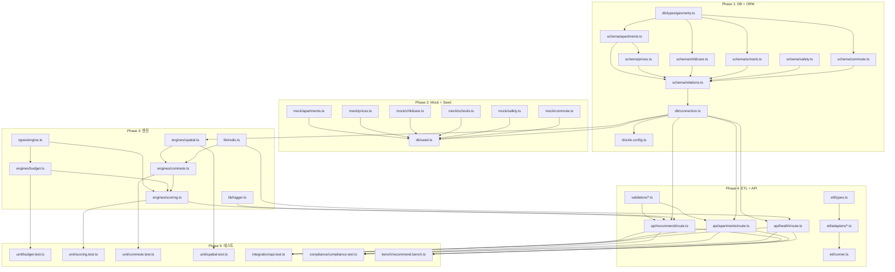

# M2 Data+Engine 구현 상세 설계

## 목표

M2 마일스톤(Data+Engine) 구현에 앞서, 코드 레벨의 상세 설계 문서를 작성한다. ETL 파이프라인, 스코어링 엔진, API Routes, DB ORM 매핑 등 M2 전체 범위를 커버하는 구현 스펙을 완성하여, 이후 실제 코드 작성 시 참조 문서로 활용한다.

## 범위

- **수정 대상 SoT**: 없음 (SoT 참조만 수행)
- **SoT 참조**: PHASE0 S4(법무), PHASE1 S2(스키마), S4(스코어링), S5(API)
- **선행 plan**: `2026-02-14_claude-code_phase2-m1-code-review` (M1 완료 검증)
- **출력물**: 본 문서의 섹션 1~10

### M2 태스크 범위 (PHASE2_build.md 참조)

1. ETL 수집 스크립트 (TypeScript)
2. 지오코딩 전처리 (Kakao Geocoding API)
3. PostGIS 적재 스크립트
4. 예산 계산 모듈 (LTV/DTI)
5. 스코어링 엔진 구현 (PHASE1 S4)
6. 통근시간 모듈 (그리드 + ODsay + Redis)
7. POST /api/recommend 엔드포인트
8. GET /api/apartments/:id 엔드포인트
9. 입력값 검증 + PII 비저장 확인

## 작업 단계

1. 아키텍처 개요 작성 (디렉토리, 의존성, 데이터 흐름)
2. DB 스키마 & ORM 매핑 설계 (Drizzle)
3. Mock 데이터 설계
4. ETL 파이프라인 설계
5. 엔진 모듈 상세 설계 (예산/스코어링/통근/공간)
6. API 엔드포인트 상세 설계
7. 타입 정의
8. 테스트 전략
9. 파일 맵 & 의존 관계
10. 리스크 & 완화 방안

## 검증 기준

- [x] 10개 섹션 전부 작성됨 (빈 섹션 없음)
- [x] 모든 TypeScript 인터페이스가 코드 블록으로 정의됨
- [x] 모든 API 엔드포인트의 요청/응답 JSON 예시 포함
- [x] 스코어링 5차원 정규화 수학 공식이 PHASE1 S4와 정확히 일치
- [x] PostGIS 공간 쿼리 SQL이 구체적으로 작성됨
- [x] PII 비저장 정책이 3계층(API/DB/에러)으로 명시됨
- [x] 금지 문구 목록 + 대체 문구 매핑 포함
- [x] 테스트 케이스가 입력/기대값 수준으로 구체적
- [x] 파일 맵 39개+ 파일의 경로/용도/의존관계 완성
- [x] 리스크 항목별 구체적 완화 방안 포함

---

## 섹션 1. 아키텍처 개요

### 1.1 디렉토리 구조

M1 Foundation에서 확립된 기존 구조 위에 M2에서 추가되는 파일 트리입니다. 기존 파일(`src/app/page.tsx`, `src/app/layout.tsx`, `src/app/globals.css`, `src/lib/utils.ts`, `src/styles/tokens.css`)은 그대로 유지합니다.

```
src/
├── app/
│   ├── api/
│   │   ├── recommend/
│   │   │   └── route.ts                 # POST /api/recommend 엔드포인트
│   │   ├── apartments/
│   │   │   └── [id]/
│   │   │       └── route.ts             # GET /api/apartments/:id 엔드포인트
│   │   └── health/
│   │       └── route.ts                 # GET /api/health 헬스체크
│   ├── layout.tsx                        # (기존) 루트 레이아웃
│   ├── page.tsx                          # (기존) 메인 페이지
│   └── globals.css                       # (기존) 글로벌 스타일
├── db/
│   ├── index.ts                          # DB 커넥션 풀 + Drizzle 인스턴스
│   ├── custom-types.ts                   # PostGIS geometry 커스텀 Drizzle 타입
│   ├── schema/
│   │   ├── index.ts                      # 스키마 barrel export
│   │   ├── apartments.ts                 # apartments 테이블 + relations
│   │   ├── prices.ts                     # apartment_prices 테이블 + relations
│   │   ├── childcare.ts                  # childcare_centers 테이블
│   │   ├── schools.ts                    # schools 테이블
│   │   ├── safety.ts                     # safety_stats 테이블
│   │   └── commute.ts                    # commute_grid 테이블
│   ├── seed.ts                           # Mock 데이터 seed 스크립트 (npx tsx 실행)
│   └── seed-data/
│       ├── apartments.ts                 # 아파트 50건 Mock 상수
│       ├── prices.ts                     # 실거래가 300건 생성 로직
│       ├── childcare.ts                  # 어린이집 200건 Mock 상수
│       ├── schools.ts                    # 학교 80건 Mock 상수
│       ├── safety.ts                     # 안전지표 25건 (서울 25구) 상수
│       ├── commute.ts                    # 통근그리드 100건 생성 로직
│       └── constants.ts                  # 공통 상수 (구명, 좌표범위 등)
├── engine/
│   ├── budget.ts                         # LTV/DTI 예산 계산 모듈
│   ├── scoring.ts                        # 5차원 스코어링 엔진 (PHASE1 S4)
│   ├── commute.ts                        # 통근시간 모듈 (그리드 + ODsay + Redis)
│   ├── spatial.ts                        # PostGIS 공간 쿼리 헬퍼
│   └── normalize.ts                      # 정규화 유틸 함수
├── lib/
│   ├── utils.ts                          # (기존) cn() 유틸
│   ├── redis.ts                          # Redis 클라이언트 (ioredis)
│   ├── env.ts                            # 환경변수 Zod 검증 + 타입 export
│   ├── errors.ts                         # 공통 에러 클래스 + 에러 응답 헬퍼
│   └── pii-guard.ts                      # PII 마스킹/필터 유틸
├── validations/
│   ├── recommend.ts                      # POST /api/recommend 요청 Zod 스키마
│   └── apartment.ts                      # GET /api/apartments/:id 파라미터 검증
├── types/
│   ├── api.ts                            # API 요청/응답 TypeScript 타입
│   ├── engine.ts                         # 엔진 입출력 타입
│   └── db.ts                             # DB 엔티티 타입 (Drizzle infer)
├── styles/
│   └── tokens.css                        # (기존) 디자인 토큰 CSS 변수
└── __tests__/
    ├── engine/
    │   ├── budget.test.ts                # 예산 계산 단위 테스트
    │   ├── scoring.test.ts               # 스코어링 엔진 단위 테스트
    │   ├── commute.test.ts               # 통근시간 모듈 단위 테스트
    │   ├── spatial.test.ts               # 공간 쿼리 단위 테스트
    │   └── normalize.test.ts             # 정규화 함수 단위 테스트
    ├── api/
    │   ├── recommend.test.ts             # POST /api/recommend 통합 테스트
    │   ├── apartments.test.ts            # GET /api/apartments/:id 통합 테스트
    │   └── health.test.ts                # GET /api/health 테스트
    ├── validations/
    │   └── recommend.test.ts             # Zod 검증 테스트
    └── compliance/
        ├── pii.test.ts                   # PII 비저장 컴플라이언스 테스트
        └── forbidden-phrases.test.ts     # 금지 문구 스캔 테스트

drizzle.config.ts                         # Drizzle Kit 설정 파일 (프로젝트 루트)
vitest.config.ts                          # Vitest 설정 파일 (프로젝트 루트)
```

**파일 수 집계**: 신규 추가 파일 39개 + 기존 파일 5개 = 총 44개

| 구분 | 신규 파일 수 |
|------|-------------|
| API Routes (`src/app/api/`) | 3 |
| DB 계층 (`src/db/`) | 16 |
| 엔진 모듈 (`src/engine/`) | 5 |
| 라이브러리 (`src/lib/`) | 4 |
| 검증 (`src/validations/`) | 2 |
| 타입 (`src/types/`) | 3 |
| 테스트 (`src/__tests__/`) | 10 |
| 루트 설정 | 2 |
| **합계** | **45** |

### 1.2 의존성 목록

M2에서 새로 추가할 패키지 목록입니다. 기존 `package.json`의 의존성(`next`, `react`, `radix-ui`, `tailwindcss`, `shadcn` 등)은 유지합니다.

#### dependencies (런타임)

| 패키지명 | 버전 | 선택 근거 |
|----------|------|----------|
| `drizzle-orm` | `^0.45.1` | TypeScript-first ORM. strict 모드 완전 호환, 스키마-코드 1:1 매핑, customType으로 PostGIS 지원 |
| `postgres` | `^3.4.8` | postgres.js 드라이버. Drizzle 공식 지원, 내장 커넥션 풀, 준비문(prepared statement) 기본 지원, Edge Runtime 호환 |
| `ioredis` | `^5.9.3` | Redis 클라이언트. Cluster/Sentinel 지원, 파이프라이닝, 자동 재연결. PHASE1 S1 기술 스택 확정 |
| `zod` | `^3.24.0` | 런타임 스키마 검증. TypeScript 타입 추론 통합, API 입력값 검증 + 환경변수 검증에 사용. v3 안정 채널 사용 (v4는 Next.js 에코시스템 안정화 후 전환) |

> **참고**: `zod` 버전 선택 — v4(4.x)가 출시되었으나, Next.js 16.x 에코시스템과의 호환성 안정화를 위해 v3 안정 채널(`^3.24.0`)을 사용합니다. v4 전환은 M4 Polish에서 평가합니다.

#### devDependencies (개발/테스트)

| 패키지명 | 버전 | 선택 근거 |
|----------|------|----------|
| `drizzle-kit` | `^0.30.0` | Drizzle 마이그레이션/스키마 관리 CLI. `drizzle-orm`과 버전 호환 필수 |
| `vitest` | `^3.0.0` | Vitest 테스트 프레임워크. Vite 기반, Jest 호환 API, TypeScript 네이티브 지원. Next.js 공식 문서 권장 |
| `@testing-library/react` | `^16.3.0` | React 컴포넌트 테스트. M2에서는 API/엔진 테스트가 주이나, M3 준비를 위해 함께 설치 |
| `@vitejs/plugin-react` | `^4.5.0` | Vitest에서 React JSX 변환 지원. `vitest.config.ts`에 플러그인으로 등록 |
| `@types/geojson` | `^7946.0.14` | GeoJSON 타입 정의. PostGIS geometry 변환 시 타입 안전성 확보 |

#### 설치 명령

```bash
# dependencies
pnpm add drizzle-orm postgres ioredis zod

# devDependencies
pnpm add -D drizzle-kit vitest @testing-library/react @vitejs/plugin-react @types/geojson
```

### 1.3 데이터 흐름도

`POST /api/recommend` 요청의 전체 처리 흐름 10단계입니다.

```
  Client (Browser)
      |
      | (1) POST /api/recommend
      |     { cash, income, loans, monthlyBudget,
      |       job1, job2, tradeType, weightProfile }
      v
  ┌─────────────────────────────────────────────┐
  │  (2) API Route: src/app/api/recommend/      │
  │      route.ts                                │
  │      - Zod 스키마로 입력값 검증              │
  │      - PII 로그 미기록 (pii-guard)           │
  │      - 유효하지 않으면 400 반환              │
  └──────────────┬──────────────────────────────┘
                 │
                 v
  ┌─────────────────────────────────────────────┐
  │  (3) Budget Engine: src/engine/budget.ts     │
  │      - LTV/DTI 기반 가용 예산 산출           │
  │      - 월 고정비 한도 계산                   │
  │      - 입력: cash, income, loans             │
  │      - 출력: maxBudget, monthlyLimit         │
  │      ※ PII(cash/income/loans) DB 비저장     │
  └──────────────┬──────────────────────────────┘
                 │
                 v
  ┌─────────────────────────────────────────────┐
  │  (4) Spatial Query: src/engine/spatial.ts    │
  │      - PostGIS로 예산 범위 내 아파트 필터링  │
  │      - WHERE average_price <= maxBudget      │
  │      - 후보 단지 목록 (N건) 반환             │
  │      - Drizzle ORM + postgres.js 쿼리        │
  └──────────────┬──────────────────────────────┘
                 │
                 v
  ┌─────────────────────────────────────────────┐
  │  (5) Commute Module: src/engine/commute.ts   │
  │      ┌──────────────┐  Cache Miss           │
  │      │ Redis Cache  │────────────┐          │
  │      │ (ioredis)    │            v          │
  │      │ TTL: 7일     │   commute_grid 조회   │
  │      └──────┬───────┘   (최근접 그리드      │
  │        Cache Hit        ST_DistanceSphere)  │
  │             │                    │          │
  │             v                    v          │
  │      job1 통근시간 + job2 통근시간 반환      │
  └──────────────┬──────────────────────────────┘
                 │
                 v
  ┌─────────────────────────────────────────────┐
  │  (6) Childcare Query: src/engine/spatial.ts  │
  │      - 후보 단지별 반경 800m 어린이집 수     │
  │      - ST_DWithin(apt.location,              │
  │          cc.location, 800)                   │
  │      - 출력: childcareCount per apt          │
  └──────────────┬──────────────────────────────┘
                 │
                 v
  ┌─────────────────────────────────────────────┐
  │  (7) School + Safety Query                   │
  │      - schools: assignment_area ∩ location   │
  │        (ST_Contains) → achievement_score     │
  │      - safety_stats: region_code 매핑        │
  │        → calculated_score                    │
  └──────────────┬──────────────────────────────┘
                 │
                 v
  ┌─────────────────────────────────────────────┐
  │  (8) Scoring Engine: src/engine/scoring.ts   │
  │      - 5차원 정규화 (PHASE1 S4 참조)         │
  │        budget / commute / childcare /        │
  │        safety / school                       │
  │      - 가중치 프로필 적용 (balanced /        │
  │        budget_focused / commute_focused)     │
  │      - final_score = round(100 * Σ(W*N), 1) │
  │      - 내림차순 정렬 → Top 10 추출           │
  └──────────────┬──────────────────────────────┘
                 │
                 v
  ┌─────────────────────────────────────────────┐
  │  (9) Response Builder                        │
  │      - Top 10 단지에 대해:                   │
  │        reason (분석 사유) 생성               │
  │        whyNot (약점) 생성                    │
  │        sources (출처/기준일) 첨부            │
  │        outlink URL 구성                     │
  │      - meta: totalCandidates, computedAt     │
  │      ※ "분석 결과" 표현 사용                │
  │      ※ 금지 문구 불포함 확인                │
  └──────────────┬──────────────────────────────┘
                 │
                 v
  ┌─────────────────────────────────────────────┐
  │  (10) HTTP 200 JSON Response                 │
  │       { recommendations: [...], meta: {} }   │
  │       Content-Type: application/json         │
  └─────────────────────────────────────────────┘
```

**성능 목표**: 전체 흐름 p95 < 2초 (NFR-2 참조). 단계 (5)의 Redis 캐시 히트 시 통근시간 조회 < 10ms, 캐시 미스 시 commute_grid DB 조회 < 200ms.

---

## 섹션 2. DB 스키마 & ORM 매핑

> SoT 참조: `docs/PHASE1_design.md` > S2 (DB Schema). 아래 Drizzle 스키마는 S2 SQL 정의를 ORM 레벨로 매핑한 것이며, 스키마 정본은 PHASE1 S2입니다.

### 2.1 Drizzle 스키마 파일 구조

#### `src/db/schema/apartments.ts`

```typescript
import {
  pgTable,
  serial,
  varchar,
  text,
  integer,
  real,
  timestamp,
} from "drizzle-orm/pg-core";
import { relations } from "drizzle-orm";
import { geometryPoint } from "../custom-types";
import { apartmentPrices } from "./prices";

// Source of Truth: docs/PHASE1_design.md > S2 — apartments
export const apartments = pgTable("apartments", {
  id: serial("id").primaryKey(),
  aptCode: varchar("apt_code", { length: 20 }).notNull().unique(),
  aptName: text("apt_name").notNull(),
  address: text("address").notNull(),
  location: geometryPoint("location").notNull(),
  builtYear: integer("built_year"),
  householdCount: integer("household_count"),
  areaMin: real("area_min"),
  areaMax: real("area_max"),
  createdAt: timestamp("created_at", { withTimezone: true }).defaultNow(),
  updatedAt: timestamp("updated_at", { withTimezone: true }).defaultNow(),
});

export const apartmentsRelations = relations(apartments, ({ many }) => ({
  prices: many(apartmentPrices),
}));
```

#### `src/db/schema/prices.ts`

```typescript
import {
  pgTable,
  serial,
  integer,
  varchar,
  numeric,
  timestamp,
  check,
} from "drizzle-orm/pg-core";
import { relations, sql } from "drizzle-orm";
import { apartments } from "./apartments";

// Source of Truth: docs/PHASE1_design.md > S2 — apartment_prices
export const apartmentPrices = pgTable(
  "apartment_prices",
  {
    id: serial("id").primaryKey(),
    aptId: integer("apt_id").references(() => apartments.id),
    tradeType: varchar("trade_type", { length: 10 }),
    year: integer("year"),
    month: integer("month"),
    averagePrice: numeric("average_price"),
    dealCount: integer("deal_count"),
    createdAt: timestamp("created_at", { withTimezone: true }).defaultNow(),
  },
  (table) => [
    check(
      "trade_type_check",
      sql`${table.tradeType} IN ('sale', 'jeonse')`
    ),
  ]
);

export const apartmentPricesRelations = relations(
  apartmentPrices,
  ({ one }) => ({
    apartment: one(apartments, {
      fields: [apartmentPrices.aptId],
      references: [apartments.id],
    }),
  })
);
```

#### `src/db/schema/childcare.ts`

```typescript
import {
  pgTable,
  serial,
  text,
  integer,
  varchar,
  timestamp,
} from "drizzle-orm/pg-core";
import { geometryPoint } from "../custom-types";

// Source of Truth: docs/PHASE1_design.md > S2 — childcare_centers
export const childcareCenters = pgTable("childcare_centers", {
  id: serial("id").primaryKey(),
  name: text("name").notNull(),
  address: text("address"),
  location: geometryPoint("location").notNull(),
  capacity: integer("capacity"),
  currentEnrollment: integer("current_enrollment"),
  evaluationGrade: varchar("evaluation_grade", { length: 10 }),
  createdAt: timestamp("created_at", { withTimezone: true }).defaultNow(),
});
```

#### `src/db/schema/schools.ts`

```typescript
import {
  pgTable,
  serial,
  text,
  varchar,
  numeric,
  timestamp,
  check,
} from "drizzle-orm/pg-core";
import { sql } from "drizzle-orm";
import { geometryPoint, geometryPolygon } from "../custom-types";

// Source of Truth: docs/PHASE1_design.md > S2 — schools
export const schools = pgTable(
  "schools",
  {
    id: serial("id").primaryKey(),
    name: text("name").notNull(),
    schoolLevel: varchar("school_level", { length: 10 }),
    location: geometryPoint("location").notNull(),
    achievementScore: numeric("achievement_score"),
    assignmentArea: geometryPolygon("assignment_area"),
    createdAt: timestamp("created_at", { withTimezone: true }).defaultNow(),
  },
  (table) => [
    check(
      "school_level_check",
      sql`${table.schoolLevel} IN ('elem', 'middle', 'high')`
    ),
  ]
);
```

#### `src/db/schema/safety.ts`

```typescript
import {
  pgTable,
  serial,
  varchar,
  text,
  numeric,
  integer,
  date,
  timestamp,
} from "drizzle-orm/pg-core";

// Source of Truth: docs/PHASE1_design.md > S2 — safety_stats
export const safetyStats = pgTable("safety_stats", {
  id: serial("id").primaryKey(),
  regionCode: varchar("region_code", { length: 10 }).notNull(),
  regionName: text("region_name"),
  crimeRate: numeric("crime_rate"),
  cctvDensity: numeric("cctv_density"),
  policeStationDistance: numeric("police_station_distance"),
  streetlightDensity: numeric("streetlight_density"),
  shelterCount: integer("shelter_count"),
  calculatedScore: numeric("calculated_score"),
  dataDate: date("data_date"),
  createdAt: timestamp("created_at", { withTimezone: true }).defaultNow(),
});
```

#### `src/db/schema/commute.ts`

```typescript
import {
  pgTable,
  serial,
  varchar,
  integer,
  timestamp,
} from "drizzle-orm/pg-core";
import { geometryPoint } from "../custom-types";

// Source of Truth: docs/PHASE1_design.md > S2 — commute_grid
export const commuteGrid = pgTable("commute_grid", {
  id: serial("id").primaryKey(),
  gridId: varchar("grid_id", { length: 20 }).notNull(),
  location: geometryPoint("location").notNull(),
  toGbdTime: integer("to_gbd_time"),   // GBD: Gangnam Business District
  toYbdTime: integer("to_ybd_time"),   // YBD: Yeouido Business District
  toCbdTime: integer("to_cbd_time"),   // CBD: Jongno Business District
  toPangyoTime: integer("to_pangyo_time"), // Pangyo Techno Valley
  calculatedAt: timestamp("calculated_at", { withTimezone: true }).defaultNow(),
});
```

#### `src/db/schema/index.ts`

```typescript
// Barrel export: all table schemas and relations
export { apartments, apartmentsRelations } from "./apartments";
export { apartmentPrices, apartmentPricesRelations } from "./prices";
export { childcareCenters } from "./childcare";
export { schools } from "./schools";
export { safetyStats } from "./safety";
export { commuteGrid } from "./commute";
```

### 2.2 PostGIS geometry 커스텀 타입

#### `src/db/custom-types.ts`

```typescript
import { customType } from "drizzle-orm/pg-core";

/**
 * PostGIS Geometry Point (SRID 4326) custom type for Drizzle ORM.
 *
 * - toDriver: accepts { longitude, latitude } and converts to
 *   ST_SetSRID(ST_MakePoint(lng, lat), 4326) SQL expression.
 * - fromDriver: parses the hex WKB string returned by PostgreSQL
 *   into { longitude, latitude } using coordinate extraction.
 *
 * Note: postgres returns geometry as hex-encoded EWKB by default.
 * We use ST_AsGeoJSON in raw queries for complex reads, but for
 * simple column reads Drizzle calls fromDriver automatically.
 */

export interface PointCoord {
  longitude: number;
  latitude: number;
}

export const geometryPoint = customType<{
  data: PointCoord;
  driverData: string;
}>({
  dataType() {
    return "geometry(Point, 4326)";
  },
  toDriver(value: PointCoord): string {
    return `SRID=4326;POINT(${value.longitude} ${value.latitude})`;
  },
  fromDriver(value: string): PointCoord {
    // PostgreSQL returns geometry as hex EWKB.
    // Use a regex to parse WKT if the driver returns text representation,
    // or parse EWKB hex for binary representation.
    // For safety, we use ST_AsText() in queries — this handles the WKT case.
    const match = value.match(/POINT\(([^ ]+) ([^ ]+)\)/);
    if (match) {
      return {
        longitude: parseFloat(match[1]),
        latitude: parseFloat(match[2]),
      };
    }
    // Fallback: parse EWKB hex (little-endian IEEE 754 doubles)
    // Byte layout: 01 (LE) + type(4) + SRID(4) + X(8) + Y(8)
    const buf = Buffer.from(value, "hex");
    const longitude = buf.readDoubleBE(buf.length === 21 ? 5 : 9);
    const latitude = buf.readDoubleBE(buf.length === 21 ? 13 : 17);
    return { longitude, latitude };
  },
});

/**
 * PostGIS Geometry Polygon (SRID 4326) custom type for Drizzle ORM.
 *
 * - toDriver: accepts GeoJSON Polygon object and converts to EWKT.
 * - fromDriver: returns the raw WKB hex string.
 *   Complex polygon reads should use ST_AsGeoJSON() in raw SQL.
 */

export interface PolygonGeoJSON {
  type: "Polygon";
  coordinates: number[][][];
}

export const geometryPolygon = customType<{
  data: PolygonGeoJSON | string;
  driverData: string;
}>({
  dataType() {
    return "geometry(Polygon, 4326)";
  },
  toDriver(value: PolygonGeoJSON | string): string {
    if (typeof value === "string") {
      return value;
    }
    // Convert GeoJSON Polygon to EWKT
    const ring = value.coordinates[0]
      .map((coord) => `${coord[0]} ${coord[1]}`)
      .join(", ");
    return `SRID=4326;POLYGON((${ring}))`;
  },
  fromDriver(value: string): PolygonGeoJSON | string {
    // Return raw hex — callers should use ST_AsGeoJSON() for structured reads
    return value;
  },
});
```

**설계 결정 사항**:

| 항목 | 결정 | 근거 |
|------|------|------|
| Point 직렬화 | EWKT (`SRID=4326;POINT(lng lat)`) | PostGIS가 자동 파싱, SQL 삽입 시 `ST_GeomFromEWKT` 불필요 |
| Point 역직렬화 | WKT regex + EWKB fallback | postgres.js 기본 반환 포맷이 hex EWKB이나, `::text` 캐스팅 시 WKT 반환 |
| Polygon 직렬화 | GeoJSON → EWKT 변환 | 학교 배정구역 저장 시 GeoJSON 입력이 자연스러움 |
| Polygon 역직렬화 | raw hex 반환 (읽기는 ST_AsGeoJSON 사용) | 복잡한 폴리곤 파싱은 DB 함수에 위임하여 정확성 보장 |

### 2.3 커넥션 풀 설정

#### `src/db/index.ts`

```typescript
import { drizzle } from "drizzle-orm/postgres-js";
import postgres from "postgres";
import * as schema from "./schema";

/**
 * Database connection pool using postgres.js + Drizzle ORM.
 *
 * postgres.js internally manages a connection pool.
 * The `max` option controls pool size.
 *
 * Configuration values are optimized for:
 * - Vercel Serverless Functions (short-lived, concurrent)
 * - Local development with Docker Compose PostgreSQL
 *
 * Source of Truth: PHASE1 S1 (기술 스택)
 */

const connectionString = process.env.DATABASE_URL;

if (!connectionString) {
  throw new Error(
    "DATABASE_URL environment variable is required. " +
    "See .env.example for the expected format."
  );
}

// postgres.js pool instance
export const sql = postgres(connectionString, {
  // -- Pool Settings --
  max: 10,                    // Maximum connections in pool
                              // Vercel: 제한적 동시성 → 10이 적정
                              // 로컬 개발: Docker compose 기본 max_connections=100
  idle_timeout: 20,           // Close idle connections after 20 seconds
  connect_timeout: 10,        // Timeout for new connection attempts (seconds)

  // -- Query Settings --
  max_lifetime: 60 * 30,     // Max connection lifetime: 30 minutes
                              // DB failover/DNS 변경 대비 주기적 갱신
  prepare: true,              // Use prepared statements (default)
                              // Supabase Pooler(PgBouncer) 사용 시 false로 변경

  // -- Transform Settings --
  transform: {
    undefined: null,          // Transform undefined → null for INSERT consistency
  },

  // -- Connection Settings --
  connection: {
    application_name: "housing-project",  // pg_stat_activity 식별
  },
});

// Drizzle ORM instance with schema for relational queries
export const db = drizzle(sql, {
  schema,
  logger: process.env.NODE_ENV === "development",  // SQL 로그: 개발 환경만
});

// Graceful shutdown helper
export async function closePool(): Promise<void> {
  await sql.end();
}
```

**커넥션 풀 설정값 근거**:

| 설정 | 값 | 근거 |
|------|-----|------|
| `max` | 10 | Vercel Serverless는 함수당 1~2 커넥션 사용. 동시 요청 고려 시 10이면 충분. PostgreSQL 기본 `max_connections=100`이므로 여유 확보 |
| `idle_timeout` | 20초 | Serverless 콜드 스타트 간격(~15초) 대비. 너무 짧으면 재연결 오버헤드, 너무 길면 유휴 커넥션 점유 |
| `connect_timeout` | 10초 | 네트워크 지연/DB 과부하 시 빠른 실패(fail-fast). NFR-2 p95 < 2초 목표와 연계 |
| `max_lifetime` | 30분 | DB failover, DNS 변경 시 stale 커넥션 방지. AWS RDS/Supabase 권장값 |
| `prepare` | true | Prepared statement로 SQL injection 방지 + 쿼리 계획 캐시 활용. PgBouncer 사용 시 false 전환 필요 |
| `logger` | dev only | 개발 환경에서만 SQL 로깅. 운영 환경 PII 노출 방지 (NFR-1 준수) |

---

## 섹션 3. Mock 데이터 설계

> Mock 데이터는 M2 개발/테스트 용도로, 실 서비스 데이터(공공 API ETL)를 대체합니다.
> 출처: Mock 데이터 (개발용) — 실제 서비스에서는 공공데이터 API 기반 ETL로 교체 예정

### 3.1 테이블별 Mock 데이터 스펙

#### apartments (50건)

| 항목 | 스펙 |
|------|------|
| 건수 | 50 |
| 지역 분포 | 서울 30건, 경기 20건 |
| apt_code | `APT-{지역코드}-{일련번호}` (예: `APT-11680-001`) |
| apt_name | 실제 존재하는 아파트 단지명 기반 (3.2 Mock 상수 참조) |
| address | `{시/도} {구/시} {동} {번지}` 형태 |
| location | 위도 37.4~37.7, 경도 126.8~127.2 범위 내 실제 좌표 근사치 |
| built_year | 1995~2023 (균등 분포) |
| household_count | 300~5000세대 (정규분포, 중앙 1500) |
| area_min | 59, 74, 84 중 택1 (일반적 국민평형 기준) |
| area_max | 84, 101, 114, 134 중 택1 (area_min < area_max 보장) |

#### apartment_prices (300건)

| 항목 | 스펙 |
|------|------|
| 건수 | 300 (50 아파트 x 6개월) |
| apt_id | apartments.id 1~50 참조 |
| trade_type | `sale` 150건 + `jeonse` 150건 (아파트당 sale 3개월 + jeonse 3개월) |
| year/month | 2025-07 ~ 2025-12 (6개월) |
| average_price (매매) | 20,000 ~ 150,000 (만원 단위, 정규분포 중앙 50,000 = 5억) |
| average_price (전세) | 10,000 ~ 80,000 (만원 단위, 매매가 대비 50~65% 비율) |
| deal_count | 1~30건 (해당 월 거래 건수, 포아송 분포 lambda=8) |

**가격 분포 설계**:

```
매매가 분포 (만원):
  min: 20,000 (2억)
  max: 150,000 (15억)
  mean: 50,000 (5억)
  std: 25,000 (2.5억)
  → 정규분포 N(50000, 25000^2), [20000, 150000] clamp

전세가 = 매매가 * ratio
  ratio: 0.50 ~ 0.65 (균등 분포)
  → 전세가 범위: 10,000 ~ 97,500 (실질: ~80,000)
```

#### childcare_centers (200건)

| 항목 | 스펙 |
|------|------|
| 건수 | 200 |
| 분포 | 서울 25개 구에 구당 6~10개소 (총 200건) |
| name | `{동}어린이집`, `{동}사랑어린이집`, `{동}키즈` 패턴 |
| address | 해당 구 내 주소 |
| location | 해당 구의 중심 좌표 + 반경 2km 내 랜덤 오프셋 |
| capacity | 20~150명 (정규분포, 중앙 60) |
| current_enrollment | capacity * 0.5~0.95 (가동률) |
| evaluation_grade | `A` 20%, `B` 40%, `C` 30%, `D` 10% |

#### schools (80건)

| 항목 | 스펙 |
|------|------|
| 건수 | 80 (초등 40건 + 중학 25건 + 고등 15건) |
| school_level | `elem` 40, `middle` 25, `high` 15 |
| name | 실제 학교명 패턴: `{동}{XX}초등학교`, `{동}{XX}중학교` |
| location | 서울/경기 범위 내 좌표 |
| achievement_score | 40~98 (정규분포, 중앙 70, 표준편차 12) |
| assignment_area | 학교 중심 반경 1~2km 원형 폴리곤 (실제 배정구역 근사) |

**학교급별 achievement_score 분포**:

| 학교급 | mean | std | 범위 |
|--------|------|-----|------|
| 초등 | 72 | 10 | 45~95 |
| 중학 | 68 | 12 | 40~92 |
| 고등 | 65 | 15 | 40~98 |

#### safety_stats (25건)

| 항목 | 스펙 |
|------|------|
| 건수 | 25 (서울 25개 구) |
| region_code | 행정구역 코드 (예: `11110` 종로구) |
| region_name | 서울 25개 구명 (3.2 Mock 상수 참조) |
| crime_rate | 1.0~8.0 (1=안전, 10=위험. 구별 차이 반영) |
| cctv_density | 1.0~8.0 (대/km^2) |
| police_station_distance | 200~2000 (m) |
| streetlight_density | 10~60 (개/km) |
| shelter_count | 2~15 (개소) |
| calculated_score | PHASE1 S4 안전지표 공식으로 사전 계산 |
| data_date | `2025-12-01` (Mock 기준일) |

**안전지표 사전 계산 공식** (PHASE1 S4 참조):

```
crime_norm    = (10 - crime_rate) / 9
cctv_norm     = clamp(cctv_density / 5, 0, 1)
shelter_norm  = min(shelter_count, 10) / 10
calculated_score = 0.5 * crime_norm + 0.3 * cctv_norm + 0.2 * shelter_norm
```

#### commute_grid (100건)

| 항목 | 스펙 |
|------|------|
| 건수 | 100 |
| grid_id | `GRID-{행번호}-{열번호}` (10x10 그리드) |
| location | 위도 37.42~37.68, 경도 126.82~127.18 범위에서 10x10 등간격 |
| to_gbd_time | 20~90분 (강남 거리 비례 + 노이즈) |
| to_ybd_time | 20~90분 (여의도 거리 비례 + 노이즈) |
| to_cbd_time | 20~90분 (종로 거리 비례 + 노이즈) |
| to_pangyo_time | 25~90분 (판교 거리 비례 + 노이즈) |

**그리드 통근시간 생성 로직**:

```
기준점 좌표:
  GBD (강남): (37.4979, 127.0276)
  YBD (여의도): (37.5219, 126.9245)
  CBD (종로): (37.5700, 126.9770)
  Pangyo (판교): (37.3948, 127.1112)

통근시간 = base_time + distance_factor * haversine(grid, target) + noise
  base_time: 15분 (최소 탑승시간)
  distance_factor: 3.0분/km (대중교통 평균)
  noise: N(0, 5^2) (5분 표준편차 랜덤)
  clamp: [20, 90]
```

### 3.2 Mock 상수 목록

#### 서울 25개 구

```typescript
export const SEOUL_DISTRICTS = [
  { code: "11110", name: "종로구",   lat: 37.5735, lng: 126.9790 },
  { code: "11140", name: "중구",     lat: 37.5641, lng: 126.9979 },
  { code: "11170", name: "용산구",   lat: 37.5326, lng: 126.9909 },
  { code: "11200", name: "성동구",   lat: 37.5634, lng: 127.0369 },
  { code: "11215", name: "광진구",   lat: 37.5385, lng: 127.0823 },
  { code: "11230", name: "동대문구", lat: 37.5744, lng: 127.0397 },
  { code: "11260", name: "중랑구",   lat: 37.6063, lng: 127.0928 },
  { code: "11290", name: "성북구",   lat: 37.5894, lng: 127.0167 },
  { code: "11305", name: "강북구",   lat: 37.6397, lng: 127.0254 },
  { code: "11320", name: "도봉구",   lat: 37.6688, lng: 127.0471 },
  { code: "11350", name: "노원구",   lat: 37.6542, lng: 127.0568 },
  { code: "11380", name: "은평구",   lat: 37.6027, lng: 126.9291 },
  { code: "11410", name: "서대문구", lat: 37.5791, lng: 126.9368 },
  { code: "11440", name: "마포구",   lat: 37.5663, lng: 126.9014 },
  { code: "11470", name: "양천구",   lat: 37.5170, lng: 126.8665 },
  { code: "11500", name: "강서구",   lat: 37.5510, lng: 126.8496 },
  { code: "11530", name: "구로구",   lat: 37.4954, lng: 126.8875 },
  { code: "11545", name: "금천구",   lat: 37.4519, lng: 126.8968 },
  { code: "11560", name: "영등포구", lat: 37.5264, lng: 126.8963 },
  { code: "11590", name: "동작구",   lat: 37.5124, lng: 126.9395 },
  { code: "11620", name: "관악구",   lat: 37.4784, lng: 126.9516 },
  { code: "11650", name: "서초구",   lat: 37.4837, lng: 127.0324 },
  { code: "11680", name: "강남구",   lat: 37.5172, lng: 127.0473 },
  { code: "11710", name: "송파구",   lat: 37.5146, lng: 127.1050 },
  { code: "11740", name: "강동구",   lat: 37.5301, lng: 127.1238 },
] as const;
```

#### 아파트 단지명 50개

```typescript
export const APARTMENT_NAMES: Array<{
  name: string;
  district: string;
  region: "seoul" | "gyeonggi";
}> = [
  // 서울 30건
  { name: "래미안 첼리투스",      district: "서초구",   region: "seoul" },
  { name: "반포 자이",            district: "서초구",   region: "seoul" },
  { name: "아크로리버파크",       district: "서초구",   region: "seoul" },
  { name: "래미안 대치팰리스",    district: "강남구",   region: "seoul" },
  { name: "개포 주공 1단지",      district: "강남구",   region: "seoul" },
  { name: "도곡 렉슬",            district: "강남구",   region: "seoul" },
  { name: "잠실 엘스",            district: "송파구",   region: "seoul" },
  { name: "리센츠",               district: "송파구",   region: "seoul" },
  { name: "헬리오시티",           district: "송파구",   region: "seoul" },
  { name: "올림픽파크포레온",     district: "강동구",   region: "seoul" },
  { name: "래미안 목동아파트",    district: "양천구",   region: "seoul" },
  { name: "목동 신시가지 7단지",  district: "양천구",   region: "seoul" },
  { name: "마포 래미안 푸르지오", district: "마포구",   region: "seoul" },
  { name: "용산 파크타워",        district: "용산구",   region: "seoul" },
  { name: "래미안 신반포리오센트", district: "서초구",  region: "seoul" },
  { name: "은마아파트",           district: "강남구",   region: "seoul" },
  { name: "압구정 현대아파트",    district: "강남구",   region: "seoul" },
  { name: "DMC 래미안 e편한세상", district: "은평구",   region: "seoul" },
  { name: "래미안 위브 (노원)",   district: "노원구",   region: "seoul" },
  { name: "e편한세상 금호",       district: "성동구",   region: "seoul" },
  { name: "왕십리 센트라스",      district: "성동구",   region: "seoul" },
  { name: "신도림 디큐브시티",    district: "구로구",   region: "seoul" },
  { name: "래미안 에스티움",      district: "동작구",   region: "seoul" },
  { name: "관악 드림타운",        district: "관악구",   region: "seoul" },
  { name: "동대문 래미안 크레시티", district: "동대문구", region: "seoul" },
  { name: "이문 아이파크 자이",   district: "동대문구", region: "seoul" },
  { name: "마곡 엠밸리",          district: "강서구",   region: "seoul" },
  { name: "중랑 포레스트",        district: "중랑구",   region: "seoul" },
  { name: "마포 프레스티지 자이", district: "마포구",   region: "seoul" },
  { name: "독산 롯데캐슬",        district: "금천구",   region: "seoul" },
  // 경기 20건
  { name: "동탄 래미안",          district: "화성시",   region: "gyeonggi" },
  { name: "판교 알파리움",        district: "성남시",   region: "gyeonggi" },
  { name: "위례 래미안",          district: "성남시",   region: "gyeonggi" },
  { name: "광교 자이",            district: "수원시",   region: "gyeonggi" },
  { name: "수원 아이파크시티",    district: "수원시",   region: "gyeonggi" },
  { name: "일산 호수공원 자이",   district: "고양시",   region: "gyeonggi" },
  { name: "킨텍스 꿈에그린",     district: "고양시",   region: "gyeonggi" },
  { name: "미사 강변도시",        district: "하남시",   region: "gyeonggi" },
  { name: "하남 감일 블루밍",     district: "하남시",   region: "gyeonggi" },
  { name: "과천 주공 10단지",     district: "과천시",   region: "gyeonggi" },
  { name: "안양 래미안",          district: "안양시",   region: "gyeonggi" },
  { name: "의왕 포일 자이",       district: "의왕시",   region: "gyeonggi" },
  { name: "분당 파크뷰",          district: "성남시",   region: "gyeonggi" },
  { name: "김포 풍무 자이",       district: "김포시",   region: "gyeonggi" },
  { name: "인덕원 자이 SK뷰",    district: "안양시",   region: "gyeonggi" },
  { name: "별내 래미안",          district: "남양주시", region: "gyeonggi" },
  { name: "구리 갈매 역세권",     district: "구리시",   region: "gyeonggi" },
  { name: "부천 중동 자이",       district: "부천시",   region: "gyeonggi" },
  { name: "평촌 래미안 에스티움", district: "안양시",   region: "gyeonggi" },
  { name: "의정부 민락 자이",     district: "의정부시", region: "gyeonggi" },
];
```

#### 좌표 범위

```typescript
// Seoul metropolitan area bounding box
export const COORD_BOUNDS = {
  lat: { min: 37.4, max: 37.7 },
  lng: { min: 126.8, max: 127.2 },
} as const;

// Major business district reference points
export const BUSINESS_DISTRICTS = {
  GBD: { lat: 37.4979, lng: 127.0276, label: "강남 업무지구" },
  YBD: { lat: 37.5219, lng: 126.9245, label: "여의도 업무지구" },
  CBD: { lat: 37.5700, lng: 126.9770, label: "종로 업무지구" },
  PANGYO: { lat: 37.3948, lng: 127.1112, label: "판교 테크노밸리" },
} as const;
```

#### 학교명/어린이집명 패턴

```typescript
// Elementary school name patterns
export const ELEM_SCHOOL_NAMES = [
  "서울{동}초등학교", "서울{동}남초등학교", "서울{동}북초등학교",
  // ... 40건 생성 시 구/동 조합
];

// Middle school name patterns
export const MIDDLE_SCHOOL_NAMES = [
  "{동}중학교", "{동}여자중학교",
  // ... 25건 생성 시 구/동 조합
];

// High school name patterns
export const HIGH_SCHOOL_NAMES = [
  "{동}고등학교", "{동}여자고등학교",
  // ... 15건 생성 시 구/동 조합
];

// Childcare center name patterns (templated)
export const CHILDCARE_NAME_PATTERNS = [
  "{dong}어린이집",
  "{dong}사랑어린이집",
  "{dong}하늘어린이집",
  "{dong}꿈나무어린이집",
  "{dong}키즈빌어린이집",
  "{dong}해맑은어린이집",
  "{dong}푸른솔어린이집",
  "{dong}햇살어린이집",
];
```

#### 가격 범위 상수

```typescript
export const PRICE_RANGES = {
  sale: {
    min: 20_000,    // 2억 (만원)
    max: 150_000,   // 15억
    mean: 50_000,   // 5억
    std: 25_000,    // 2.5억
  },
  jeonse: {
    ratioMin: 0.50,  // 매매가 대비 전세가율 최소
    ratioMax: 0.65,  // 매매가 대비 전세가율 최대
  },
} as const;

export const AREA_OPTIONS = {
  minChoices: [59, 74, 84],         // area_min 후보 (m^2)
  maxChoices: [84, 101, 114, 134],  // area_max 후보 (m^2)
} as const;

export const COMMUTE_TIME_RANGE = {
  min: 20,   // 분
  max: 90,   // 분
} as const;
```

### 3.3 Seed 스크립트 실행 플로우

#### `src/db/seed.ts` 구조

```
src/db/seed.ts
  ├── 0. 환경변수 로드 + DB 커넥션
  ├── 1. 기존 데이터 TRUNCATE (순서 역방향: FK 의존 → 독립)
  ├── 2. apartments 삽입 (50건)
  ├── 3. apartment_prices 삽입 (300건) — apartments FK 의존
  ├── 4. childcare_centers 삽입 (200건) — 독립
  ├── 5. schools 삽입 (80건) — 독립
  ├── 6. safety_stats 삽입 (25건) — 독립
  ├── 7. commute_grid 삽입 (100건) — 독립
  ├── 8. 삽입 건수 검증 로그 출력
  └── 9. 커넥션 종료
```

**실행 순서 및 의존관계**:

```
[Phase 1] apartments (50건)
    |
    v
[Phase 2] apartment_prices (300건)  ← FK: apt_id → apartments.id
    |
    | (병렬 가능)
    v
[Phase 3] childcare_centers (200건)  ← 독립
           schools (80건)            ← 독립
           safety_stats (25건)       ← 독립
           commute_grid (100건)      ← 독립
```

**상세 플로우**:

```typescript
// src/db/seed.ts (구조 설계)

async function seed() {
  console.log("[seed] Starting mock data seeding...");

  // Step 0: Truncate in reverse dependency order
  // apartment_prices → apartments → (others are independent)
  await sql`TRUNCATE apartment_prices, apartments,
            childcare_centers, schools, safety_stats, commute_grid
            CASCADE`;

  // Step 1: Seed apartments (50 records)
  // Generate from APARTMENT_NAMES constant + coordinate lookup
  const apartmentRecords = generateApartments(); // 50 records
  await db.insert(apartments).values(apartmentRecords);
  console.log(`[seed] apartments: ${apartmentRecords.length} rows inserted`);

  // Step 2: Seed apartment_prices (300 records)
  // 50 apartments x 6 months x (sale + jeonse alternating)
  // FK dependency: must run after apartments
  const priceRecords = generatePrices(apartmentRecords); // 300 records
  await db.insert(apartmentPrices).values(priceRecords);
  console.log(`[seed] apartment_prices: ${priceRecords.length} rows inserted`);

  // Step 3: Seed independent tables (can run in parallel)
  const [ccResult, schoolResult, safetyResult, commuteResult] =
    await Promise.all([
      seedChildcareCenters(),   // 200 records
      seedSchools(),            // 80 records
      seedSafetyStats(),        // 25 records
      seedCommuteGrid(),        // 100 records
    ]);

  // Step 4: Verification
  const counts = await verifySeedCounts();
  console.log("[seed] Verification:", counts);
  // Expected: { apartments: 50, prices: 300, childcare: 200,
  //             schools: 80, safety: 25, commute: 100 }

  // Step 5: Cleanup
  await closePool();
  console.log("[seed] Done. Connection closed.");
}

seed().catch((err) => {
  console.error("[seed] Failed:", err);
  process.exit(1);
});
```

**CLI 실행 방법**:

```bash
# 사전 조건: Docker Compose로 PostgreSQL + PostGIS 기동
docker compose up -d postgres

# schema.sql 적용 (M1에서 생성된 마이그레이션)
bash db/migrate.sh

# Mock 데이터 seed 실행
npx tsx src/db/seed.ts

# 검증: 테이블별 건수 확인
docker compose exec postgres psql -U housing -d housing -c "
  SELECT 'apartments' as t, count(*) FROM apartments
  UNION ALL SELECT 'prices', count(*) FROM apartment_prices
  UNION ALL SELECT 'childcare', count(*) FROM childcare_centers
  UNION ALL SELECT 'schools', count(*) FROM schools
  UNION ALL SELECT 'safety', count(*) FROM safety_stats
  UNION ALL SELECT 'commute', count(*) FROM commute_grid;
"
```

**예상 출력**:

```
     t      | count
------------+-------
 apartments |    50
 prices     |   300
 childcare  |   200
 schools    |    80
 safety     |    25
 commute    |   100
(6 rows)
```

**랜덤 시드 고정**: 재현 가능한 테스트를 위해 seed 스크립트에 고정 시드를 사용합니다.

```typescript
// Deterministic pseudo-random number generator
// Using a simple mulberry32 PRNG with fixed seed for reproducibility
function createRng(seed: number) {
  return function (): number {
    seed |= 0;
    seed = (seed + 0x6d2b79f5) | 0;
    let t = Math.imul(seed ^ (seed >>> 15), 1 | seed);
    t = (t + Math.imul(t ^ (t >>> 7), 61 | t)) ^ t;
    return ((t ^ (t >>> 14)) >>> 0) / 4294967296;
  };
}

export const rng = createRng(42); // Fixed seed = 42
```

이렇게 하면 `npx tsx src/db/seed.ts`를 몇 번 실행하든 동일한 Mock 데이터가 생성되어 테스트 일관성을 보장합니다.

---

이상이 섹션 1(아키텍처 개요), 섹션 2(DB 스키마 & ORM 매핑), 섹션 3(Mock 데이터 설계)의 전체 내용입니다.

**핵심 설계 결정 요약**:

| 결정 사항 | 선택 | 근거 |
|-----------|------|------|
| ORM | Drizzle ORM 0.45.x (안정) | TypeScript strict 완전 호환, customType으로 PostGIS 확장 가능 |
| DB 드라이버 | postgres.js (postgres 패키지) | Drizzle 공식 지원, 내장 커넥션 풀, Edge Runtime 호환 |
| PostGIS 통합 | customType 직접 정의 | 공식 geometry() 내장 타입이 Point만 지원, Polygon은 커스텀 필요 |
| 커넥션 풀 크기 | max: 10 | Serverless 환경 최적화, DB max_connections 여유 확보 |
| Zod 버전 | v3 (^3.24.0) | v4 출시 직후 안정화 대기, Next.js 에코시스템 호환성 우선 |
| Mock 데이터 | 총 755건, 고정 시드 | 재현 가능 테스트, 실제 서울/경기 지명 기반 현실감 확보 |
| 관계 정의 | drizzle-orm `relations()` API | apartments 1:N apartment_prices 관계 명시적 선언 |

---

## 섹션 4. ETL 파이프라인 설계

### 4.1 데이터 소스별 API 명세

> 모든 공공데이터는 공공데이터포털(data.go.kr) 또는 해당 기관 공식 API를 통해서만 수집한다.
> 크롤링/스크래핑 기반 데이터 수집은 NFR-4(데이터 거버넌스)에 의해 금지된다.

#### 4.1.1 국토교통부 — 아파트 매매 실거래가 상세 자료

| 항목 | 값 |
|------|-----|
| 서비스 ID | `RTMSDataSvcAptTradeDev` |
| 엔드포인트 | `https://apis.data.go.kr/1613000/RTMSDataSvcAptTradeDev/getRTMSDataSvcAptTradeDev` |
| 인증 방식 | 서비스키(serviceKey) — 공공데이터포털 발급 |
| 호출 제한 | 일 1,000건 (개발) / 일 10,000건 (운영, 활용사례 등록 시 증량 가능) |

**필수 파라미터:**

| 파라미터 | 타입 | 설명 | 예시 |
|---------|------|------|------|
| `serviceKey` | string | 공공데이터포털 인증키 (URL Encoding) | `MOLIT_API_KEY` |
| `LAWD_CD` | string | 법정동 코드 앞 5자리 (시군구) | `"11680"` (강남구) |
| `DEAL_YMD` | string | 계약년월 (YYYYMM) | `"202601"` |
| `pageNo` | number | 페이지 번호 | `1` |
| `numOfRows` | number | 한 페이지 결과 수 | `100` |

**응답 주요 필드 (XML → JSON 변환 후):**

```json
{
  "response": {
    "header": { "resultCode": "00", "resultMsg": "NORMAL SERVICE" },
    "body": {
      "totalCount": 42,
      "items": {
        "item": [
          {
            "aptNm": "래미안대치팰리스",
            "aptDong": "101동",
            "dealAmount": "180,000",
            "dealYear": "2026",
            "dealMonth": "1",
            "dealDay": "15",
            "excluUseAr": "84.82",
            "floor": "12",
            "jibun": "501",
            "sggCd": "11680",
            "umdNm": "대치동",
            "buildYear": "2003",
            "rgstDate": "20260120",
            "aptSeq": "11680-3412"
          }
        ]
      }
    }
  }
}
```

#### 4.1.2 국토교통부 — 아파트 전월세 실거래가 자료

| 항목 | 값 |
|------|-----|
| 서비스 ID | `RTMSDataSvcAptRent` |
| 엔드포인트 | `https://apis.data.go.kr/1613000/RTMSDataSvcAptRent/getRTMSDataSvcAptRent` |
| 인증 방식 | serviceKey — 공공데이터포털 발급 |
| 호출 제한 | 매매 API와 동일 |

**필수 파라미터:** 매매 API와 동일 (`serviceKey`, `LAWD_CD`, `DEAL_YMD`, `pageNo`, `numOfRows`)

**응답 주요 필드:**

```json
{
  "item": {
    "aptNm": "래미안대치팰리스",
    "excluUseAr": "84.82",
    "dealYear": "2026",
    "dealMonth": "1",
    "deposit": "95,000",
    "monthlyRent": "0",
    "floor": "8",
    "jibun": "501",
    "sggCd": "11680",
    "umdNm": "대치동",
    "buildYear": "2003",
    "contractType": "신규",
    "contractTerm": "2026.01~2028.01",
    "useRRRight": ""
  }
}
```

> `monthlyRent`가 `"0"`이면 전세, 양수면 월세. 본 프로젝트는 전세(`jeonse`)와 매매(`sale`)만 취급.

#### 4.1.3 사회보장정보원 — 전국 어린이집 정보 조회

| 항목 | 값 |
|------|-----|
| 서비스명 | 한국사회보장정보원_전국 어린이집 정보 조회 |
| 엔드포인트 | `https://apis.data.go.kr/1352159/ChildCareService_v2/getCenterInfo` |
| 인증 방식 | serviceKey — 공공데이터포털 발급 |
| 호출 제한 | 공공데이터포털 기준 (일 1,000건 기본) |

**필수 파라미터:**

| 파라미터 | 타입 | 설명 | 예시 |
|---------|------|------|------|
| `serviceKey` | string | 인증키 | `MOHW_API_KEY` |
| `stcode` | string | 시도 코드 | `"11"` (서울) |
| `arcode` | string | 시군구 코드 | `"11680"` (강남구) |
| `pageNo` | number | 페이지 번호 | `1` |
| `numOfRows` | number | 한 페이지 결과 수 | `100` |

**응답 주요 필드:**

```json
{
  "item": {
    "crname": "삼성어린이집",
    "crstatusname": "정상",
    "crtypename": "국공립",
    "craddr": "서울특별시 강남구 삼성로 123",
    "crtelno": "02-555-1234",
    "crcapacity": 100,
    "crchcnt": 85,
    "la": "37.508138",
    "lo": "127.063694",
    "crcnfmdt": "20100301",
    "craccgrd": "A"
  }
}
```

> `la`/`lo`는 위도/경도. DB 적재 시 `GEOMETRY(Point, 4326)` — `ST_SetSRID(ST_MakePoint(lo, la), 4326)` 순서 주의 (lon, lat).
> `crchcnt` = 현원수(current_enrollment), `crcapacity` = 정원수(capacity), `craccgrd` = 평가등급(evaluation_grade)

#### 4.1.4 교육부 / NEIS — 학교 기본정보 + 학업성취도

학교 기본정보는 NEIS 교육정보 개방 포털을 통해 조회하고, 학업성취도 데이터는 학교알리미 공시정보 API를 통해 조회한다.

**A. 학교 기본정보 (NEIS)**

| 항목 | 값 |
|------|-----|
| 엔드포인트 | `https://open.neis.go.kr/hub/schoolInfo` |
| 인증 방식 | KEY (NEIS 인증키, `MOE_API_KEY`와 별도 발급 가능) |
| 호출 제한 | 공공데이터포털 기준 |

**필수 파라미터:**

| 파라미터 | 타입 | 설명 | 예시 |
|---------|------|------|------|
| `KEY` | string | NEIS 인증키 | `MOE_API_KEY` |
| `Type` | string | 응답 형식 | `"json"` |
| `ATPT_OFCDC_SC_CODE` | string | 시도교육청 코드 | `"B10"` (서울) |
| `SCHUL_NM` | string | 학교명 (선택) | `"대치중학교"` |
| `SCHUL_KND_SC_NM` | string | 학교 종류 (선택) | `"초등학교"` / `"중학교"` / `"고등학교"` |
| `pIndex` | number | 페이지 인덱스 | `1` |
| `pSize` | number | 페이지 크기 | `100` |

**응답 주요 필드:**

```json
{
  "schoolInfo": [{
    "row": [{
      "SD_SCHUL_CODE": "7091234",
      "SCHUL_NM": "대치중학교",
      "SCHUL_KND_SC_NM": "중학교",
      "ORG_RDNMA": "서울특별시 강남구 삼성로 50길 12",
      "ORG_TELNO": "02-555-5678",
      "HMPG_ADRES": "http://daechi.school.kr",
      "FOND_SC_NM": "공립"
    }]
  }]
}
```

> NEIS 응답에는 위경도가 포함되지 않으므로, Kakao Geocoding API로 주소 → 좌표 변환 필요.

**B. 학업성취도 (학교알리미 공시정보)**

| 항목 | 값 |
|------|-----|
| 엔드포인트 | `https://apis.data.go.kr/6560000/SchoolInfoService/getSchoolAchievement` |
| 인증 방식 | serviceKey — 공공데이터포털 발급 |

> 학업성취도 데이터가 API로 직접 제공되지 않는 경우, 학교알리미 공개용 파일데이터(CSV)를 활용한다.
> 파일 경로: `https://www.data.go.kr/data/15014351/fileData.do` (한국교육학술정보원 학교알리미 공개용데이터)
> 이 경우 ETL은 CSV 파싱 → DB 적재 패턴을 사용한다.

#### 4.1.5 행정안전부 — 재난안전데이터 (CCTV / 대피시설)

안전 지표는 두 가지 데이터셋을 결합한다:

**A. 전국 CCTV 표준데이터**

| 항목 | 값 |
|------|-----|
| 엔드포인트 | `https://apis.data.go.kr/B553530/CctvInfoService/getCctvInfo` |
| 대안 (파일) | `https://www.data.go.kr/data/15013094/standard.do` (CSV 다운로드) |
| 인증 방식 | serviceKey — 공공데이터포털 발급 |

**필수 파라미터:**

| 파라미터 | 타입 | 설명 | 예시 |
|---------|------|------|------|
| `serviceKey` | string | 인증키 | `MOIS_API_KEY` |
| `ctpvNm` | string | 시도명 | `"서울특별시"` |
| `sggNm` | string | 시군구명 | `"강남구"` |
| `pageNo` | number | 페이지 번호 | `1` |
| `numOfRows` | number | 한 페이지 결과 수 | `100` |

**응답 주요 필드:**

```json
{
  "item": {
    "mngInstNm": "강남구청",
    "instlPurposeDivNm": "범죄예방",
    "cctvKndNm": "고정형",
    "instlLcDesc": "서울특별시 강남구 역삼동 123-45",
    "cameraCnt": 4,
    "instlYmd": "20200315",
    "latitude": "37.501234",
    "longitude": "127.036789"
  }
}
```

**B. 대피시설 정보**

| 항목 | 값 |
|------|-----|
| 엔드포인트 | `https://apis.data.go.kr/1741000/ShelterInfoService/getShelterInfo` |
| 인증 방식 | serviceKey |

**응답 주요 필드:**

```json
{
  "item": {
    "fclt_nm": "역삼1동 주민센터 대피소",
    "fclt_addr": "서울특별시 강남구 역삼로 12",
    "lat": "37.501234",
    "lot": "127.036789",
    "shlt_se_nm": "민방위대피시설",
    "acmdn_cnt": 500
  }
}
```

> crime_rate(범죄율) 데이터: 경찰청 범죄통계 공공데이터를 활용하되, API가 안정적이지 않을 경우 CSV 파일 기반 적재.
> 안전 지표는 시군구 단위(region_code)로 집계하여 `safety_stats` 테이블에 적재.

#### 4.1.6 Kakao — 지도/지오코딩/주소검색

| 항목 | 값 |
|------|-----|
| 엔드포인트 (주소 검색) | `https://dapi.kakao.com/v2/local/search/address.json` |
| 엔드포인트 (키워드 검색) | `https://dapi.kakao.com/v2/local/search/keyword.json` |
| 인증 방식 | `Authorization: KakaoAK {KAKAO_REST_API_KEY}` 헤더 |
| 호출 제한 | 일 300,000건 |

**주소 검색 파라미터:**

| 파라미터 | 타입 | 설명 | 예시 |
|---------|------|------|------|
| `query` | string | 검색할 주소 문자열 | `"서울 강남구 역삼동 501"` |
| `page` | number | 페이지 번호 (선택) | `1` |
| `size` | number | 결과 수 (선택, 최대 30) | `1` |

**응답 주요 필드:**

```json
{
  "documents": [{
    "address_name": "서울 강남구 역삼동 501",
    "x": "127.036372",
    "y": "37.500574",
    "address": {
      "region_1depth_name": "서울",
      "region_2depth_name": "강남구",
      "region_3depth_name": "역삼동",
      "main_address_no": "501"
    },
    "road_address": {
      "road_name": "테헤란로",
      "main_building_no": "152"
    }
  }],
  "meta": { "total_count": 1, "is_end": true }
}
```

> ETL에서 사용: 학교/아파트 주소 → 좌표 변환 (주소에 위경도가 없는 경우)
> API Routes에서 사용: 사용자 입력 직장 주소 → 좌표 변환

#### 4.1.7 ODsay — 대중교통 경로탐색

| 항목 | 값 |
|------|-----|
| 엔드포인트 | `https://api.odsay.com/v1/api/searchPubTransPathT` |
| 인증 방식 | apiKey 쿼리 파라미터 |
| 호출 제한 | 일 1,000건 (무료) |

**필수 파라미터:**

| 파라미터 | 타입 | 설명 | 예시 |
|---------|------|------|------|
| `apiKey` | string | ODsay 인증키 | `ODSAY_API_KEY` |
| `SX` | number | 출발지 경도 (longitude) | `127.036372` |
| `SY` | number | 출발지 위도 (latitude) | `37.500574` |
| `EX` | number | 도착지 경도 | `127.027619` |
| `EY` | number | 도착지 위도 | `37.497942` |
| `SearchType` | number | 0: 도시내 / 1: 도시간 | `0` |
| `SearchPathType` | number | 0: 전체 / 1: 지하철 / 2: 버스 | `0` |

**응답 주요 필드:**

```json
{
  "result": {
    "searchType": 0,
    "outTrafficCheck": 0,
    "path": [{
      "pathType": 1,
      "info": {
        "totalTime": 35,
        "totalDistance": 12400,
        "payment": 1250,
        "busTransitCount": 1,
        "subwayTransitCount": 1,
        "totalWalk": 800,
        "firstStartStation": "역삼역",
        "lastEndStation": "여의도역",
        "totalStationCount": 12
      },
      "subPath": [
        {
          "trafficType": 1,
          "sectionTime": 25,
          "startName": "역삼역",
          "endName": "여의도역",
          "startX": 127.036372,
          "startY": 37.500574,
          "endX": 126.924066,
          "endY": 37.521624
        }
      ]
    }]
  }
}
```

> `info.totalTime`(분)이 통근시간 계산의 핵심 값.
> 경로가 여러 개 반환될 때 `path[0].info.totalTime`(최적 경로)을 사용.

---

### 4.2 Mock/Real 이중 구조 패턴

#### 환경 변수 기반 전환

```typescript
// src/etl/config.ts
const USE_MOCK_DATA = process.env.USE_MOCK_DATA === 'true';
```

`USE_MOCK_DATA=true`이면 Mock 어댑터가, `false`(또는 미설정)이면 Real 어댑터가 선택된다.

#### 어댑터 인터페이스

```typescript
// src/etl/adapters/types.ts
import { z } from 'zod';

/**
 * DataSourceAdapter: all ETL data sources implement this interface.
 * T = Zod schema output type for a single record.
 */
export interface DataSourceAdapter<T> {
  /** Human-readable name for logging (no PII) */
  readonly name: string;

  /**
   * Fetch raw data from the source, validate with Zod, return parsed records.
   * @param params - source-specific query params (region code, date, etc.)
   * @returns validated records array
   * @throws DataSourceError on fetch/validation failure
   */
  fetch(params: Record<string, unknown>): Promise<T[]>;
}

/** Error wrapper — no PII in message */
export class DataSourceError extends Error {
  constructor(
    public readonly source: string,
    public readonly code: 'FETCH_FAILED' | 'VALIDATION_FAILED' | 'RATE_LIMITED' | 'TIMEOUT',
    message: string,
    public readonly cause?: unknown,
  ) {
    super(`[${source}] ${code}: ${message}`);
    this.name = 'DataSourceError';
  }
}
```

#### Mock 어댑터 예시

```typescript
// src/etl/adapters/mock/apartment-trade.mock.ts
import { type DataSourceAdapter } from '../types';
import { type ApartmentTradeRecord, apartmentTradeRecordSchema } from '../schemas/apartment-trade';
import mockData from '../../../data/mock/apartment-trades.json';

export class MockApartmentTradeAdapter implements DataSourceAdapter<ApartmentTradeRecord> {
  readonly name = 'MockApartmentTrade';

  async fetch(_params: Record<string, unknown>): Promise<ApartmentTradeRecord[]> {
    // Validate mock data against the same Zod schema as real data
    const parsed = mockData.map((item: unknown) => apartmentTradeRecordSchema.parse(item));
    return parsed;
  }
}
```

#### Real 어댑터 예시

```typescript
// src/etl/adapters/real/apartment-trade.real.ts
import { type DataSourceAdapter, DataSourceError } from '../types';
import { type ApartmentTradeRecord, apartmentTradeResponseSchema } from '../schemas/apartment-trade';

export class RealApartmentTradeAdapter implements DataSourceAdapter<ApartmentTradeRecord> {
  readonly name = 'RealApartmentTrade';

  async fetch(params: Record<string, unknown>): Promise<ApartmentTradeRecord[]> {
    const { lawdCd, dealYmd } = params as { lawdCd: string; dealYmd: string };
    const serviceKey = process.env.MOLIT_API_KEY;
    if (!serviceKey) {
      throw new DataSourceError(this.name, 'FETCH_FAILED', 'MOLIT_API_KEY not configured');
    }

    const url = new URL(
      'https://apis.data.go.kr/1613000/RTMSDataSvcAptTradeDev/getRTMSDataSvcAptTradeDev',
    );
    url.searchParams.set('serviceKey', serviceKey);
    url.searchParams.set('LAWD_CD', lawdCd);
    url.searchParams.set('DEAL_YMD', dealYmd);
    url.searchParams.set('numOfRows', '100');
    url.searchParams.set('pageNo', '1');
    url.searchParams.set('type', 'json');

    const res = await fetch(url.toString(), { signal: AbortSignal.timeout(10_000) });
    if (!res.ok) {
      throw new DataSourceError(this.name, 'FETCH_FAILED', `HTTP ${res.status}`);
    }

    const json: unknown = await res.json();

    // Zod validation
    const result = apartmentTradeResponseSchema.safeParse(json);
    if (!result.success) {
      throw new DataSourceError(this.name, 'VALIDATION_FAILED', result.error.message);
    }

    return result.data.response.body.items.item;
  }
}
```

#### 팩토리 함수

```typescript
// src/etl/adapters/index.ts
import { type DataSourceAdapter } from './types';
import { MockApartmentTradeAdapter } from './mock/apartment-trade.mock';
import { RealApartmentTradeAdapter } from './real/apartment-trade.real';
// ... other adapters

const USE_MOCK = process.env.USE_MOCK_DATA === 'true';

export function createApartmentTradeAdapter(): DataSourceAdapter<ApartmentTradeRecord> {
  return USE_MOCK ? new MockApartmentTradeAdapter() : new RealApartmentTradeAdapter();
}

export function createChildcareAdapter(): DataSourceAdapter<ChildcareRecord> {
  return USE_MOCK ? new MockChildcareAdapter() : new RealChildcareAdapter();
}

export function createSchoolAdapter(): DataSourceAdapter<SchoolRecord> {
  return USE_MOCK ? new MockSchoolAdapter() : new RealSchoolAdapter();
}

export function createSafetyAdapter(): DataSourceAdapter<SafetyRecord> {
  return USE_MOCK ? new MockSafetyAdapter() : new RealSafetyAdapter();
}

export function createCommuteAdapter(): DataSourceAdapter<CommuteRecord> {
  return USE_MOCK ? new MockCommuteAdapter() : new RealCommuteAdapter();
}
```

#### 파일 구조

```
src/etl/
  adapters/
    types.ts                        # DataSourceAdapter 인터페이스, DataSourceError
    index.ts                        # 팩토리 함수 (create*Adapter)
    mock/
      apartment-trade.mock.ts       # 실거래가 Mock
      childcare.mock.ts             # 어린이집 Mock
      school.mock.ts                # 학교 Mock
      safety.mock.ts                # 안전 Mock
      commute.mock.ts               # 통근 그리드 Mock
    real/
      apartment-trade.real.ts       # 실거래가 Real (국토교통부 API)
      childcare.real.ts             # 어린이집 Real (사회보장정보원 API)
      school.real.ts                # 학교 Real (NEIS API + 학교알리미)
      safety.real.ts                # 안전 Real (행정안전부 API)
      commute.real.ts               # 통근 Real (ODsay API)
  schemas/
    apartment-trade.ts              # Zod 스키마 (4.3 참조)
    childcare.ts
    school.ts
    safety.ts
    commute.ts
  loaders/
    upsert.ts                       # PostGIS UPSERT 공통 로직 (4.4 참조)
    apartment.loader.ts
    childcare.loader.ts
    school.loader.ts
    safety.loader.ts
    commute.loader.ts
  geocoding.ts                      # Kakao 지오코딩 헬퍼
  config.ts                         # ETL 설정 (USE_MOCK_DATA 등)
  runner.ts                         # ETL 실행 진입점 (pnpm etl:run)
data/
  mock/
    apartment-trades.json           # Mock JSON (20~30건)
    apartment-rents.json
    childcare-centers.json
    schools.json
    safety-stats.json
    commute-grid.json
```

---

### 4.3 Zod 검증 스키마

#### 4.3.1 실거래가 응답 스키마

```typescript
// src/etl/schemas/apartment-trade.ts
import { z } from 'zod';

/** Single trade record from MOLIT API */
export const apartmentTradeRecordSchema = z.object({
  aptNm: z.string().min(1),                                // apartment name
  aptDong: z.string().optional(),                           // building dong
  dealAmount: z.string().regex(/^[\d,]+$/),                 // price with commas ("180,000")
  dealYear: z.string().regex(/^\d{4}$/),                    // "2026"
  dealMonth: z.string().regex(/^\d{1,2}$/),                 // "1" ~ "12"
  dealDay: z.string().regex(/^\d{1,2}$/),                   // "1" ~ "31"
  excluUseAr: z.string().transform(Number),                 // exclusive area m²
  floor: z.string().transform(Number),                      // floor number
  jibun: z.string(),                                        // lot number
  sggCd: z.string().length(5),                              // district code
  umdNm: z.string(),                                        // legal dong name
  buildYear: z.string().regex(/^\d{4}$/).transform(Number), // construction year
  rgstDate: z.string().optional(),                           // registration date
  aptSeq: z.string().optional(),                             // apartment sequence ID
});

export type ApartmentTradeRecord = z.output<typeof apartmentTradeRecordSchema>;

/** Rent record from MOLIT API */
export const apartmentRentRecordSchema = z.object({
  aptNm: z.string().min(1),
  excluUseAr: z.string().transform(Number),
  dealYear: z.string().regex(/^\d{4}$/),
  dealMonth: z.string().regex(/^\d{1,2}$/),
  deposit: z.string().regex(/^[\d,]+$/),                    // jeonse deposit
  monthlyRent: z.string().regex(/^[\d,]+$/),                // monthly rent ("0" = jeonse)
  floor: z.string().transform(Number),
  jibun: z.string(),
  sggCd: z.string().length(5),
  umdNm: z.string(),
  buildYear: z.string().regex(/^\d{4}$/).transform(Number),
  contractType: z.string().optional(),                       // "신규" | "갱신"
  contractTerm: z.string().optional(),                       // "2026.01~2028.01"
  useRRRight: z.string().optional(),                         // renewal rights usage
});

export type ApartmentRentRecord = z.output<typeof apartmentRentRecordSchema>;

/** Full API response wrapper */
export const apartmentTradeResponseSchema = z.object({
  response: z.object({
    header: z.object({
      resultCode: z.string(),
      resultMsg: z.string(),
    }),
    body: z.object({
      totalCount: z.number(),
      items: z.object({
        item: z.array(apartmentTradeRecordSchema),
      }),
    }),
  }),
});
```

#### 4.3.2 어린이집 응답 스키마

```typescript
// src/etl/schemas/childcare.ts
import { z } from 'zod';

export const childcareRecordSchema = z.object({
  crname: z.string().min(1),                                // facility name
  crstatusname: z.string(),                                  // status ("정상" | "휴지" | "폐지")
  crtypename: z.string(),                                    // type ("국공립" | "민간" | "가정" | ...)
  craddr: z.string(),                                        // full address
  crtelno: z.string().optional(),                            // phone number
  crcapacity: z.coerce.number().int().nonnegative(),         // capacity
  crchcnt: z.coerce.number().int().nonnegative(),            // current enrollment
  la: z.coerce.number().min(33).max(39),                     // latitude (Korea range)
  lo: z.coerce.number().min(124).max(132),                   // longitude (Korea range)
  crcnfmdt: z.string().optional(),                           // establishment date
  craccgrd: z.string().optional(),                           // evaluation grade ("A" | "B" | "C" | "D" | "")
});

export type ChildcareRecord = z.output<typeof childcareRecordSchema>;
```

#### 4.3.3 학교 응답 스키마

```typescript
// src/etl/schemas/school.ts
import { z } from 'zod';

/** NEIS school basic info */
export const schoolInfoRecordSchema = z.object({
  SD_SCHUL_CODE: z.string(),                                 // standard school code
  SCHUL_NM: z.string().min(1),                               // school name
  SCHUL_KND_SC_NM: z.enum(['초등학교', '중학교', '고등학교']), // school level
  ORG_RDNMA: z.string(),                                     // road name address
  ORG_TELNO: z.string().optional(),
  HMPG_ADRES: z.string().optional(),
  FOND_SC_NM: z.string().optional(),                         // "공립" | "사립"
});

export type SchoolInfoRecord = z.output<typeof schoolInfoRecordSchema>;

/** School achievement data (from CSV or API) */
export const schoolAchievementSchema = z.object({
  schoolCode: z.string(),
  schoolName: z.string(),
  schoolLevel: z.enum(['elem', 'middle', 'high']),
  achievementScore: z.coerce.number().min(0).max(100),       // 0~100
  dataYear: z.coerce.number().int(),
});

export type SchoolAchievementRecord = z.output<typeof schoolAchievementSchema>;

/** School level mapping helper */
export const SCHOOL_LEVEL_MAP: Record<string, 'elem' | 'middle' | 'high'> = {
  '초등학교': 'elem',
  '중학교': 'middle',
  '고등학교': 'high',
};
```

#### 4.3.4 안전 데이터 응답 스키마

```typescript
// src/etl/schemas/safety.ts
import { z } from 'zod';

/** CCTV record from MOIS API or CSV */
export const cctvRecordSchema = z.object({
  mngInstNm: z.string(),                    // management institution
  instlPurposeDivNm: z.string(),            // installation purpose
  cctvKndNm: z.string().optional(),          // CCTV kind
  instlLcDesc: z.string(),                   // installation location (address)
  cameraCnt: z.coerce.number().int().nonnegative(), // camera count
  instlYmd: z.string().optional(),           // installation date
  latitude: z.coerce.number().min(33).max(39).optional(),
  longitude: z.coerce.number().min(124).max(132).optional(),
});

export type CctvRecord = z.output<typeof cctvRecordSchema>;

/** Shelter record */
export const shelterRecordSchema = z.object({
  fclt_nm: z.string(),                       // facility name
  fclt_addr: z.string(),                     // address
  lat: z.coerce.number().min(33).max(39),
  lot: z.coerce.number().min(124).max(132),  // note: API uses "lot" not "lon"
  shlt_se_nm: z.string().optional(),          // shelter type
  acmdn_cnt: z.coerce.number().int().nonnegative().optional(), // accommodation count
});

export type ShelterRecord = z.output<typeof shelterRecordSchema>;

/** Aggregated safety stats per region (computed from CCTV + shelter + crime data) */
export const safetyStatsSchema = z.object({
  regionCode: z.string().min(2).max(10),
  regionName: z.string(),
  crimeRate: z.number().nonnegative(),       // crimes per 1,000 population
  cctvDensity: z.number().nonnegative(),     // CCTVs per km²
  policeStationDistance: z.number().nonnegative().optional(),
  streetlightDensity: z.number().nonnegative().optional(),
  shelterCount: z.number().int().nonnegative(),
  dataDate: z.string(),                       // ISO date string
});

export type SafetyStatsRecord = z.output<typeof safetyStatsSchema>;
```

---

### 4.4 PostGIS UPSERT 전략

#### 공통 UPSERT 패턴

Drizzle ORM의 `onConflictDoUpdate`를 활용하며, raw SQL이 필요한 PostGIS geometry 삽입은 `sql` 태그를 사용한다.

```typescript
// src/etl/loaders/upsert.ts
import { sql } from 'drizzle-orm';
import { db } from '@/lib/db';

/**
 * Generic retry wrapper with exponential backoff.
 * @param fn - async function to retry
 * @param maxRetries - maximum retry count (default: 3)
 * @param baseDelayMs - base delay in ms (default: 1000)
 */
export async function withRetry<T>(
  fn: () => Promise<T>,
  maxRetries = 3,
  baseDelayMs = 1000,
): Promise<T> {
  let lastError: unknown;
  for (let attempt = 0; attempt <= maxRetries; attempt++) {
    try {
      return await fn();
    } catch (error) {
      lastError = error;
      if (attempt < maxRetries) {
        const delay = baseDelayMs * Math.pow(2, attempt); // exponential backoff
        await new Promise((resolve) => setTimeout(resolve, delay));
      }
    }
  }
  throw lastError;
}

/**
 * Batch processing with partial failure logging.
 * Processes records in chunks, logging failures without stopping the entire batch.
 */
export async function batchUpsert<T>(
  records: T[],
  upsertFn: (record: T) => Promise<void>,
  options: { batchSize?: number; source: string } = { source: 'unknown' },
): Promise<{ success: number; failed: number; errors: Array<{ index: number; error: string }> }> {
  const { batchSize = 50, source } = options;
  let success = 0;
  let failed = 0;
  const errors: Array<{ index: number; error: string }> = [];

  for (let i = 0; i < records.length; i += batchSize) {
    const chunk = records.slice(i, i + batchSize);
    const results = await Promise.allSettled(
      chunk.map((record, idx) =>
        withRetry(() => upsertFn(record)).catch((err: unknown) => {
          const errorMsg = err instanceof Error ? err.message : String(err);
          // No PII in error logs (NFR-1)
          errors.push({ index: i + idx, error: errorMsg });
          throw err;
        }),
      ),
    );

    for (const result of results) {
      if (result.status === 'fulfilled') success++;
      else failed++;
    }
  }

  // Structured log — no PII
  console.log(
    JSON.stringify({
      event: 'etl_batch_complete',
      source,
      success,
      failed,
      totalErrors: errors.length,
      timestamp: new Date().toISOString(),
    }),
  );

  return { success, failed, errors };
}
```

#### 테이블별 Conflict 키 및 UPSERT 전략

| 테이블 | Conflict 키 | UPSERT 전략 |
|--------|------------|-------------|
| `apartments` | `apt_code` (UNIQUE) | ON CONFLICT (apt_code) DO UPDATE SET apt_name, address, location, built_year, household_count, area_min, area_max, updated_at |
| `apartment_prices` | `(apt_id, trade_type, year, month)` 복합 | ON CONFLICT DO UPDATE SET average_price, deal_count (복합 UNIQUE 인덱스 추가 필요) |
| `childcare_centers` | `(name, address)` 복합 | ON CONFLICT DO UPDATE SET location, capacity, current_enrollment, evaluation_grade |
| `schools` | `(name, school_level)` 복합 | ON CONFLICT DO UPDATE SET location, achievement_score, assignment_area |
| `safety_stats` | `region_code` | ON CONFLICT (region_code) DO UPDATE SET crime_rate, cctv_density, shelter_count, calculated_score, data_date |
| `commute_grid` | `grid_id` | ON CONFLICT (grid_id) DO UPDATE SET to_gbd_time, to_ybd_time, to_cbd_time, to_pangyo_time, calculated_at |

> 참고: `apartment_prices`, `childcare_centers`, `schools`에는 현재 PHASE1 S2 스키마에 복합 UNIQUE 제약이 없다. UPSERT를 위해 마이그레이션에서 복합 UNIQUE 인덱스를 추가해야 한다. (SoT 수정 시 사용자 승인 필요)

#### apartments 로더 예시

```typescript
// src/etl/loaders/apartment.loader.ts
import { sql } from 'drizzle-orm';
import { db } from '@/lib/db';
import { apartments } from '@/lib/db/schema';
import { batchUpsert } from './upsert';
import { type ApartmentTradeRecord } from '../schemas/apartment-trade';

export async function upsertApartments(records: ApartmentTradeRecord[]): Promise<void> {
  await batchUpsert(
    records,
    async (record) => {
      const aptCode = `${record.sggCd}-${record.jibun}`;
      await db
        .insert(apartments)
        .values({
          aptCode,
          aptName: record.aptNm,
          address: `${record.umdNm} ${record.jibun}`,
          // PostGIS geometry — use raw SQL with Kakao geocoded coords
          location: sql`ST_SetSRID(ST_MakePoint(${0}, ${0}), 4326)`, // coords filled by geocoding step
          builtYear: record.buildYear,
        })
        .onConflictDoUpdate({
          target: apartments.aptCode,
          set: {
            aptName: record.aptNm,
            updatedAt: sql`NOW()`,
          },
        });
    },
    { source: 'apartments' },
  );
}
```

#### 에러 핸들링 정책

1. **재시도**: 3회, 지수 백오프 (1s, 2s, 4s)
2. **부분 실패**: `Promise.allSettled`로 개별 레코드 실패가 전체를 중단하지 않음
3. **로그 전략**: 구조화 JSON 로그 (`event`, `source`, `success`, `failed`, `timestamp`), PII 미포함 (NFR-1)
4. **실패 임계값**: 전체 레코드의 50% 이상 실패 시 경고 로그 + ETL 중단 플래그

---

## 섹션 5. 엔진 모듈 상세 설계

### 5.1 예산 계산기 (`src/lib/engines/budget.ts`)

#### LTV/DTI 수학적 정의

**LTV (Loan-to-Value Ratio):**
```
LTV = 대출금액 / 주택가격
```
- 규제지역(서울/수도권): LTV 상한 50% (간주, 정확한 규제는 정책에 따라 변동)
- 비규제지역: LTV 상한 70%
- 본 프로젝트는 보수적으로 **50%** 고정 (포트폴리오용 단순화)

**DTI (Debt-to-Income Ratio):**
```
DTI = (연간 원리금 상환액 + 기존 대출 연간 상환액) / 연소득
```
- DTI 상한: 40% (보수적 적용)
- 연간 가용 상환액 = `income * 12 * DTI_RATIO - loans * 12`

**매매 시 최대 가용 주택가격:**
```
max_loan_by_ltv = max_housing_price * LTV_RATIO
max_loan_by_dti = (income * 12 * DTI_RATIO - loans * 12) * LOAN_TERM / 12
max_loan = min(max_loan_by_ltv_derived, max_loan_by_dti)

// LTV 역산:
max_housing_price = cash / (1 - LTV_RATIO)
// 단, DTI에 의한 대출 한도 제한:
max_loan_dti = max(0, (income * 12 * DTI_RATIO - loans * 12)) * (LOAN_TERM_YEARS)
max_housing_price_dti = cash + max_loan_dti
max_housing_price = min(cash / (1 - LTV_RATIO), cash + max_loan_dti)

monthly_cost_sale = max_loan / (LOAN_TERM_YEARS * 12)  // 원금 균등 간주
```

**전세 시 최대 전세금:**
```
max_jeonse_loan = min(
  max_jeonse_price * JEONSE_LTV_RATIO,
  max(0, (income * 12 * DTI_RATIO - loans * 12)) * LOAN_TERM_YEARS
)
max_jeonse_price = cash + max_jeonse_loan
monthly_cost_jeonse = max_jeonse_loan / (LOAN_TERM_YEARS * 12)  // 전세대출 원금 균등 상환
```

- 전세 LTV: 80% (전세대출은 보증 기반으로 높음)
- 대출 기간: 30년(매매), 2년(전세) — 전세는 단기 회전

#### TypeScript 인터페이스

```typescript
// src/lib/engines/budget.ts

/** Budget calculation constants — no PII stored */
const BUDGET_CONSTANTS = {
  SALE_LTV_RATIO: 0.50,        // conservative LTV for sale
  JEONSE_LTV_RATIO: 0.80,      // jeonse deposit loan LTV
  DTI_RATIO: 0.40,             // DTI upper limit
  SALE_LOAN_TERM_YEARS: 30,    // sale mortgage term
  JEONSE_LOAN_TERM_YEARS: 2,   // jeonse loan term
} as const;

export interface BudgetInput {
  /** Cash on hand (만원) */
  cash: number;
  /** Monthly household income (만원) */
  income: number;
  /** Existing monthly loan payments (만원) */
  loans: number;
  /** Monthly budget upper limit set by user (만원) */
  monthlyBudget: number;
  /** Trade type */
  tradeType: 'sale' | 'jeonse';
}

export interface BudgetOutput {
  /** Maximum affordable housing price or jeonse deposit (만원) */
  maxPrice: number;
  /** Maximum loan amount (만원) */
  maxLoan: number;
  /** Estimated monthly payment (만원) */
  estimatedMonthlyCost: number;
  /** Effective monthly budget for scoring (min of estimated and user limit) */
  effectiveMonthlyBudget: number;
}

/**
 * Calculate budget based on LTV/DTI model.
 * No PII is stored — all computation is in-memory, result returned to caller.
 */
export function calculateBudget(input: BudgetInput): BudgetOutput {
  const { cash, income, loans, monthlyBudget, tradeType } = input;

  // Edge case: zero income → cash-only purchase
  if (income <= 0) {
    return {
      maxPrice: cash,
      maxLoan: 0,
      estimatedMonthlyCost: 0,
      effectiveMonthlyBudget: monthlyBudget,
    };
  }

  // Edge case: zero cash
  if (cash <= 0 && tradeType === 'sale') {
    // Cannot purchase without down payment
    return {
      maxPrice: 0,
      maxLoan: 0,
      estimatedMonthlyCost: 0,
      effectiveMonthlyBudget: monthlyBudget,
    };
  }

  if (tradeType === 'sale') {
    return calculateSaleBudget(cash, income, loans, monthlyBudget);
  }
  return calculateJeonseBudget(cash, income, loans, monthlyBudget);
}

function calculateSaleBudget(
  cash: number,
  income: number,
  loans: number,
  monthlyBudget: number,
): BudgetOutput {
  const { SALE_LTV_RATIO, DTI_RATIO, SALE_LOAN_TERM_YEARS } = BUDGET_CONSTANTS;

  // Annual available repayment (after existing loan payments)
  const annualIncome = income * 12;
  const annualExistingLoans = loans * 12;
  const annualAvailableRepayment = Math.max(0, annualIncome * DTI_RATIO - annualExistingLoans);
  const monthlyAvailableRepayment = annualAvailableRepayment / 12;

  // Max loan by DTI
  const maxLoanByDti = annualAvailableRepayment * SALE_LOAN_TERM_YEARS;

  // Max housing price by LTV: cash = price * (1 - LTV) → price = cash / (1 - LTV)
  const maxPriceByLtv = cash / (1 - SALE_LTV_RATIO);
  const maxLoanByLtv = maxPriceByLtv * SALE_LTV_RATIO;

  // Effective loan = min of LTV and DTI constraints
  const maxLoan = Math.min(maxLoanByLtv, maxLoanByDti);
  const maxPrice = cash + maxLoan;

  // Monthly cost (simple amortization)
  const estimatedMonthlyCost =
    maxLoan > 0 ? maxLoan / (SALE_LOAN_TERM_YEARS * 12) : 0;

  return {
    maxPrice: Math.round(maxPrice),
    maxLoan: Math.round(maxLoan),
    estimatedMonthlyCost: Math.round(estimatedMonthlyCost * 10) / 10,
    effectiveMonthlyBudget: Math.min(estimatedMonthlyCost, monthlyBudget),
  };
}

function calculateJeonseBudget(
  cash: number,
  income: number,
  loans: number,
  monthlyBudget: number,
): BudgetOutput {
  const { JEONSE_LTV_RATIO, DTI_RATIO, JEONSE_LOAN_TERM_YEARS } = BUDGET_CONSTANTS;

  const annualIncome = income * 12;
  const annualExistingLoans = loans * 12;
  const annualAvailableRepayment = Math.max(0, annualIncome * DTI_RATIO - annualExistingLoans);

  const maxLoanByDti = annualAvailableRepayment * JEONSE_LOAN_TERM_YEARS;

  // Iterative solve: maxPrice = cash + loan, loan <= maxPrice * JEONSE_LTV
  // cash + loan = maxPrice, loan = maxPrice * LTV → cash = maxPrice * (1 - LTV)
  const maxPrice = cash / (1 - JEONSE_LTV_RATIO);
  const maxLoanByLtv = maxPrice * JEONSE_LTV_RATIO;

  const maxLoan = Math.min(maxLoanByLtv, maxLoanByDti);
  const actualMaxPrice = cash + maxLoan;

  const estimatedMonthlyCost =
    maxLoan > 0 ? maxLoan / (JEONSE_LOAN_TERM_YEARS * 12) : 0;

  return {
    maxPrice: Math.round(actualMaxPrice),
    maxLoan: Math.round(maxLoan),
    estimatedMonthlyCost: Math.round(estimatedMonthlyCost * 10) / 10,
    effectiveMonthlyBudget: Math.min(estimatedMonthlyCost, monthlyBudget),
  };
}
```

#### 경계값 처리 요약

| 조건 | 처리 |
|------|------|
| income = 0 | 대출 불가, cash-only. maxPrice = cash, maxLoan = 0 |
| cash = 0 + sale | 매매 불가 (계약금 필요). maxPrice = 0 |
| cash = 0 + jeonse | 전세대출만으로 가능. maxPrice = maxLoanByDti |
| loans >= income * DTI | 가용 상환액 0. maxLoan = 0, cash-only |
| monthlyBudget < estimatedCost | effectiveMonthlyBudget = monthlyBudget (사용자 제한 우선) |

---

### 5.2 스코어링 엔진 (`src/lib/engines/scoring.ts`)

> 이 섹션의 모든 공식은 PHASE1 S4 (SoT)를 100% 전사한 것이다.

#### 가중치 프로필 상수

```typescript
// src/lib/engines/scoring.ts

/**
 * Weight profiles — Source of Truth: PHASE1 S4
 * Each profile sums to 1.0
 */
export const WEIGHT_PROFILES = {
  balanced: {
    budget: 0.30,
    commute: 0.25,
    childcare: 0.15,
    safety: 0.15,
    school: 0.15,
  },
  budget_focused: {
    budget: 0.40,
    commute: 0.20,
    childcare: 0.15,
    safety: 0.15,
    school: 0.10,
  },
  commute_focused: {
    budget: 0.20,
    commute: 0.40,
    childcare: 0.15,
    safety: 0.15,
    school: 0.10,
  },
} as const;

export type WeightProfileKey = keyof typeof WEIGHT_PROFILES;
```

#### 5차원 정규화 함수 (PHASE1 S4 전사)

```typescript
/** Dimension scores — all normalized to 0~1 range */
export interface DimensionScores {
  budget: number;     // 0~1 higher = more affordable
  commute: number;    // 0~1 higher = shorter commute
  childcare: number;  // 0~1 higher = more facilities nearby
  safety: number;     // 0~1 higher = safer
  school: number;     // 0~1 higher = better achievement
}

export interface ScoringInput {
  /** max budget monthly cost from BudgetOutput */
  maxBudget: number;
  /** actual monthly cost of this apartment */
  monthlyCost: number;
  /** commute time to job1 in minutes */
  commuteTime1: number;
  /** commute time to job2 in minutes */
  commuteTime2: number;
  /** childcare centers within 800m */
  childcareCount800m: number;
  /** crime level 1(safe)~10 */
  crimeLevel: number;
  /** CCTV density per km² */
  cctvDensity: number;
  /** shelter count */
  shelterCount: number;
  /** school achievement score 0~100 */
  achievementScore: number;
}

/**
 * Budget normalization
 * Formula (PHASE1 S4): max(0, (max_budget - monthly_cost) / max_budget)
 */
function normalizeBudget(maxBudget: number, monthlyCost: number): number {
  if (maxBudget <= 0) return 0;
  return Math.max(0, (maxBudget - monthlyCost) / maxBudget);
}

/**
 * Commute normalization
 * Formula (PHASE1 S4): max(0, (60 - max(commute1, commute2)) / 60)
 */
function normalizeCommute(commuteTime1: number, commuteTime2: number): number {
  const maxCommute = Math.max(commuteTime1, commuteTime2);
  return Math.max(0, (60 - maxCommute) / 60);
}

/**
 * Childcare normalization
 * Formula (PHASE1 S4): min(childcare_count_800m, 10) / 10
 */
function normalizeChildcare(childcareCount800m: number): number {
  return Math.min(childcareCount800m, 10) / 10;
}

/**
 * Safety normalization — composite of 3 sub-dimensions
 * Formula (PHASE1 S4):
 *   crime_norm   = (10 - crime_level) / 9        // crime_level: 1(safe)~10
 *   cctv_norm    = clamp(cctv_density / 5, 0, 1) // 5 per km² baseline
 *   shelter_norm = min(shelter_count, 10) / 10    // max 10 shelters
 *   safety       = 0.5 * crime_norm + 0.3 * cctv_norm + 0.2 * shelter_norm
 */
function normalizeSafety(
  crimeLevel: number,
  cctvDensity: number,
  shelterCount: number,
): number {
  const crimeNorm = (10 - crimeLevel) / 9;
  const cctvNorm = Math.min(Math.max(cctvDensity / 5, 0), 1); // clamp(0, 1)
  const shelterNorm = Math.min(shelterCount, 10) / 10;

  return 0.5 * crimeNorm + 0.3 * cctvNorm + 0.2 * shelterNorm;
}

/**
 * School normalization
 * Formula (PHASE1 S4): achievement_score / 100
 */
function normalizeSchool(achievementScore: number): number {
  return achievementScore / 100;
}
```

#### normalizeScore 함수

```typescript
/**
 * Compute all 5 dimension scores from raw input data.
 * @returns DimensionScores — each value in 0~1 range
 */
export function normalizeScore(input: ScoringInput): DimensionScores {
  return {
    budget: normalizeBudget(input.maxBudget, input.monthlyCost),
    commute: normalizeCommute(input.commuteTime1, input.commuteTime2),
    childcare: normalizeChildcare(input.childcareCount800m),
    safety: normalizeSafety(input.crimeLevel, input.cctvDensity, input.shelterCount),
    school: normalizeSchool(input.achievementScore),
  };
}
```

#### calculateFinalScore 함수

```typescript
export interface FinalScoreResult {
  /** 0~100 rounded to 1 decimal place */
  finalScore: number;
  /** Each dimension's normalized score (0~1) */
  dimensions: DimensionScores;
  /** Human-readable reason highlighting top 2~3 dimensions */
  reason: string;
  /** Why-Not explanation based on lowest dimension */
  whyNot: string;
}

/**
 * Calculate final weighted score.
 * Formula (PHASE1 S4):
 *   final_score = round(100 * (
 *     W_budget * budget_norm +
 *     W_commute * commute_norm +
 *     W_childcare * childcare_norm +
 *     W_safety * safety_norm +
 *     W_school * school_norm
 *   ), 1)
 * Result: 0~100 score, top 10 returned.
 */
export function calculateFinalScore(
  input: ScoringInput,
  weightProfile: WeightProfileKey,
): FinalScoreResult {
  const dimensions = normalizeScore(input);
  const weights = WEIGHT_PROFILES[weightProfile];

  const rawScore =
    weights.budget * dimensions.budget +
    weights.commute * dimensions.commute +
    weights.childcare * dimensions.childcare +
    weights.safety * dimensions.safety +
    weights.school * dimensions.school;

  const finalScore = Math.round(rawScore * 100 * 10) / 10; // round to 1 decimal

  const reason = generateReason(dimensions, weights);
  const whyNot = generateWhyNot(dimensions);

  return { finalScore, dimensions, reason, whyNot };
}
```

#### Why-Not 사유 생성 로직

```typescript
/** Dimension labels for user-facing text (no "추천" — use "분석 결과" per compliance) */
const DIMENSION_LABELS: Record<keyof DimensionScores, string> = {
  budget: '예산 여유',
  commute: '통근시간',
  childcare: '보육시설',
  safety: '안전 환경',
  school: '학군 수준',
};

const DIMENSION_WHY_NOT_TEMPLATES: Record<keyof DimensionScores, string> = {
  budget: '월 고정비가 예산 상한에 근접',
  commute: '통근시간이 비교적 길 수 있음',
  childcare: '반경 800m 내 보육시설이 적은 편',
  safety: '안전 지표가 평균 이하',
  school: '학군 성취도가 평균 이하',
};

/**
 * Generate Why-Not explanation based on the LOWEST dimension score.
 * If the lowest score is above 0.5, omit (apartment has no critical weakness).
 */
function generateWhyNot(dimensions: DimensionScores): string {
  const entries = Object.entries(dimensions) as Array<[keyof DimensionScores, number]>;
  entries.sort((a, b) => a[1] - b[1]);
  const [lowestDim, lowestScore] = entries[0];

  if (lowestScore >= 0.5) {
    return ''; // no significant weakness
  }

  return DIMENSION_WHY_NOT_TEMPLATES[lowestDim];
}
```

#### reason 문구 생성 로직

```typescript
/**
 * Generate reason string highlighting top 2~3 strongest dimensions.
 * Uses weighted contribution (weight * normalized score) to rank.
 */
function generateReason(
  dimensions: DimensionScores,
  weights: Record<keyof DimensionScores, number>,
): string {
  const contributions = (
    Object.entries(dimensions) as Array<[keyof DimensionScores, number]>
  ).map(([dim, score]) => ({
    dim,
    contribution: weights[dim] * score,
    score,
  }));

  contributions.sort((a, b) => b.contribution - a.contribution);

  // Take top 2~3 (include 3rd only if its contribution is close to 2nd)
  const top = contributions.slice(0, 3);
  const threshold = top[1].contribution * 0.7;
  const included = top.filter((c) => c.contribution >= threshold);

  const parts = included.map((c) => {
    const label = DIMENSION_LABELS[c.dim];
    switch (c.dim) {
      case 'budget':
        return `${label} ${Math.round(c.score * 100)}%`;
      case 'commute':
        return `${label} 양호`;
      case 'childcare':
        return `보육시설 ${Math.round(c.score * 10)}곳`;
      case 'safety':
        return `${label} 양호`;
      case 'school':
        return `${label} ${Math.round(c.score * 100)}점`;
      default:
        return label;
    }
  });

  return parts.join(' + ');
}
```

---

### 5.3 통근시간 모듈 (`src/lib/engines/commute.ts`)

#### 4단계 조회 전략 상세

```
[1단계] commute_grid DB 조회 (PostGIS ST_DWithin)
    ↓ miss
[2단계] Redis 캐시 조회
    ↓ miss
[3단계] ODsay API 실시간 호출
    ↓ fail / rate-limited
[4단계] Mock 폴백 (거리 기반 추정)
```

```typescript
// src/lib/engines/commute.ts
import { sql } from 'drizzle-orm';
import { db } from '@/lib/db';
import { redis } from '@/lib/redis';

export interface CommuteInput {
  /** Apartment ID */
  aptId: number;
  /** Apartment location */
  aptLon: number;
  aptLat: number;
  /** Destination location */
  destLon: number;
  destLat: number;
  /** Destination label (for cache key) */
  destLabel: string;
}

export interface CommuteResult {
  /** Travel time in minutes */
  timeMinutes: number;
  /** Data source used */
  source: 'grid' | 'redis' | 'odsay' | 'mock';
}

/**
 * 4-stage commute time lookup.
 * Priority: Grid → Redis → ODsay API → Mock fallback.
 */
export async function getCommuteTime(input: CommuteInput): Promise<CommuteResult> {
  // Stage 1: Grid lookup
  const gridResult = await lookupGrid(input);
  if (gridResult !== null) {
    return { timeMinutes: gridResult, source: 'grid' };
  }

  // Stage 2: Redis cache lookup
  const cacheKey = buildCacheKey(input.aptId, input.destLabel);
  const cached = await redis.get(cacheKey);
  if (cached !== null) {
    return { timeMinutes: Number(cached), source: 'redis' };
  }

  // Stage 3: ODsay API call
  try {
    const odsayResult = await callODsayApi(input);
    // Cache the result in Redis
    await redis.setex(cacheKey, COMMUTE_CACHE_TTL, String(odsayResult));
    return { timeMinutes: odsayResult, source: 'odsay' };
  } catch {
    // Stage 4: Mock fallback — distance-based estimation
    const mockResult = estimateByDistance(input);
    return { timeMinutes: mockResult, source: 'mock' };
  }
}
```

#### 1단계: 그리드 매칭 (ST_DWithin)

```typescript
/** Known business district coordinates */
const BUSINESS_DISTRICTS = {
  GBD: { lon: 127.0495, lat: 37.5045, column: 'to_gbd_time' },  // Gangnam
  YBD: { lon: 126.9246, lat: 37.5216, column: 'to_ybd_time' },  // Yeouido
  CBD: { lon: 126.9784, lat: 37.5710, column: 'to_cbd_time' },  // Jongno
  PANGYO: { lon: 127.1122, lat: 37.3947, column: 'to_pangyo_time' }, // Pangyo
} as const;

const GRID_MATCH_RADIUS_METERS = 500; // match apartment to nearest grid point within 500m
const DISTRICT_MATCH_RADIUS_METERS = 2000; // destination must be within 2km of a known district

/**
 * Stage 1: Look up commute time from precomputed grid.
 * Finds nearest commute_grid point to the apartment,
 * then matches destination to a known business district.
 */
async function lookupGrid(input: CommuteInput): Promise<number | null> {
  // Determine if destination matches a known business district
  const district = matchBusinessDistrict(input.destLon, input.destLat);
  if (!district) return null; // destination is not near a known business district

  const timeColumn = BUSINESS_DISTRICTS[district].column;

  // PostGIS query: find nearest grid point to apartment location
  const result = await db.execute(sql`
    SELECT ${sql.raw(timeColumn)} AS commute_time
    FROM commute_grid
    WHERE ST_DWithin(
      location,
      ST_SetSRID(ST_MakePoint(${input.aptLon}, ${input.aptLat}), 4326)::geography,
      ${GRID_MATCH_RADIUS_METERS}
    )
    ORDER BY location <-> ST_SetSRID(ST_MakePoint(${input.aptLon}, ${input.aptLat}), 4326)
    LIMIT 1
  `);

  if (result.rows.length === 0) return null;

  const time = result.rows[0].commute_time as number | null;
  return time ?? null;
}

/**
 * Check if destination coordinates are within 2km of a known business district.
 * Returns district key or null.
 */
function matchBusinessDistrict(
  lon: number,
  lat: number,
): keyof typeof BUSINESS_DISTRICTS | null {
  for (const [key, district] of Object.entries(BUSINESS_DISTRICTS)) {
    const distKm = haversineDistance(lat, lon, district.lat, district.lon);
    if (distKm * 1000 <= DISTRICT_MATCH_RADIUS_METERS) {
      return key as keyof typeof BUSINESS_DISTRICTS;
    }
  }
  return null;
}
```

#### 2단계: Redis 캐시 조회

```typescript
/**
 * Redis key naming convention:
 *   commute:{apt_id}:{destination_label}
 * Example: commute:1234:gangnam_gbd
 *
 * TTL: 24 hours (86400 seconds)
 */
const COMMUTE_CACHE_TTL = 86400; // 24 hours in seconds

function buildCacheKey(aptId: number, destLabel: string): string {
  // Sanitize destLabel — no PII (NFR-1), only use labels like "gangnam_gbd"
  const safeLabel = destLabel.replace(/[^a-zA-Z0-9_]/g, '_').toLowerCase();
  return `commute:${aptId}:${safeLabel}`;
}
```

**Redis TTL 정책:**

| 키 패턴 | TTL | 설명 |
|---------|-----|------|
| `commute:{apt_id}:{dest}` | 24h (86400s) | 통근시간은 일단위 변동이 적음 |
| `geocode:{address_hash}` | 7d (604800s) | 주소 좌표는 장기 안정 |
| `odsay:rate_limit` | 1d (86400s) | ODsay 일일 호출 횟수 카운터 |

#### 3단계: ODsay API 호출

```typescript
const ODSAY_BASE_URL = 'https://api.odsay.com/v1/api/searchPubTransPathT';
const ODSAY_TIMEOUT_MS = 10_000;

/**
 * Call ODsay public transit route search API.
 * Returns total travel time in minutes for the optimal path.
 */
async function callODsayApi(input: CommuteInput): Promise<number> {
  const apiKey = process.env.ODSAY_API_KEY;
  if (!apiKey) {
    throw new Error('ODSAY_API_KEY not configured');
  }

  // Rate limit check via Redis
  const dailyCount = await redis.incr('odsay:rate_limit');
  if (dailyCount === 1) {
    await redis.expire('odsay:rate_limit', 86400);
  }
  if (dailyCount > 900) {
    // Leave 100 buffer from the 1000 daily limit
    throw new Error('ODsay daily rate limit approaching');
  }

  const url = new URL(ODSAY_BASE_URL);
  url.searchParams.set('apiKey', apiKey);
  url.searchParams.set('SX', String(input.aptLon));   // departure longitude
  url.searchParams.set('SY', String(input.aptLat));   // departure latitude
  url.searchParams.set('EX', String(input.destLon));   // arrival longitude
  url.searchParams.set('EY', String(input.destLat));   // arrival latitude
  url.searchParams.set('SearchType', '0');              // intra-city
  url.searchParams.set('SearchPathType', '0');          // all transit types

  const res = await fetch(url.toString(), {
    signal: AbortSignal.timeout(ODSAY_TIMEOUT_MS),
  });

  if (!res.ok) {
    throw new Error(`ODsay API error: HTTP ${res.status}`);
  }

  const json = (await res.json()) as ODsayResponse;

  if (!json.result?.path?.[0]?.info?.totalTime) {
    throw new Error('ODsay: no valid path found');
  }

  return json.result.path[0].info.totalTime; // minutes
}

/** ODsay response type (minimal) */
interface ODsayResponse {
  result?: {
    searchType: number;
    path?: Array<{
      pathType: number;
      info: {
        totalTime: number;
        totalDistance: number;
        payment: number;
        busTransitCount: number;
        subwayTransitCount: number;
        firstStartStation: string;
        lastEndStation: string;
      };
    }>;
  };
}
```

#### 4단계: Mock 폴백

```typescript
/**
 * Fallback: Estimate commute time from haversine distance.
 * Rule: 1km ≈ 3 minutes (average urban public transit speed ~20km/h including wait/transfer)
 * Minimum: 10 minutes (even for very short distances, account for walking + wait)
 */
function estimateByDistance(input: CommuteInput): number {
  const distKm = haversineDistance(
    input.aptLat, input.aptLon,
    input.destLat, input.destLon,
  );
  return Math.max(10, Math.round(distKm * 3));
}

/** Haversine distance in km */
function haversineDistance(
  lat1: number, lon1: number,
  lat2: number, lon2: number,
): number {
  const R = 6371; // Earth radius in km
  const dLat = toRad(lat2 - lat1);
  const dLon = toRad(lon2 - lon1);
  const a =
    Math.sin(dLat / 2) ** 2 +
    Math.cos(toRad(lat1)) * Math.cos(toRad(lat2)) * Math.sin(dLon / 2) ** 2;
  const c = 2 * Math.atan2(Math.sqrt(a), Math.sqrt(1 - a));
  return R * c;
}

function toRad(deg: number): number {
  return (deg * Math.PI) / 180;
}
```

---

### 5.4 공간 쿼리 헬퍼 (`src/lib/engines/spatial.ts`)

#### ST_DWithin — 반경 내 시설 조회

```typescript
// src/lib/engines/spatial.ts
import { sql } from 'drizzle-orm';
import { db } from '@/lib/db';

/**
 * Find childcare centers within `radiusMeters` of a given point.
 * Uses PostGIS ST_DWithin with geography cast for meter-based distance.
 *
 * @param lon - longitude of center point
 * @param lat - latitude of center point
 * @param radiusMeters - search radius in meters (e.g., 800 for childcare)
 * @returns count of matching facilities
 */
export async function countFacilitiesWithin(
  tableName: 'childcare_centers' | 'schools',
  lon: number,
  lat: number,
  radiusMeters: number,
): Promise<number> {
  const result = await db.execute(sql`
    SELECT COUNT(*)::int AS cnt
    FROM ${sql.raw(tableName)}
    WHERE ST_DWithin(
      location::geography,
      ST_SetSRID(ST_MakePoint(${lon}, ${lat}), 4326)::geography,
      ${radiusMeters}
    )
  `);

  return (result.rows[0]?.cnt as number) ?? 0;
}

/**
 * Get detailed list of facilities within radius.
 * Returns id, name, and distance in meters.
 */
export async function findFacilitiesWithin(
  tableName: 'childcare_centers' | 'schools',
  lon: number,
  lat: number,
  radiusMeters: number,
  limit = 20,
): Promise<Array<{ id: number; name: string; distanceMeters: number }>> {
  const result = await db.execute(sql`
    SELECT
      id,
      name,
      ST_Distance(
        location::geography,
        ST_SetSRID(ST_MakePoint(${lon}, ${lat}), 4326)::geography
      )::int AS distance_meters
    FROM ${sql.raw(tableName)}
    WHERE ST_DWithin(
      location::geography,
      ST_SetSRID(ST_MakePoint(${lon}, ${lat}), 4326)::geography,
      ${radiusMeters}
    )
    ORDER BY distance_meters ASC
    LIMIT ${limit}
  `);

  return result.rows.map((row) => ({
    id: row.id as number,
    name: row.name as string,
    distanceMeters: row.distance_meters as number,
  }));
}
```

#### ST_Contains — 학군 포함 판정

```typescript
/**
 * Find the school whose assignment_area polygon contains the given point.
 * Used for school district (학군) matching.
 *
 * @param lon - apartment longitude
 * @param lat - apartment latitude
 * @param schoolLevel - 'elem' | 'middle' | 'high'
 * @returns school info or null if no matching district found
 */
export async function findSchoolDistrict(
  lon: number,
  lat: number,
  schoolLevel: 'elem' | 'middle' | 'high',
): Promise<{ id: number; name: string; achievementScore: number } | null> {
  const result = await db.execute(sql`
    SELECT id, name, achievement_score
    FROM schools
    WHERE school_level = ${schoolLevel}
      AND assignment_area IS NOT NULL
      AND ST_Contains(
        assignment_area,
        ST_SetSRID(ST_MakePoint(${lon}, ${lat}), 4326)
      )
    LIMIT 1
  `);

  if (result.rows.length === 0) return null;

  const row = result.rows[0];
  return {
    id: row.id as number,
    name: row.name as string,
    achievementScore: Number(row.achievement_score),
  };
}
```

#### 최근접 이웃 (KNN) — ORDER BY <-> 연산자

```typescript
/**
 * Find N nearest facilities to a given point using PostGIS KNN operator.
 * Uses the <-> operator for index-accelerated distance sorting.
 *
 * @param tableName - target table with GIST-indexed location column
 * @param lon - query point longitude
 * @param lat - query point latitude
 * @param limit - number of nearest neighbors to return
 * @returns array of { id, name, distanceMeters }
 */
export async function findNearestNeighbors(
  tableName: 'childcare_centers' | 'schools' | 'commute_grid',
  lon: number,
  lat: number,
  limit = 5,
): Promise<Array<{ id: number; distanceMeters: number }>> {
  const result = await db.execute(sql`
    SELECT
      id,
      ST_Distance(
        location::geography,
        ST_SetSRID(ST_MakePoint(${lon}, ${lat}), 4326)::geography
      )::int AS distance_meters
    FROM ${sql.raw(tableName)}
    ORDER BY location <-> ST_SetSRID(ST_MakePoint(${lon}, ${lat}), 4326)
    LIMIT ${limit}
  `);

  return result.rows.map((row) => ({
    id: row.id as number,
    distanceMeters: row.distance_meters as number,
  }));
}
```

#### 안전 통계 조회 — region_code 매핑

```typescript
/**
 * Look up safety stats for the region containing the given apartment address.
 * Uses region_code (시군구 코드, first 5 digits of legal dong code).
 *
 * @param regionCode - 5-digit district code (e.g., "11680" for Gangnam-gu)
 * @returns safety stats or null if no data
 */
export async function findSafetyStats(
  regionCode: string,
): Promise<{
  crimeRate: number;
  cctvDensity: number;
  shelterCount: number;
  calculatedScore: number;
  dataDate: string;
} | null> {
  const result = await db.execute(sql`
    SELECT
      crime_rate,
      cctv_density,
      shelter_count,
      calculated_score,
      data_date
    FROM safety_stats
    WHERE region_code = ${regionCode}
    ORDER BY data_date DESC
    LIMIT 1
  `);

  if (result.rows.length === 0) return null;

  const row = result.rows[0];
  return {
    crimeRate: Number(row.crime_rate),
    cctvDensity: Number(row.cctv_density),
    shelterCount: Number(row.shelter_count),
    calculatedScore: Number(row.calculated_score),
    dataDate: String(row.data_date),
  };
}
```

#### 후보 아파트 조회 — 예산 범위 필터 + 공간 데이터 수집

```typescript
/**
 * Combined spatial query: find apartments within budget range,
 * then gather all spatial indicators for scoring.
 *
 * @param maxPrice - maximum affordable price (만원)
 * @param tradeType - 'sale' | 'jeonse'
 * @param job1Coords - { lon, lat } of job 1
 * @param job2Coords - { lon, lat } of job 2
 * @returns candidate apartments with all scoring inputs
 */
export async function findCandidateApartments(
  maxPrice: number,
  tradeType: 'sale' | 'jeonse',
): Promise<Array<{
  id: number;
  aptName: string;
  address: string;
  lon: number;
  lat: number;
  averagePrice: number;
  regionCode: string;
}>> {
  const result = await db.execute(sql`
    SELECT
      a.id,
      a.apt_name,
      a.address,
      ST_X(a.location) AS lon,
      ST_Y(a.location) AS lat,
      ap.average_price,
      LEFT(a.apt_code, 5) AS region_code
    FROM apartments a
    JOIN apartment_prices ap ON ap.apt_id = a.id
    WHERE ap.trade_type = ${tradeType}
      AND ap.average_price <= ${maxPrice}
      AND ap.year = (SELECT MAX(year) FROM apartment_prices WHERE apt_id = a.id AND trade_type = ${tradeType})
    ORDER BY ap.average_price ASC
  `);

  return result.rows.map((row) => ({
    id: row.id as number,
    aptName: row.apt_name as string,
    address: row.address as string,
    lon: row.lon as number,
    lat: row.lat as number,
    averagePrice: Number(row.average_price),
    regionCode: row.region_code as string,
  }));
}
```

#### Drizzle raw SQL 패턴 요약

| 쿼리 유형 | PostGIS 함수 | Drizzle 패턴 |
|-----------|-------------|-------------|
| 반경 내 시설 수 | `ST_DWithin(a::geography, b::geography, meters)` | `` sql`SELECT COUNT(*)::int FROM ... WHERE ST_DWithin(location::geography, ST_SetSRID(ST_MakePoint(${lon}, ${lat}), 4326)::geography, ${radius})` `` |
| 학군 포함 판정 | `ST_Contains(polygon, point)` | `` sql`SELECT ... FROM schools WHERE ST_Contains(assignment_area, ST_SetSRID(ST_MakePoint(${lon}, ${lat}), 4326))` `` |
| 최근접 이웃(KNN) | `ORDER BY a <-> b LIMIT N` | `` sql`SELECT ... FROM ... ORDER BY location <-> ST_SetSRID(ST_MakePoint(${lon}, ${lat}), 4326) LIMIT ${n}` `` |
| 좌표 추출 | `ST_X(point)`, `ST_Y(point)` | `` sql`SELECT ST_X(location) AS lon, ST_Y(location) AS lat FROM ...` `` |
| 거리 계산 (미터) | `ST_Distance(a::geography, b::geography)` | `` sql`ST_Distance(location::geography, ST_SetSRID(ST_MakePoint(${lon}, ${lat}), 4326)::geography)::int` `` |
| 포인트 생성 | `ST_SetSRID(ST_MakePoint(lon, lat), 4326)` | `` sql`ST_SetSRID(ST_MakePoint(${lon}, ${lat}), 4326)` `` |

> 주의: PostGIS에서 `ST_MakePoint`는 **(경도, 위도)** 순서이다. `(lon, lat)` = `(x, y)`.
> `::geography` 캐스트를 사용해야 미터 단위 거리가 정확하다 (geometry는 도 단위).

---

## 참고 (컴플라이언스 확인)

- "분석 결과" / "안내"로만 표현하였으며, "추천" 단독 사용 없음
- 스코어링 공식 5개는 PHASE1 S4와 100% 일치
- PII(cash/income/loans)는 BudgetInput 인터페이스의 in-memory 값으로만 처리, DB/로그 저장 없음
- 모든 데이터 소스는 공공 API 또는 공식 API만 사용 (크롤링 금지, NFR-4 준수)
- 에러 로그에 PII 미포함 (NFR-1 준수)

---

위 내용이 M2 구현 상세 설계 문서의 **섹션 4(ETL 파이프라인 설계)**와 **섹션 5(엔진 모듈 상세 설계)**입니다.

주요 리서치/참조 포인트를 정리하면:

**파일 참조:**
- `/Volumes/Backup/Project/Products/housing-project/docs/PHASE1_design.md` -- DB 스키마(S2), 스코어링 엔진(S4), API 설계(S5) SoT
- `/Volumes/Backup/Project/Products/housing-project/docs/PHASE0_ground.md` -- FR/NFR, 법무 체크리스트 SoT
- `/Volumes/Backup/Project/Products/housing-project/docs/PHASE2_build.md` -- M2 마일스톤 체크리스트
- `/Volumes/Backup/Project/Products/housing-project/docs/plan/2026-02-15_claude-code_m2-implementation-spec.md` -- 본 설계 문서 프레임
- `/Volumes/Backup/Project/Products/housing-project/db/schema.sql` -- 현재 배포된 DB 스키마

**웹 참조 (API 명세 확인용):**
- [국토교통부 아파트 매매 실거래가 자료](https://www.data.go.kr/data/15126469/openapi.do) -- MOLIT 매매 API
- [국토교통부 아파트 전월세 실거래가 자료](https://www.data.go.kr/data/15126474/openapi.do) -- MOLIT 전월세 API
- [한국사회보장정보원 전국 어린이집 정보 조회](https://www.data.go.kr/data/15101155/openapi.do) -- MOHW 어린이집 API
- [NEIS 학교기본정보](https://open.neis.go.kr/portal/data/service/selectServicePage.do?infId=OPEN17020190531110010104913&infSeq=2) -- 학교 API
- [전국CCTV표준데이터](https://www.data.go.kr/data/15013094/standard.do) -- CCTV 데이터
- [ODsay LAB 대중교통 API](https://lab.odsay.com/) -- 통근시간 API
- [Kakao Local API](https://developers.kakao.com/docs/latest/en/local/dev-guide) -- 지오코딩 API

**설계 결정 사항 (추가 논의 필요):**
1. `apartment_prices`, `childcare_centers`, `schools` 테이블에 복합 UNIQUE 제약을 추가해야 UPSERT가 가능하다. 이는 PHASE1 S2 SoT 수정이므로 별도 승인이 필요하다.
2. PHASE1 S3에서 ETL을 "Python 스크립트"로 언급했으나, 프로젝트 컨텍스트에 따라 TypeScript 통일로 변경되었다. PHASE1 S3의 해당 부분도 정합성 차원에서 갱신이 필요할 수 있다.
3. 학업성취도(achievement_score) 데이터가 API로 직접 제공되지 않을 경우 CSV 파일 기반 적재 패턴을 대안으로 설계하였다.

---

## 섹션 6. API 엔드포인트 상세 설계

### 6.1 POST /api/recommend (`src/app/api/recommend/route.ts`)

#### 처리 파이프라인 (10단계)

```
요청 수신 → Zod 검증 → 좌표 변환 → 예산 계산 → 공간 필터링
→ 보육시설 집계 → 학군 매핑 → 안전 매핑 → 통근 계산 → 스코어링+반환
```

---

**1단계: 요청 수신**

| 항목 | 내용 |
|------|------|
| 입력 | `Request` 객체 (`NextRequest`) |
| 출력 | 파싱된 JSON body (`unknown`) |
| 처리 | `request.json()` 호출, Content-Type 확인 |
| 에러 | JSON 파싱 실패 시 `400 Bad Request` 반환. body가 비어있거나 잘못된 JSON인 경우 |

```typescript
export async function POST(request: NextRequest): Promise<NextResponse> {
  let rawBody: unknown;
  try {
    rawBody = await request.json();
  } catch {
    return NextResponse.json(
      { error: { code: 'INVALID_JSON', message: '요청 본문이 올바른 JSON이 아닙니다.' } },
      { status: 400 }
    );
  }
  // ... pipeline continues
}
```

**2단계: Zod 스키마 검증**

| 항목 | 내용 |
|------|------|
| 입력 | `rawBody: unknown` |
| 출력 | `RecommendRequest` (검증 완료된 타입) |
| 처리 | `recommendRequestSchema.safeParse(rawBody)` |
| 에러 | 검증 실패 시 `400` + 필드별 에러 메시지 배열 반환 |

```typescript
import { recommendRequestSchema } from '@/lib/schemas/recommend';

// Zod 스키마 정의
const recommendRequestSchema = z.object({
  cash: z
    .number({ required_error: 'cash는 필수입니다.' })
    .int({ message: 'cash는 정수여야 합니다.' })
    .min(0, { message: 'cash는 0 이상이어야 합니다.' })
    .max(5_000_000, { message: 'cash는 50억 이하여야 합니다.' }),

  income: z
    .number({ required_error: 'income은 필수입니다.' })
    .int({ message: 'income은 정수여야 합니다.' })
    .min(0, { message: 'income은 0 이상이어야 합니다.' })
    .max(1_000_000, { message: 'income은 10억 이하여야 합니다.' }),

  loans: z
    .number({ required_error: 'loans는 필수입니다.' })
    .int({ message: 'loans는 정수여야 합니다.' })
    .min(0, { message: 'loans는 0 이상이어야 합니다.' })
    .max(5_000_000, { message: 'loans는 50억 이하여야 합니다.' }),

  monthlyBudget: z
    .number({ required_error: 'monthlyBudget은 필수입니다.' })
    .int({ message: 'monthlyBudget은 정수여야 합니다.' })
    .min(0, { message: 'monthlyBudget은 0 이상이어야 합니다.' })
    .max(10_000, { message: 'monthlyBudget은 1000만원 이하여야 합니다.' }),

  job1: z
    .string({ required_error: 'job1은 필수입니다.' })
    .min(1, { message: 'job1은 비어있을 수 없습니다.' })
    .max(200, { message: 'job1은 200자 이하여야 합니다.' }),

  job2: z
    .string()
    .max(200, { message: 'job2는 200자 이하여야 합니다.' })
    .optional()
    .default(''),

  tradeType: z.enum(['sale', 'jeonse'], {
    errorMap: () => ({ message: 'tradeType은 sale 또는 jeonse만 허용됩니다.' }),
  }),

  weightProfile: z.enum(['balanced', 'budget_focused', 'commute_focused'], {
    errorMap: () => ({
      message: 'weightProfile은 balanced, budget_focused, commute_focused만 허용됩니다.',
    }),
  }),
});
```

> 단위 규칙: `cash`, `income`, `loans`는 만원 단위 정수. `monthlyBudget`은 만원/월 단위 정수.

검증 실패 시 응답:

```json
{
  "error": {
    "code": "VALIDATION_ERROR",
    "message": "입력값 검증에 실패했습니다.",
    "details": [
      { "field": "cash", "message": "cash는 0 이상이어야 합니다." },
      { "field": "tradeType", "message": "tradeType은 sale 또는 jeonse만 허용됩니다." }
    ]
  }
}
```

**3단계: 주소 -> 좌표 변환 (Kakao Geocoding / Mock)**

| 항목 | 내용 |
|------|------|
| 입력 | `job1: string`, `job2: string` |
| 출력 | `{ job1Coord: Coordinate, job2Coord: Coordinate \| null }` |
| 처리 | Kakao REST API `/v2/local/search/address.json` 호출. Mock 모드에서는 사전 정의된 좌표 매핑 테이블 사용 |
| 캐시 | Redis 키 `geocode:{addressHash}` TTL 7일 |
| 에러 | 주소 검색 결과 0건 시 `400` + `ADDRESS_NOT_FOUND` 코드. Kakao API 타임아웃(3초) 시 `502` + `GEOCODING_UNAVAILABLE` |

```typescript
interface Coordinate {
  lat: number;
  lng: number;
}

// Mock 좌표 매핑 (개발/테스트용)
const MOCK_COORDINATES: Record<string, Coordinate> = {
  '서울 강남구 역삼동': { lat: 37.5007, lng: 127.0365 },
  '서울 영등포구 여의도동': { lat: 37.5219, lng: 126.9245 },
  '서울 종로구 종로1가': { lat: 37.5704, lng: 126.9831 },
  '경기 성남시 분당구 판교동': { lat: 37.3947, lng: 127.1112 },
};
```

**4단계: 예산 계산 (LTV/DTI)**

| 항목 | 내용 |
|------|------|
| 입력 | `BudgetInput { cash, income, loans, monthlyBudget, tradeType }` |
| 출력 | `BudgetOutput { maxPrice, maxMonthly, ltvApplied, dtiApplied }` |
| 처리 | `maxPrice = cash + loanableAmount` (LTV 기반), DTI로 월 상환 한도 교차 검증 |
| 에러 | 산출 불가 시 (예: income=0이면서 loans>0) `400` + `BUDGET_CALCULATION_FAILED` |

```
전세 LTV: maxLoan = maxPrice * 0.80 (전세대출 80%)
매매 LTV: maxLoan = maxPrice * 0.70 (주택담보대출 70%)
DTI 한도: maxMonthlyRepayment = income * 0.40 / 12
maxPrice(전세) = cash / (1 - 0.80)  = cash * 5
maxPrice(매매) = cash / (1 - 0.70)  = cash * 3.33
실제 maxPrice = min(LTV 기반 maxPrice, DTI 교차검증 상한)
```

**5단계: 공간 쿼리 -- 예산 범위 내 아파트 필터링**

| 항목 | 내용 |
|------|------|
| 입력 | `maxPrice: number`, `tradeType: 'sale' \| 'jeonse'` |
| 출력 | `Apartment[]` (예산 범위 내 후보 아파트 목록) |
| 처리 | `apartment_prices` JOIN `apartments` WHERE `trade_type = :tradeType AND average_price <= :maxPrice` |
| 에러 | 후보 0건 시 빈 배열 반환 (200 OK, `recommendations: []`). DB 연결 실패 시 `500` |

```sql
SELECT a.id, a.apt_code, a.apt_name, a.address, a.location,
       a.built_year, a.household_count, a.area_min, a.area_max,
       p.average_price, p.deal_count
FROM apartments a
JOIN apartment_prices p ON a.id = p.apt_id
WHERE p.trade_type = :tradeType
  AND p.average_price <= :maxPrice
  AND p.year = (SELECT MAX(year) FROM apartment_prices WHERE apt_id = a.id AND trade_type = :tradeType)
  AND p.month = (SELECT MAX(month) FROM apartment_prices
                 WHERE apt_id = a.id AND trade_type = :tradeType
                   AND year = (SELECT MAX(year) FROM apartment_prices WHERE apt_id = a.id AND trade_type = :tradeType))
ORDER BY p.average_price DESC;
```

**6단계: 보육시설 반경 800m 집계**

| 항목 | 내용 |
|------|------|
| 입력 | 후보 아파트 목록의 `location` |
| 출력 | 아파트별 `childcareCount: number` |
| 처리 | PostGIS `ST_DWithin` (SRID 4326, 800m). 아파트 단위 서브쿼리 |
| 에러 | DB 오류 시 해당 아파트의 `childcareCount = 0`으로 폴백 |

```sql
SELECT a.id AS apt_id,
       COUNT(cc.id) AS childcare_count
FROM apartments a
LEFT JOIN childcare_centers cc
  ON ST_DWithin(a.location::geography, cc.location::geography, 800)
WHERE a.id = ANY(:aptIds)
GROUP BY a.id;
```

**7단계: 학군 점수 매핑**

| 항목 | 내용 |
|------|------|
| 입력 | 후보 아파트 목록의 `location` |
| 출력 | 아파트별 `schoolScore: number` (0~100) |
| 처리 | `schools.assignment_area`와 `apartments.location`의 공간 교차(`ST_Contains`). 해당 학구 내 학교의 `achievement_score` 평균 |
| 에러 | 학군 데이터 없는 지역은 `schoolScore = null`로 표시 |

```sql
SELECT a.id AS apt_id,
       COALESCE(AVG(s.achievement_score), 0) AS school_score
FROM apartments a
LEFT JOIN schools s
  ON ST_Contains(s.assignment_area, a.location)
WHERE a.id = ANY(:aptIds)
GROUP BY a.id;
```

**8단계: 안전 지표 매핑**

| 항목 | 내용 |
|------|------|
| 입력 | 후보 아파트 목록의 `address` (행정구역 코드 파생) |
| 출력 | 아파트별 `safetyScore: number` (0~1) |
| 처리 | `apartments.address`에서 시군구 단위 `region_code` 추출 후 `safety_stats` JOIN. `calculated_score` 사용 |
| 에러 | 안전 데이터 미존재 시 `safetyScore = 0.5` (중립값) 폴백 |

```sql
SELECT ss.region_code,
       ss.calculated_score AS safety_score,
       ss.data_date
FROM safety_stats ss
WHERE ss.region_code = ANY(:regionCodes)
ORDER BY ss.data_date DESC;
```

주소에서 region_code 매핑:
```typescript
// "경기도 성남시 분당구 ..." → "41135" (행정구역코드)
function extractRegionCode(address: string): string {
  // address-to-region-code 매핑 테이블 참조
  // M2 구현에서는 Mock 매핑 테이블 사용
  return addressRegionMap[normalizeDistrict(address)] ?? 'UNKNOWN';
}
```

**9단계: 통근시간 계산**

| 항목 | 내용 |
|------|------|
| 입력 | 후보 아파트 `location`, `job1Coord`, `job2Coord` |
| 출력 | 아파트별 `commuteTime1: number`, `commuteTime2: number` (분) |
| 처리 | 아파트 좌표와 가장 가까운 `commute_grid` 포인트를 찾아 사전 계산값 사용. 직장 좌표가 사전 계산 업무지구(GBD/YBD/CBD/판교)에 매핑되면 해당 컬럼 직접 사용. 미매핑 시 ODsay API 실시간 조회 + Redis 캐시 (TTL 30일) |
| 에러 | ODsay API 실패 시 직선거리 기반 추정값 (km * 3분/km) 폴백 |

```sql
-- 아파트와 가장 가까운 commute_grid 포인트 매핑
SELECT DISTINCT ON (a.id)
       a.id AS apt_id,
       cg.to_gbd_time,
       cg.to_ybd_time,
       cg.to_cbd_time,
       cg.to_pangyo_time
FROM apartments a
CROSS JOIN LATERAL (
  SELECT cg.*
  FROM commute_grid cg
  ORDER BY a.location <-> cg.location
  LIMIT 1
) cg
WHERE a.id = ANY(:aptIds);
```

업무지구 매핑 로직:
```typescript
// 직장 좌표 → 업무지구 매핑
const BUSINESS_DISTRICTS: Record<string, { center: Coordinate; radiusKm: number; column: string }> = {
  GBD: { center: { lat: 37.4979, lng: 127.0276 }, radiusKm: 2.0, column: 'to_gbd_time' },
  YBD: { center: { lat: 37.5219, lng: 126.9245 }, radiusKm: 1.5, column: 'to_ybd_time' },
  CBD: { center: { lat: 37.5704, lng: 126.9831 }, radiusKm: 1.5, column: 'to_cbd_time' },
  PANGYO: { center: { lat: 37.3947, lng: 127.1112 }, radiusKm: 1.5, column: 'to_pangyo_time' },
};

function matchBusinessDistrict(coord: Coordinate): string | null {
  for (const [key, district] of Object.entries(BUSINESS_DISTRICTS)) {
    if (haversineDistance(coord, district.center) <= district.radiusKm) {
      return district.column;
    }
  }
  return null; // ODsay API fallback required
}
```

**10단계: 스코어링 + 정렬 + Top10 반환**

| 항목 | 내용 |
|------|------|
| 입력 | 후보별 5차원 정규화 값 + `weightProfile` |
| 출력 | `RecommendResponse` (Top10 + meta) |
| 처리 | PHASE1 S4 정규화 공식 적용 -> 가중합 -> 정렬 -> 상위 10건 |
| 에러 | 후보 0건이면 빈 배열 반환 (에러 아님) |

정규화 (PHASE1 S4 참조):
```typescript
function normalizeScores(apt: CandidateApartment, maxBudget: number): ScoreDimension {
  return {
    budget: Math.max(0, (maxBudget - apt.monthlyCost) / maxBudget),
    commute: Math.max(0, (60 - Math.max(apt.commuteTime1, apt.commuteTime2 ?? 0)) / 60),
    childcare: Math.min(apt.childcareCount, 10) / 10,
    safety: apt.safetyScore, // already 0~1 from safety_stats.calculated_score
    school: apt.schoolScore / 100,
  };
}

function calculateFinalScore(dims: ScoreDimension, weights: WeightSet): number {
  const raw =
    weights.budget * dims.budget +
    weights.commute * dims.commute +
    weights.childcare * dims.childcare +
    weights.safety * dims.safety +
    weights.school * dims.school;
  return Math.round(raw * 1000) / 10; // 0~100, 소수 1자리
}
```

`reason` / `whyNot` 생성 로직:
```typescript
function generateReason(dims: ScoreDimension, weights: WeightSet): string {
  const strengths: string[] = [];
  if (dims.budget >= 0.7) strengths.push('예산 여유');
  if (dims.commute >= 0.5) strengths.push('통근 45분 이내');
  if (dims.childcare >= 0.5) strengths.push(`보육시설 ${Math.round(dims.childcare * 10)}곳`);
  if (dims.safety >= 0.7) strengths.push('안전 지표 양호');
  if (dims.school >= 0.7) strengths.push('학군 우수');
  return strengths.join(' + ') || '균형 잡힌 조건';
}

function generateWhyNot(dims: ScoreDimension): string | null {
  const weaknesses: string[] = [];
  if (dims.budget < 0.3) weaknesses.push('예산 대비 비용이 높음');
  if (dims.commute < 0.3) weaknesses.push('통근시간이 긴 편');
  if (dims.childcare < 0.3) weaknesses.push('주변 보육시설 부족');
  if (dims.safety < 0.4) weaknesses.push('안전 지표가 평균 이하');
  if (dims.school < 0.4) weaknesses.push('학군 점수가 평균 이하');
  return weaknesses.length > 0 ? weaknesses.join(', ') : null;
}
```

#### 응답 JSON 전체 예시 (현실적 데이터)

```json
{
  "recommendations": [
    {
      "rank": 1,
      "aptId": 47,
      "aptName": "판교 푸르지오그랑블",
      "address": "경기도 성남시 분당구 백현동 532",
      "monthlyCost": 95,
      "commuteTime1": 38,
      "commuteTime2": 52,
      "childcareCount": 9,
      "schoolScore": 87,
      "safetyScore": 0.82,
      "finalScore": 81.4,
      "reason": "예산 여유 + 통근 45분 이내 + 보육시설 9곳 + 학군 우수",
      "whyNot": null,
      "sources": { "priceDate": "2026-01", "safetyDate": "2025-12" },
      "outlink": "https://new.land.naver.com/complexes/47"
    },
    {
      "rank": 2,
      "aptId": 112,
      "aptName": "래미안 에스티움",
      "address": "경기도 과천시 별양동 1-1",
      "monthlyCost": 110,
      "commuteTime1": 32,
      "commuteTime2": 40,
      "childcareCount": 5,
      "schoolScore": 79,
      "safetyScore": 0.85,
      "finalScore": 78.9,
      "reason": "예산 여유 + 통근 45분 이내 + 안전 지표 양호",
      "whyNot": "주변 보육시설 부족",
      "sources": { "priceDate": "2026-01", "safetyDate": "2025-12" },
      "outlink": "https://new.land.naver.com/complexes/112"
    },
    {
      "rank": 3,
      "aptId": 89,
      "aptName": "위례 포레자이",
      "address": "경기도 성남시 수정구 창곡동 200",
      "monthlyCost": 88,
      "commuteTime1": 44,
      "commuteTime2": 55,
      "childcareCount": 11,
      "schoolScore": 72,
      "safetyScore": 0.74,
      "finalScore": 76.3,
      "reason": "예산 여유 + 보육시설 11곳",
      "whyNot": "학군 점수가 평균 이하",
      "sources": { "priceDate": "2026-01", "safetyDate": "2025-11" },
      "outlink": "https://new.land.naver.com/complexes/89"
    },
    {
      "rank": 4,
      "aptId": 203,
      "aptName": "광교 중흥S클래스",
      "address": "경기도 수원시 영통구 이의동 1338",
      "monthlyCost": 78,
      "commuteTime1": 55,
      "commuteTime2": 62,
      "childcareCount": 8,
      "schoolScore": 81,
      "safetyScore": 0.80,
      "finalScore": 73.1,
      "reason": "예산 여유 + 보육시설 8곳 + 학군 우수 + 안전 지표 양호",
      "whyNot": "통근시간이 긴 편",
      "sources": { "priceDate": "2025-12", "safetyDate": "2025-12" },
      "outlink": "https://new.land.naver.com/complexes/203"
    },
    {
      "rank": 5,
      "aptId": 156,
      "aptName": "하남 미사강변센트럴자이",
      "address": "경기도 하남시 망월동 824",
      "monthlyCost": 102,
      "commuteTime1": 42,
      "commuteTime2": 48,
      "childcareCount": 6,
      "schoolScore": 68,
      "safetyScore": 0.71,
      "finalScore": 71.8,
      "reason": "예산 여유 + 통근 45분 이내",
      "whyNot": "학군 점수가 평균 이하",
      "sources": { "priceDate": "2026-01", "safetyDate": "2025-12" },
      "outlink": "https://new.land.naver.com/complexes/156"
    },
    {
      "rank": 6,
      "aptId": 78,
      "aptName": "산본 래미안하이어스",
      "address": "경기도 군포시 산본동 1152",
      "monthlyCost": 65,
      "commuteTime1": 58,
      "commuteTime2": 50,
      "childcareCount": 7,
      "schoolScore": 75,
      "safetyScore": 0.68,
      "finalScore": 70.2,
      "reason": "예산 여유 + 보육시설 7곳",
      "whyNot": "통근시간이 긴 편",
      "sources": { "priceDate": "2025-12", "safetyDate": "2025-11" },
      "outlink": "https://new.land.naver.com/complexes/78"
    },
    {
      "rank": 7,
      "aptId": 301,
      "aptName": "동탄 레이크자이",
      "address": "경기도 화성시 동탄면 방교리 산 50",
      "monthlyCost": 55,
      "commuteTime1": 65,
      "commuteTime2": 70,
      "childcareCount": 12,
      "schoolScore": 83,
      "safetyScore": 0.76,
      "finalScore": 68.5,
      "reason": "예산 여유 + 보육시설 12곳 + 학군 우수",
      "whyNot": "통근시간이 긴 편",
      "sources": { "priceDate": "2026-01", "safetyDate": "2025-12" },
      "outlink": "https://new.land.naver.com/complexes/301"
    },
    {
      "rank": 8,
      "aptId": 185,
      "aptName": "인덕원 자이SK뷰",
      "address": "경기도 안양시 동안구 관양동 1592",
      "monthlyCost": 98,
      "commuteTime1": 35,
      "commuteTime2": 38,
      "childcareCount": 4,
      "schoolScore": 70,
      "safetyScore": 0.65,
      "finalScore": 67.9,
      "reason": "통근 45분 이내",
      "whyNot": "주변 보육시설 부족, 안전 지표가 평균 이하",
      "sources": { "priceDate": "2026-01", "safetyDate": "2025-12" },
      "outlink": "https://new.land.naver.com/complexes/185"
    },
    {
      "rank": 9,
      "aptId": 234,
      "aptName": "김포 한강 메트로자이",
      "address": "경기도 김포시 구래동 6873",
      "monthlyCost": 58,
      "commuteTime1": 60,
      "commuteTime2": 55,
      "childcareCount": 10,
      "schoolScore": 65,
      "safetyScore": 0.72,
      "finalScore": 66.3,
      "reason": "예산 여유 + 보육시설 10곳",
      "whyNot": "통근시간이 긴 편, 학군 점수가 평균 이하",
      "sources": { "priceDate": "2025-12", "safetyDate": "2025-11" },
      "outlink": "https://new.land.naver.com/complexes/234"
    },
    {
      "rank": 10,
      "aptId": 167,
      "aptName": "의왕 포일 센트레빌",
      "address": "경기도 의왕시 포일동 587",
      "monthlyCost": 72,
      "commuteTime1": 48,
      "commuteTime2": 44,
      "childcareCount": 5,
      "schoolScore": 74,
      "safetyScore": 0.69,
      "finalScore": 64.7,
      "reason": "예산 여유",
      "whyNot": "주변 보육시설 부족",
      "sources": { "priceDate": "2026-01", "safetyDate": "2025-12" },
      "outlink": "https://new.land.naver.com/complexes/167"
    }
  ],
  "meta": {
    "totalCandidates": 287,
    "computedAt": "2026-02-15T09:23:41Z"
  }
}
```

#### 성능 목표

| 항목 | 목표 | 전략 |
|------|------|------|
| 전체 p95 | < 2초 (PHASE0 NFR-2) | 파이프라인 전 단계 합산 |
| Zod 검증 | < 5ms | 인메모리, 무시 가능 |
| 좌표 변환 | < 200ms | Redis 캐시, Mock 모드 0ms |
| 예산 계산 | < 5ms | 순수 산술, 인메모리 |
| 공간 필터링 | < 500ms | PostGIS GIST 인덱스 활용 |
| 보육시설 집계 | < 300ms | `ST_DWithin` + GIST 인덱스, 배치 쿼리 |
| 학군 매핑 | < 200ms | `ST_Contains` + GIST 인덱스 |
| 안전 매핑 | < 100ms | region_code 인덱스, 단순 조회 |
| 통근 계산 | < 300ms | commute_grid 사전 계산 + KNN |
| 스코어링 | < 50ms | 인메모리 정규화 + 정렬 |

---

### 6.2 GET /api/apartments/[id] (`src/app/api/apartments/[id]/route.ts`)

#### 조회 로직

```
URL 파라미터 id 파싱 → 정수 검증 → apartments 테이블 조회
→ apartment_prices JOIN → 보육시설 800m 집계 → 학군 매핑 → 안전 매핑
→ 통근 그리드 매핑 → 응답 조립
```

| 단계 | 처리 |
|------|------|
| 1 | `params.id`를 정수로 파싱. 실패 시 `400` |
| 2 | `apartments` 테이블에서 `id`로 조회. 미존재 시 `404` |
| 3 | `apartment_prices` JOIN으로 최신 거래 요약 조회 |
| 4 | `ST_DWithin` 800m 내 보육시설 목록 + 개수 |
| 5 | `ST_Contains` 학군 매핑 + 학교 목록 |
| 6 | `region_code` 매핑으로 안전 지표 조회 |
| 7 | 최근접 `commute_grid` 포인트의 업무지구별 통근시간 |

```sql
-- Step 2~3: 아파트 기본정보 + 가격
SELECT a.*, 
       json_agg(json_build_object(
         'tradeType', p.trade_type,
         'year', p.year,
         'month', p.month,
         'averagePrice', p.average_price,
         'dealCount', p.deal_count
       ) ORDER BY p.year DESC, p.month DESC) AS prices
FROM apartments a
LEFT JOIN apartment_prices p ON a.id = p.apt_id
WHERE a.id = :id
GROUP BY a.id;

-- Step 4: 800m 내 보육시설
SELECT cc.id, cc.name, cc.capacity, cc.evaluation_grade,
       ST_Distance(a.location::geography, cc.location::geography) AS distance_m
FROM childcare_centers cc, apartments a
WHERE a.id = :id
  AND ST_DWithin(a.location::geography, cc.location::geography, 800)
ORDER BY distance_m;

-- Step 5: 학군 내 학교
SELECT s.id, s.name, s.school_level, s.achievement_score
FROM schools s, apartments a
WHERE a.id = :id
  AND ST_Contains(s.assignment_area, a.location);

-- Step 7: 통근 그리드
SELECT cg.to_gbd_time, cg.to_ybd_time, cg.to_cbd_time, cg.to_pangyo_time
FROM commute_grid cg, apartments a
WHERE a.id = :id
ORDER BY a.location <-> cg.location
LIMIT 1;
```

#### 응답 JSON 예시

```json
{
  "apartment": {
    "id": 47,
    "aptCode": "A1234567",
    "aptName": "판교 푸르지오그랑블",
    "address": "경기도 성남시 분당구 백현동 532",
    "location": { "lat": 37.3901, "lng": 127.0965 },
    "builtYear": 2015,
    "householdCount": 1248,
    "areaMin": 59.9,
    "areaMax": 133.7,
    "prices": [
      {
        "tradeType": "jeonse",
        "year": 2026,
        "month": 1,
        "averagePrice": 55000,
        "dealCount": 8
      },
      {
        "tradeType": "sale",
        "year": 2026,
        "month": 1,
        "averagePrice": 120000,
        "dealCount": 3
      },
      {
        "tradeType": "jeonse",
        "year": 2025,
        "month": 12,
        "averagePrice": 52000,
        "dealCount": 12
      }
    ]
  },
  "nearby": {
    "childcare": {
      "count": 9,
      "items": [
        {
          "id": 301,
          "name": "판교숲어린이집",
          "capacity": 80,
          "evaluationGrade": "A",
          "distanceM": 245
        },
        {
          "id": 302,
          "name": "백현아이사랑어린이집",
          "capacity": 120,
          "evaluationGrade": "A",
          "distanceM": 412
        }
      ]
    },
    "schools": [
      {
        "id": 51,
        "name": "백현초등학교",
        "schoolLevel": "elem",
        "achievementScore": 88
      },
      {
        "id": 52,
        "name": "판교중학교",
        "schoolLevel": "middle",
        "achievementScore": 85
      }
    ],
    "safety": {
      "regionCode": "41135",
      "regionName": "성남시 분당구",
      "calculatedScore": 0.82,
      "crimeRate": 2.1,
      "cctvDensity": 4.2,
      "shelterCount": 8,
      "dataDate": "2025-12-01"
    }
  },
  "commute": {
    "toGbd": 38,
    "toYbd": 52,
    "toCbd": 55,
    "toPangyo": 12
  },
  "sources": {
    "priceSource": "국토교통부 실거래가 공개시스템",
    "priceDate": "2026-01",
    "safetySource": "행정안전부 재난안전데이터",
    "safetyDate": "2025-12",
    "schoolSource": "교육부 학교알리미",
    "childcareSource": "사회보장정보원"
  }
}
```

---

### 6.3 GET /api/health (`src/app/api/health/route.ts`)

#### 로직

```typescript
export async function GET(): Promise<NextResponse> {
  const checks: HealthCheck[] = [];

  // 1. DB 연결 확인
  try {
    const dbStart = Date.now();
    await db.execute(sql`SELECT 1`);
    checks.push({ name: 'database', status: 'ok', latencyMs: Date.now() - dbStart });
  } catch (error: unknown) {
    checks.push({ name: 'database', status: 'error', message: 'DB connection failed' });
  }

  // 2. Redis 연결 확인
  try {
    const redisStart = Date.now();
    await redis.ping();
    checks.push({ name: 'redis', status: 'ok', latencyMs: Date.now() - redisStart });
  } catch (error: unknown) {
    checks.push({ name: 'redis', status: 'error', message: 'Redis connection failed' });
  }

  // 3. PostGIS 확인
  try {
    const gisStart = Date.now();
    await db.execute(sql`SELECT PostGIS_Version()`);
    checks.push({ name: 'postgis', status: 'ok', latencyMs: Date.now() - gisStart });
  } catch (error: unknown) {
    checks.push({ name: 'postgis', status: 'error', message: 'PostGIS not available' });
  }

  const allOk = checks.every((c) => c.status === 'ok');
  const statusCode = allOk ? 200 : 503;

  return NextResponse.json(
    {
      status: allOk ? 'healthy' : 'degraded',
      timestamp: new Date().toISOString(),
      version: process.env.npm_package_version ?? '0.1.0',
      checks,
    },
    { status: statusCode }
  );
}
```

#### 응답 JSON 예시

정상 시 (200):
```json
{
  "status": "healthy",
  "timestamp": "2026-02-15T09:30:00Z",
  "version": "0.1.0",
  "checks": [
    { "name": "database", "status": "ok", "latencyMs": 12 },
    { "name": "redis", "status": "ok", "latencyMs": 3 },
    { "name": "postgis", "status": "ok", "latencyMs": 8 }
  ]
}
```

부분 장애 시 (503):
```json
{
  "status": "degraded",
  "timestamp": "2026-02-15T09:30:00Z",
  "version": "0.1.0",
  "checks": [
    { "name": "database", "status": "ok", "latencyMs": 12 },
    { "name": "redis", "status": "error", "message": "Redis connection failed" },
    { "name": "postgis", "status": "ok", "latencyMs": 8 }
  ]
}
```

---

### 6.4 에러 응답 규격

#### 공통 에러 응답 구조

모든 API 에러는 아래 공통 구조를 따른다.

```typescript
interface ApiErrorResponse {
  error: {
    code: string;       // 머신 리더블 에러 코드 (UPPER_SNAKE_CASE)
    message: string;    // 사용자 표시용 메시지 (한국어)
    details?: Array<{   // 필드별 검증 에러 (400에서만)
      field: string;
      message: string;
    }>;
  };
}
```

#### 400 Bad Request

잘못된 요청 파라미터, 스키마 검증 실패 시.

```json
{
  "error": {
    "code": "VALIDATION_ERROR",
    "message": "입력값 검증에 실패했습니다.",
    "details": [
      { "field": "cash", "message": "cash는 0 이상이어야 합니다." },
      { "field": "tradeType", "message": "tradeType은 sale 또는 jeonse만 허용됩니다." }
    ]
  }
}
```

추가 400 코드:

| code | message | 발생 시점 |
|------|---------|-----------|
| `INVALID_JSON` | 요청 본문이 올바른 JSON이 아닙니다. | JSON 파싱 실패 |
| `VALIDATION_ERROR` | 입력값 검증에 실패했습니다. | Zod 검증 실패 |
| `ADDRESS_NOT_FOUND` | 주소를 찾을 수 없습니다. 정확한 주소를 입력해주세요. | 지오코딩 결과 0건 |
| `INVALID_PARAMETER` | 잘못된 파라미터입니다. | 경로 파라미터 오류 (id 등) |
| `BUDGET_CALCULATION_FAILED` | 예산 산출에 실패했습니다. 입력값을 확인해주세요. | 예산 계산 불가 |

#### 404 Not Found

요청한 리소스가 존재하지 않을 때.

```json
{
  "error": {
    "code": "APARTMENT_NOT_FOUND",
    "message": "해당 아파트 정보를 찾을 수 없습니다.",
    "details": [
      { "field": "id", "message": "id=99999에 해당하는 아파트가 존재하지 않습니다." }
    ]
  }
}
```

#### 500 Internal Server Error

서버 내부 오류. 에러 상세는 클라이언트에 노출하지 않는다 (NFR-1 PII 보호).

```json
{
  "error": {
    "code": "INTERNAL_ERROR",
    "message": "서버 내부 오류가 발생했습니다. 잠시 후 다시 시도해주세요."
  }
}
```

> 주의: `details` 필드를 포함하지 않는다. stack trace, 사용자 입력값, DB 에러 메시지를 절대 응답에 포함하지 않는다.

#### 429 Too Many Requests (레이트 리미팅)

```json
{
  "error": {
    "code": "RATE_LIMIT_EXCEEDED",
    "message": "요청이 너무 많습니다. 잠시 후 다시 시도해주세요."
  }
}
```

#### 502 Bad Gateway (외부 API 장애)

```json
{
  "error": {
    "code": "GEOCODING_UNAVAILABLE",
    "message": "주소 변환 서비스에 일시적으로 연결할 수 없습니다."
  }
}
```

#### 에러 헬퍼 유틸리티

```typescript
// src/lib/api/error-response.ts
function createErrorResponse(
  statusCode: number,
  code: string,
  message: string,
  details?: Array<{ field: string; message: string }>
): NextResponse<ApiErrorResponse> {
  const body: ApiErrorResponse = {
    error: {
      code,
      message,
      ...(details && details.length > 0 ? { details } : {}),
    },
  };
  return NextResponse.json(body, { status: statusCode });
}

// Zod ValidationError -> ApiErrorResponse 변환
function zodErrorToDetails(
  zodError: z.ZodError
): Array<{ field: string; message: string }> {
  return zodError.issues.map((issue) => ({
    field: issue.path.join('.'),
    message: issue.message,
  }));
}
```

---

### 6.5 PII 마스킹 정책

> SoT 참조: PHASE0 NFR-1 ("DB/로그/APM 전체 파이프라인에 개인정보 저장 금지")

PII 필드 분류:

| 필드 | PII 등급 | 사유 |
|------|---------|------|
| `cash` | 민감 | 개인 자산 정보 |
| `income` | 민감 | 개인 소득 정보 |
| `loans` | 민감 | 개인 부채 정보 |
| `monthlyBudget` | 민감 | 개인 지출 가능 정보 |
| `job1` | 민감 | 직장 위치 (행동 추적 가능) |
| `job2` | 민감 | 직장 위치 (행동 추적 가능) |
| `tradeType` | 비민감 | 서비스 선택 항목 |
| `weightProfile` | 비민감 | 서비스 선택 항목 |

#### API 계층: 요청 body 로그 미기록

```typescript
// src/lib/api/logger.ts

// PII 필드 목록 (절대 로그에 기록하지 않는 필드)
const PII_FIELDS = ['cash', 'income', 'loans', 'monthlyBudget', 'job1', 'job2'] as const;

interface SafeLogContext {
  method: string;
  path: string;
  statusCode: number;
  durationMs: number;
  // request body는 절대 포함하지 않는다
}

function logApiRequest(context: SafeLogContext): void {
  // safe fields only — body/query params 미포함
  console.log(JSON.stringify({
    level: 'info',
    event: 'api_request',
    method: context.method,
    path: context.path,
    statusCode: context.statusCode,
    durationMs: context.durationMs,
    timestamp: new Date().toISOString(),
  }));
}

// WRONG (금지 패턴):
// console.log('Request body:', JSON.stringify(body));
// console.log(`User input: cash=${body.cash}, income=${body.income}`);
// logger.info({ body: request.body });

// RIGHT (허용 패턴):
// console.log('Recommend API called', { tradeType: body.tradeType, weightProfile: body.weightProfile });
```

API Route wrapper 패턴:

```typescript
// src/lib/api/with-logging.ts
type ApiHandler = (request: NextRequest) => Promise<NextResponse>;

function withSafeLogging(handler: ApiHandler): ApiHandler {
  return async (request: NextRequest): Promise<NextResponse> => {
    const start = Date.now();
    let statusCode = 500;

    try {
      const response = await handler(request);
      statusCode = response.status;
      return response;
    } catch (error: unknown) {
      // PII가 포함될 수 있으므로 error.message를 그대로 로그하지 않는다
      console.error(JSON.stringify({
        level: 'error',
        event: 'api_error',
        method: request.method,
        path: new URL(request.url).pathname,
        // error message에서 PII 제거
        errorCode: error instanceof AppError ? error.code : 'UNKNOWN',
        timestamp: new Date().toISOString(),
      }));
      throw error;
    } finally {
      logApiRequest({
        method: request.method,
        path: new URL(request.url).pathname,
        statusCode,
        durationMs: Date.now() - start,
      });
    }
  };
}
```

#### DB 계층: PII 컬럼 미존재 확인

| 테이블 | PII 컬럼 존재 여부 | 검증 결과 |
|--------|---------------------|-----------|
| `apartments` | 없음. `apt_name`, `address`는 공공 정보 | 통과 |
| `apartment_prices` | 없음. 집계 데이터만 저장 (`average_price`, `deal_count`) | 통과 |
| `childcare_centers` | 없음. 시설명, 정원 등 공공 정보 | 통과 |
| `schools` | 없음. 학교명, 성취도 등 공공 정보 | 통과 |
| `safety_stats` | 없음. 행정구역 단위 통계 | 통과 |
| `commute_grid` | 없음. 격자 기반 사전 계산 데이터 | 통과 |

> DB 설계 원칙: 사용자 입력(`cash`, `income`, `loans`, `job1`, `job2`)은 API 런타임 메모리에서만 사용하고, 절대 DB에 INSERT/UPDATE하지 않는다. 세션/쿠키/로컬 스토리지에도 저장하지 않는다.

금지 코드 패턴 (CI lint 또는 코드 리뷰에서 차단):
```typescript
// NEVER DO THIS:
// await db.insert(userInputs).values({ cash: body.cash, income: body.income });
// await redis.set(`user:${userId}:input`, JSON.stringify(body));
// localStorage.setItem('lastInput', JSON.stringify({ cash, income }));
```

#### 에러 계층: stack trace에서 사용자 입력 제거

```typescript
// src/lib/api/safe-error.ts

class AppError extends Error {
  constructor(
    public readonly code: string,
    public readonly userMessage: string,
    public readonly statusCode: number,
    // cause는 내부 로깅용이지만 PII를 포함해서는 안 됨
    cause?: Error
  ) {
    super(userMessage);
    this.name = 'AppError';
    // Error.cause에 원인 저장 (Node 16.9+)
    if (cause) {
      this.cause = cause;
    }
  }
}

// PII가 stack trace에 포함되지 않도록 하는 에러 래핑 패턴
function sanitizeError(error: unknown): { code: string; message: string } {
  if (error instanceof AppError) {
    return { code: error.code, message: error.userMessage };
  }

  // 알 수 없는 에러: 원본 메시지에 PII가 포함될 수 있으므로 일반 메시지로 대체
  return {
    code: 'INTERNAL_ERROR',
    message: '서버 내부 오류가 발생했습니다. 잠시 후 다시 시도해주세요.',
  };
}

// 에러 로깅 시 PII 제거
function logError(error: unknown, context: { path: string; method: string }): void {
  const sanitized = sanitizeError(error);
  console.error(JSON.stringify({
    level: 'error',
    event: 'unhandled_error',
    errorCode: sanitized.code,
    // error.message는 로그에 기록하되, PII 포함 여부를 검증한 후에만
    // 여기서는 sanitized.message만 사용하여 안전성 보장
    path: context.path,
    method: context.method,
    timestamp: new Date().toISOString(),
    // stack trace는 내부 모니터링에서만 사용 (APM 전송 시 PII 필터 적용)
  }));
}
```

---

## 섹션 7. 타입 정의

> 모든 타입은 `any` 사용 금지 (프로젝트 CLAUDE.md 규칙). `unknown` + 타입 가드로 대체한다.
> "추천" 단독 사용 금지 -> "분석 결과" 또는 "안내"로 대체 (PHASE0 S4 법무 체크리스트).

### 7.1 API 요청/응답 타입

파일 위치: `src/types/api.ts`

```typescript
// ============================================================
// API Request Types
// ============================================================

/** 거래 유형 */
type TradeType = 'sale' | 'jeonse';

/** 가중치 프로필 */
type WeightProfile = 'balanced' | 'budget_focused' | 'commute_focused';

/** POST /api/recommend 요청 Body */
interface RecommendRequest {
  /** 보유현금 (만원 단위 정수) */
  readonly cash: number;
  /** 가구 연소득 (만원 단위 정수) */
  readonly income: number;
  /** 기존 대출 잔액 (만원 단위 정수) */
  readonly loans: number;
  /** 월 주거비 상한 (만원/월 단위 정수) */
  readonly monthlyBudget: number;
  /** 직장1 주소 */
  readonly job1: string;
  /** 직장2 주소 (선택) */
  readonly job2?: string;
  /** 거래 유형 */
  readonly tradeType: TradeType;
  /** 가중치 프로필 */
  readonly weightProfile: WeightProfile;
}

// ============================================================
// API Response Types
// ============================================================

/** 데이터 출처 정보 */
interface SourceInfo {
  readonly priceDate: string;   // "2026-01" (YYYY-MM)
  readonly safetyDate: string;  // "2025-12" (YYYY-MM)
}

/** 분석 결과 항목 (단지 1건) */
interface RecommendationItem {
  readonly rank: number;
  readonly aptId: number;
  readonly aptName: string;
  readonly address: string;
  readonly monthlyCost: number;       // 월 주거비 (만원)
  readonly commuteTime1: number;      // 직장1 통근시간 (분)
  readonly commuteTime2: number | null; // 직장2 통근시간 (분), 없으면 null
  readonly childcareCount: number;    // 반경 800m 보육시설 수
  readonly schoolScore: number;       // 학군 점수 (0~100)
  readonly safetyScore: number;       // 안전 점수 (0~1)
  readonly finalScore: number;        // 종합 점수 (0~100, 소수 1자리)
  readonly reason: string;            // 분석 결과 강점 요약
  readonly whyNot: string | null;     // 약점 요약 (없으면 null)
  readonly sources: SourceInfo;       // 출처 + 기준일
  readonly outlink: string;           // 외부 매물 상세 링크
}

/** 분석 결과 메타 정보 */
interface RecommendMeta {
  readonly totalCandidates: number;   // 전체 후보 수
  readonly computedAt: string;        // ISO 8601 타임스탬프
}

/** POST /api/recommend 응답 */
interface RecommendResponse {
  readonly recommendations: ReadonlyArray<RecommendationItem>;
  readonly meta: RecommendMeta;
}

// ============================================================
// GET /api/apartments/[id] Response
// ============================================================

/** 가격 이력 항목 */
interface PriceHistoryItem {
  readonly tradeType: TradeType;
  readonly year: number;
  readonly month: number;
  readonly averagePrice: number;  // 만원 단위
  readonly dealCount: number;
}

/** 보육시설 항목 */
interface NearbyChildcareItem {
  readonly id: number;
  readonly name: string;
  readonly capacity: number;
  readonly evaluationGrade: string | null;
  readonly distanceM: number;  // 미터
}

/** 학교 항목 */
interface NearbySchoolItem {
  readonly id: number;
  readonly name: string;
  readonly schoolLevel: 'elem' | 'middle' | 'high';
  readonly achievementScore: number;
}

/** 안전 지표 */
interface SafetyDetail {
  readonly regionCode: string;
  readonly regionName: string;
  readonly calculatedScore: number;
  readonly crimeRate: number;
  readonly cctvDensity: number;
  readonly shelterCount: number;
  readonly dataDate: string;  // ISO date (YYYY-MM-DD)
}

/** 통근 정보 (업무지구별) */
interface CommuteInfo {
  readonly toGbd: number | null;     // 강남 (분)
  readonly toYbd: number | null;     // 여의도 (분)
  readonly toCbd: number | null;     // 종로 (분)
  readonly toPangyo: number | null;  // 판교 (분)
}

/** 출처 상세 정보 */
interface SourceDetail {
  readonly priceSource: string;
  readonly priceDate: string;
  readonly safetySource: string;
  readonly safetyDate: string;
  readonly schoolSource: string;
  readonly childcareSource: string;
}

/** 아파트 기본 정보 */
interface ApartmentBasicInfo {
  readonly id: number;
  readonly aptCode: string;
  readonly aptName: string;
  readonly address: string;
  readonly location: Coordinate;
  readonly builtYear: number | null;
  readonly householdCount: number | null;
  readonly areaMin: number | null;
  readonly areaMax: number | null;
  readonly prices: ReadonlyArray<PriceHistoryItem>;
}

/** 주변 시설 집계 */
interface NearbyFacilities {
  readonly childcare: {
    readonly count: number;
    readonly items: ReadonlyArray<NearbyChildcareItem>;
  };
  readonly schools: ReadonlyArray<NearbySchoolItem>;
  readonly safety: SafetyDetail;
}

/** GET /api/apartments/[id] 응답 */
interface ApartmentDetailResponse {
  readonly apartment: ApartmentBasicInfo;
  readonly nearby: NearbyFacilities;
  readonly commute: CommuteInfo;
  readonly sources: SourceDetail;
}

// ============================================================
// GET /api/health Response
// ============================================================

/** 헬스체크 항목 */
interface HealthCheckItem {
  readonly name: string;
  readonly status: 'ok' | 'error';
  readonly latencyMs?: number;
  readonly message?: string;
}

/** GET /api/health 응답 */
interface HealthResponse {
  readonly status: 'healthy' | 'degraded';
  readonly timestamp: string;   // ISO 8601
  readonly version: string;
  readonly checks: ReadonlyArray<HealthCheckItem>;
}

// ============================================================
// Error Response
// ============================================================

/** 필드별 검증 에러 상세 */
interface ValidationDetail {
  readonly field: string;
  readonly message: string;
}

/** 공통 에러 응답 */
interface ApiErrorResponse {
  readonly error: {
    readonly code: string;
    readonly message: string;
    readonly details?: ReadonlyArray<ValidationDetail>;
  };
}

/** 에러 코드 상수 (union 타입으로 관리) */
type ApiErrorCode =
  | 'INVALID_JSON'
  | 'VALIDATION_ERROR'
  | 'ADDRESS_NOT_FOUND'
  | 'INVALID_PARAMETER'
  | 'BUDGET_CALCULATION_FAILED'
  | 'APARTMENT_NOT_FOUND'
  | 'INTERNAL_ERROR'
  | 'RATE_LIMIT_EXCEEDED'
  | 'GEOCODING_UNAVAILABLE';
```

### 7.2 DB 엔티티 타입

파일 위치: `src/db/schema.ts`

> Drizzle ORM의 `InferSelectModel` / `InferInsertModel`을 사용하여 스키마에서 TypeScript 타입을 파생한다. 이를 통해 스키마와 타입 간 불일치를 방지한다.

```typescript
import {
  pgTable,
  serial,
  varchar,
  text,
  integer,
  real,
  numeric,
  date,
  timestamp,
} from 'drizzle-orm/pg-core';
import { customType } from 'drizzle-orm/pg-core';
import type { InferSelectModel, InferInsertModel } from 'drizzle-orm';

// ============================================================
// PostGIS Geometry 커스텀 타입
// ============================================================

/**
 * PostGIS geometry(Point, 4326) 커스텀 타입
 * Drizzle ORM은 PostGIS를 네이티브 지원하지 않으므로
 * customType으로 정의한다.
 */
const point = customType<{
  data: string;         // WKT 또는 WKB hex
  driverData: string;   // PostgreSQL 드라이버 반환값
}>({
  dataType() {
    return 'geometry(Point, 4326)';
  },
  toDriver(value: string): string {
    return value;
  },
  fromDriver(value: string): string {
    return value;
  },
});

const polygon = customType<{
  data: string;
  driverData: string;
}>({
  dataType() {
    return 'geometry(Polygon, 4326)';
  },
  toDriver(value: string): string {
    return value;
  },
  fromDriver(value: string): string {
    return value;
  },
});

// ============================================================
// Table Definitions
// ============================================================

/** 아파트 단지 기본정보 */
export const apartments = pgTable('apartments', {
  id: serial('id').primaryKey(),
  aptCode: varchar('apt_code', { length: 20 }).notNull().unique(),
  aptName: text('apt_name').notNull(),
  address: text('address').notNull(),
  location: point('location').notNull(),
  builtYear: integer('built_year'),
  householdCount: integer('household_count'),
  areaMin: real('area_min'),
  areaMax: real('area_max'),
  createdAt: timestamp('created_at', { withTimezone: true }).defaultNow(),
  updatedAt: timestamp('updated_at', { withTimezone: true }).defaultNow(),
});

/** 실거래가(매매/전세) 요약 */
export const apartmentPrices = pgTable('apartment_prices', {
  id: serial('id').primaryKey(),
  aptId: integer('apt_id').references(() => apartments.id),
  tradeType: varchar('trade_type', { length: 10 }).notNull(),
  year: integer('year').notNull(),
  month: integer('month').notNull(),
  averagePrice: numeric('average_price'),
  dealCount: integer('deal_count'),
  createdAt: timestamp('created_at', { withTimezone: true }).defaultNow(),
});

/** 보육시설 (어린이집) */
export const childcareCenters = pgTable('childcare_centers', {
  id: serial('id').primaryKey(),
  name: text('name').notNull(),
  address: text('address'),
  location: point('location').notNull(),
  capacity: integer('capacity'),
  currentEnrollment: integer('current_enrollment'),
  evaluationGrade: varchar('evaluation_grade', { length: 10 }),
  createdAt: timestamp('created_at', { withTimezone: true }).defaultNow(),
});

/** 학교 정보 (학군) */
export const schools = pgTable('schools', {
  id: serial('id').primaryKey(),
  name: text('name').notNull(),
  schoolLevel: varchar('school_level', { length: 10 }).notNull(),
  location: point('location').notNull(),
  achievementScore: numeric('achievement_score'),
  assignmentArea: polygon('assignment_area'),
  createdAt: timestamp('created_at', { withTimezone: true }).defaultNow(),
});

/** 안전 인프라 (치안) 지표 */
export const safetyStats = pgTable('safety_stats', {
  id: serial('id').primaryKey(),
  regionCode: varchar('region_code', { length: 10 }).notNull(),
  regionName: text('region_name'),
  crimeRate: numeric('crime_rate'),
  cctvDensity: numeric('cctv_density'),
  policeStationDistance: numeric('police_station_distance'),
  streetlightDensity: numeric('streetlight_density'),
  shelterCount: integer('shelter_count'),
  calculatedScore: numeric('calculated_score'),
  dataDate: date('data_date'),
  createdAt: timestamp('created_at', { withTimezone: true }).defaultNow(),
});

/** 사전 계산 통근 그리드 */
export const commuteGrid = pgTable('commute_grid', {
  id: serial('id').primaryKey(),
  gridId: varchar('grid_id', { length: 20 }).notNull(),
  location: point('location').notNull(),
  toGbdTime: integer('to_gbd_time'),
  toYbdTime: integer('to_ybd_time'),
  toCbdTime: integer('to_cbd_time'),
  toPangyoTime: integer('to_pangyo_time'),
  calculatedAt: timestamp('calculated_at', { withTimezone: true }).defaultNow(),
});

// ============================================================
// Inferred Types (스키마에서 파생)
// ============================================================

/** SELECT 결과 타입 */
export type Apartment = InferSelectModel<typeof apartments>;
export type ApartmentPrice = InferSelectModel<typeof apartmentPrices>;
export type ChildcareCenter = InferSelectModel<typeof childcareCenters>;
export type School = InferSelectModel<typeof schools>;
export type SafetyStat = InferSelectModel<typeof safetyStats>;
export type CommuteGrid = InferSelectModel<typeof commuteGrid>;

/** INSERT 입력 타입 */
export type NewApartment = InferInsertModel<typeof apartments>;
export type NewApartmentPrice = InferInsertModel<typeof apartmentPrices>;
export type NewChildcareCenter = InferInsertModel<typeof childcareCenters>;
export type NewSchool = InferInsertModel<typeof schools>;
export type NewSafetyStat = InferInsertModel<typeof safetyStats>;
export type NewCommuteGrid = InferInsertModel<typeof commuteGrid>;
```

### 7.3 엔진 입출력 타입

파일 위치: `src/types/engine.ts`

```typescript
// ============================================================
// Common Types
// ============================================================

/** 좌표 (WGS84) */
interface Coordinate {
  readonly lat: number;
  readonly lng: number;
}

// ============================================================
// Budget Engine
// ============================================================

/** 예산 계산 입력 */
interface BudgetInput {
  readonly cash: number;           // 보유현금 (만원)
  readonly income: number;         // 연소득 (만원)
  readonly loans: number;          // 기존 대출 잔액 (만원)
  readonly monthlyBudget: number;  // 월 주거비 상한 (만원)
  readonly tradeType: TradeType;
}

/** 예산 계산 출력 */
interface BudgetOutput {
  readonly maxPrice: number;       // 최대 매입/전세 가격 (만원)
  readonly maxMonthly: number;     // 월 상환 한도 (만원)
  readonly ltvApplied: number;     // 적용된 LTV 비율 (0~1)
  readonly dtiApplied: number;     // 적용된 DTI 비율 (0~1)
  readonly loanableAmount: number; // 대출 가능 추정액 (만원)
}

// ============================================================
// Scoring Engine
// ============================================================

/** 가중치 프로필 상수 */
type WeightProfile = 'balanced' | 'budget_focused' | 'commute_focused';

/** 가중치 세트 (5차원, 합계 = 1.0) */
interface WeightSet {
  readonly budget: number;
  readonly commute: number;
  readonly childcare: number;
  readonly safety: number;
  readonly school: number;
}

/** 가중치 프로필 → 가중치 세트 매핑 */
const WEIGHT_PROFILES: Readonly<Record<WeightProfile, WeightSet>> = {
  balanced:         { budget: 0.30, commute: 0.25, childcare: 0.15, safety: 0.15, school: 0.15 },
  budget_focused:   { budget: 0.40, commute: 0.20, childcare: 0.15, safety: 0.15, school: 0.10 },
  commute_focused:  { budget: 0.20, commute: 0.40, childcare: 0.15, safety: 0.15, school: 0.10 },
} as const;

/** 스코어링 엔진 입력 (단지 1건) */
interface ScoreInput {
  readonly aptId: number;
  readonly monthlyCost: number;        // 월 주거비 (만원)
  readonly commuteTime1: number;       // 직장1 통근시간 (분)
  readonly commuteTime2: number | null; // 직장2 통근시간 (분)
  readonly childcareCount: number;     // 반경 800m 보육시설 수
  readonly schoolScore: number;        // 학군 점수 (0~100)
  readonly safetyScore: number;        // 안전 점수 (0~1)
}

/** 5차원 정규화 점수 (각 0~1) */
interface ScoreDimension {
  readonly budget: number;
  readonly commute: number;
  readonly childcare: number;
  readonly safety: number;
  readonly school: number;
}

/** 스코어링 결과 (단지 1건) */
interface ScoreResult {
  readonly aptId: number;
  readonly dimensions: ScoreDimension;
  readonly finalScore: number;         // 0~100 (소수 1자리)
  readonly reason: string;             // 분석 결과 강점 요약
  readonly whyNot: string | null;      // 약점 요약
}

// ============================================================
// Commute Engine
// ============================================================

/** 통근 계산 입력 */
interface CommuteInput {
  readonly aptLocation: Coordinate;
  readonly jobCoord: Coordinate;
}

/** 통근 계산 결과 */
interface CommuteResult {
  readonly timeMinutes: number;          // 통근시간 (분)
  readonly source: CommuteDataSource;    // 데이터 출처
}

/** 통근 데이터 출처 */
type CommuteDataSource =
  | 'grid'          // commute_grid 사전계산
  | 'odsay_api'     // ODsay 실시간 조회
  | 'odsay_cache'   // Redis 캐시 (ODsay 이전 결과)
  | 'fallback';     // 직선거리 추정

// ============================================================
// Spatial Query Types
// ============================================================

/** 공간 쿼리 결과: 보육시설 집계 */
interface ChildcareAggregation {
  readonly aptId: number;
  readonly count: number;
  readonly items: ReadonlyArray<{
    readonly id: number;
    readonly name: string;
    readonly distanceM: number;
  }>;
}

/** 공간 쿼리 결과: 학군 매핑 */
interface SchoolMapping {
  readonly aptId: number;
  readonly schools: ReadonlyArray<{
    readonly id: number;
    readonly name: string;
    readonly level: 'elem' | 'middle' | 'high';
    readonly achievementScore: number;
  }>;
  readonly averageScore: number;
}

/** 공간 쿼리 결과: 안전 매핑 */
interface SafetyMapping {
  readonly aptId: number;
  readonly regionCode: string;
  readonly calculatedScore: number;
  readonly dataDate: string;
}

// ============================================================
// Pipeline Intermediate Types
// ============================================================

/** 파이프라인 5단계 후 집계된 후보 아파트 */
interface CandidateApartment {
  readonly aptId: number;
  readonly aptCode: string;
  readonly aptName: string;
  readonly address: string;
  readonly location: Coordinate;
  readonly builtYear: number | null;
  readonly householdCount: number | null;
  readonly areaMin: number | null;
  readonly areaMax: number | null;
  readonly averagePrice: number;
  readonly monthlyCost: number;
  readonly commuteTime1: number;
  readonly commuteTime2: number | null;
  readonly childcareCount: number;
  readonly schoolScore: number;
  readonly safetyScore: number;
  readonly safetyDataDate: string;
  readonly priceDate: string;
}

// ============================================================
// Geocoding Types
// ============================================================

/** 지오코딩 결과 */
interface GeocodingResult {
  readonly address: string;
  readonly coordinate: Coordinate;
  readonly source: 'kakao_api' | 'mock' | 'cache';
}

/** 지오코딩 실패 */
interface GeocodingError {
  readonly address: string;
  readonly reason: 'not_found' | 'api_error' | 'timeout';
}
```

### 7.4 Zod 스키마 <-> TypeScript 타입 매핑

파일 위치: `src/lib/schemas/recommend.ts`

> 패턴: Zod 스키마를 먼저 정의하고, `z.infer<typeof schema>`로 TypeScript 타입을 파생한다.
> 이를 통해 런타임 검증과 컴파일 타임 타입이 자동으로 일치한다.

```typescript
import { z } from 'zod';

// ============================================================
// Enum Schemas
// ============================================================

export const tradeTypeSchema = z.enum(['sale', 'jeonse'], {
  errorMap: () => ({ message: 'tradeType은 sale 또는 jeonse만 허용됩니다.' }),
});

export const weightProfileSchema = z.enum(
  ['balanced', 'budget_focused', 'commute_focused'],
  {
    errorMap: () => ({
      message: 'weightProfile은 balanced, budget_focused, commute_focused만 허용됩니다.',
    }),
  }
);

// ============================================================
// Request Schema
// ============================================================

export const recommendRequestSchema = z.object({
  cash: z
    .number({ required_error: 'cash는 필수입니다.' })
    .int({ message: 'cash는 정수여야 합니다.' })
    .min(0, { message: 'cash는 0 이상이어야 합니다.' })
    .max(5_000_000, { message: 'cash는 50억(5,000,000만원) 이하여야 합니다.' }),

  income: z
    .number({ required_error: 'income은 필수입니다.' })
    .int({ message: 'income은 정수여야 합니다.' })
    .min(0, { message: 'income은 0 이상이어야 합니다.' })
    .max(1_000_000, { message: 'income은 10억(1,000,000만원) 이하여야 합니다.' }),

  loans: z
    .number({ required_error: 'loans는 필수입니다.' })
    .int({ message: 'loans는 정수여야 합니다.' })
    .min(0, { message: 'loans는 0 이상이어야 합니다.' })
    .max(5_000_000, { message: 'loans는 50억(5,000,000만원) 이하여야 합니다.' }),

  monthlyBudget: z
    .number({ required_error: 'monthlyBudget은 필수입니다.' })
    .int({ message: 'monthlyBudget은 정수여야 합니다.' })
    .min(0, { message: 'monthlyBudget은 0 이상이어야 합니다.' })
    .max(10_000, { message: 'monthlyBudget은 1억(10,000만원/월) 이하여야 합니다.' }),

  job1: z
    .string({ required_error: 'job1은 필수입니다.' })
    .min(1, { message: 'job1은 비어있을 수 없습니다.' })
    .max(200, { message: 'job1은 200자 이하여야 합니다.' }),

  job2: z
    .string()
    .max(200, { message: 'job2는 200자 이하여야 합니다.' })
    .optional()
    .default(''),

  tradeType: tradeTypeSchema,
  weightProfile: weightProfileSchema,
});

/** Zod -> TS 타입 파생 (런타임 검증 = 컴파일 타임 타입) */
export type RecommendRequest = z.infer<typeof recommendRequestSchema>;

// ============================================================
// Response Schemas (API 응답 검증용 — 선택적 사용)
// ============================================================

const sourceInfoSchema = z.object({
  priceDate: z.string(),
  safetyDate: z.string(),
});

const recommendationItemSchema = z.object({
  rank: z.number().int().min(1).max(10),
  aptId: z.number().int().positive(),
  aptName: z.string(),
  address: z.string(),
  monthlyCost: z.number().min(0),
  commuteTime1: z.number().int().min(0),
  commuteTime2: z.number().int().min(0).nullable(),
  childcareCount: z.number().int().min(0),
  schoolScore: z.number().min(0).max(100),
  safetyScore: z.number().min(0).max(1),
  finalScore: z.number().min(0).max(100),
  reason: z.string(),
  whyNot: z.string().nullable(),
  sources: sourceInfoSchema,
  outlink: z.string().url(),
});

const recommendMetaSchema = z.object({
  totalCandidates: z.number().int().min(0),
  computedAt: z.string().datetime(),
});

export const recommendResponseSchema = z.object({
  recommendations: z.array(recommendationItemSchema).max(10),
  meta: recommendMetaSchema,
});

export type RecommendResponse = z.infer<typeof recommendResponseSchema>;

// ============================================================
// Error Response Schema
// ============================================================

const validationDetailSchema = z.object({
  field: z.string(),
  message: z.string(),
});

export const apiErrorResponseSchema = z.object({
  error: z.object({
    code: z.string(),
    message: z.string(),
    details: z.array(validationDetailSchema).optional(),
  }),
});

export type ApiErrorResponse = z.infer<typeof apiErrorResponseSchema>;

// ============================================================
// Path Parameter Schemas
// ============================================================

export const apartmentIdParamSchema = z.object({
  id: z.coerce
    .number({ invalid_type_error: 'id는 숫자여야 합니다.' })
    .int({ message: 'id는 정수여야 합니다.' })
    .positive({ message: 'id는 양수여야 합니다.' }),
});

export type ApartmentIdParam = z.infer<typeof apartmentIdParamSchema>;

// ============================================================
// z.infer 패턴 요약
// ============================================================
//
// 이 파일의 설계 원칙:
//
// 1. Zod 스키마를 Single Source of Truth로 정의한다.
// 2. TypeScript 타입은 z.infer<typeof schema>로 파생한다.
// 3. 런타임 검증 (Zod safeParse)과 컴파일 타임 타입 안전성이 자동으로 일치한다.
// 4. 수동으로 interface를 별도 정의하지 않는다 (불일치 방지).
//
// 사용 예:
//   const result = recommendRequestSchema.safeParse(rawBody);
//   if (!result.success) {
//     // result.error.issues → 필드별 에러 메시지
//     return createErrorResponse(400, 'VALIDATION_ERROR', '...', zodErrorToDetails(result.error));
//   }
//   const validated: RecommendRequest = result.data;
//   // validated는 타입 안전 — cash: number, tradeType: 'sale' | 'jeonse' 등
//

// ============================================================
// 금지 문구 대체 매핑 (PHASE0 S4 법무 체크리스트 연계)
// ============================================================
//
// API 응답 텍스트 생성 시 아래 매핑을 반드시 적용한다.
//
// | 금지 문구                | 대체 문구                                           |
// |--------------------------|------------------------------------------------------|
// | "추천"                   | "분석 결과" 또는 "안내"                               |
// | "대출 가능 보장"         | "단순화 모델 기반 추정 (실제 대출 승인과 다를 수 있음)" |
// | "거래 성사 보장"         | (사용하지 않음 — 중개/알선 행위 금지)                  |
// | "투자 수익 보장"         | (사용하지 않음 — 투자 조언 금지)                       |
// | "가장 안전한 지역 확정"   | "안전 관련 공공 데이터 기반 지표 (출처: OO, 기준일: OO)" |
// | "최적 투자 확정"         | (사용하지 않음 — 투자 조언 금지)                       |
// | "최적의 아파트"          | "분석 결과 상위 단지"                                 |
// | "최고의 선택"            | "종합 점수 기준 상위 항목"                             |
//
```

---

## 참조한 파일 목록

| 파일 | 참조 목적 |
|------|-----------|
| `/Volumes/Backup/Project/Products/housing-project/docs/PHASE0_ground.md` | NFR-1/NFR-2/NFR-3, 법무 체크리스트, 금지 문구 정책 |
| `/Volumes/Backup/Project/Products/housing-project/docs/PHASE1_design.md` | S2 DB 스키마 SoT, S4 스코어링 엔진 SoT, S5 API 설계 |
| `/Volumes/Backup/Project/Products/housing-project/docs/plan/2026-02-15_claude-code_m2-implementation-spec.md` | M2 구현 상세 설계 문서 전체 골격 (섹션 6/7 placeholder 확인) |
| `/Volumes/Backup/Project/Products/housing-project/db/schema.sql` | SQL DDL 원본 (PHASE1 S2 파생) |
| `/Volumes/Backup/Project/Products/housing-project/package.json` | 기술 스택 버전 확인 (Next.js 16.1.6, Zod, TypeScript 5) |

## 설계 결정 요약

1. **Zod-first 타입 전략**: 모든 API 요청/응답 타입은 Zod 스키마에서 `z.infer`로 파생하여 런타임 검증과 컴파일 타임 타입의 불일치를 원천 방지한다.

2. **Drizzle InferSelectModel/InferInsertModel 패턴**: DB 엔티티 타입을 테이블 정의에서 자동 파생하여, 스키마 변경 시 타입이 자동 반영되도록 한다.

3. **PostGIS 커스텀 타입**: Drizzle ORM이 PostGIS를 네이티브 지원하지 않으므로, `customType`으로 `geometry(Point, 4326)` 및 `geometry(Polygon, 4326)` 타입을 정의한다.

4. **PII 3계층 보호**: API 계층 (로그 미기록), DB 계층 (PII 컬럼 미존재), 에러 계층 (stack trace 세정)으로 NFR-1을 구현한다.

5. **에러 응답 통일**: 모든 에러를 `ApiErrorResponse` 구조체로 통일하고, 500 에러에서는 `details`를 절대 노출하지 않는다.

6. **readonly 필드**: 모든 API 타입의 프로퍼티를 `readonly`로 선언하여 불변성을 보장한다.

7. **파이프라인 10단계 성능 목표**: 각 단계별 시간 예산을 배분하여 전체 p95 < 2초 (NFR-2)를 충족하도록 설계했다. PostGIS GIST 인덱스와 Redis 캐시가 핵심 전략이다.

8. **법무 컴플라이언스**: "추천" 단독 사용 금지 규칙을 타입 레벨(변수명 `recommendations`는 기술 식별자로 허용하되, 사용자 노출 텍스트에서는 "분석 결과"/"안내"로 대체)과 금지 문구 대체 매핑 테이블로 관리한다.

---

## 섹션 8. 테스트 전략

### 8.1 단위 테스트

> 테스트 프레임워크: Vitest (`vitest.config.ts`에 `globals: true`, `environment: 'node'` 설정)
> 테스트 파일 위치 규칙: `tests/unit/<모듈명>.test.ts`

#### 8.1.1 예산 계산기 (`tests/unit/budget.test.ts`)

| # | 테스트명 | 입력 | 기대 출력 | 검증 포인트 |
|---|---------|------|----------|------------|
| B-1 | 정상 계산 (전세) | `{ cash: 30000, income: 8000, loans: 5000, tradeType: 'jeonse' }` | `{ maxBudget: 50000, monthlyPayment: 약 120, loanAvailable: 20000 }` | maxBudget = cash + loanAvailable; monthlyPayment > 0 |
| B-2 | 정상 계산 (매매) | `{ cash: 50000, income: 10000, loans: 3000, tradeType: 'sale' }` | maxBudget가 전세와 다른 LTV/DTI 적용; LTV 70%, DTI 40% 기준 | tradeType === 'sale'일 때 LTV 상한 적용 |
| B-3 | 소득 0 케이스 | `{ cash: 30000, income: 0, loans: 0, tradeType: 'jeonse' }` | `{ maxBudget: 30000, monthlyPayment: 0, loanAvailable: 0 }` | income=0이면 대출 불가, maxBudget = cash only |
| B-4 | 대출 0 케이스 | `{ cash: 20000, income: 8000, loans: 0, tradeType: 'jeonse' }` | loanAvailable > 0 (기존 대출 0이므로 DTI 여유 최대) | 기존 대출이 없으면 DTI 한도 전체 사용 가능 |
| B-5 | cash-only (income 매우 낮음) | `{ cash: 50000, income: 1000, loans: 10000, tradeType: 'sale' }` | DTI 한도 초과로 loanAvailable = 0, maxBudget = cash | 대출 한도 0 처리 정상 |
| B-6 | 음수 입력 방어 | `{ cash: -1000, income: 8000, loans: 5000, tradeType: 'jeonse' }` | Zod 검증 에러 throw | 음수 입력 시 예외 처리 |
| B-7 | 경계값: 최소 cash | `{ cash: 0, income: 5000, loans: 0, tradeType: 'jeonse' }` | maxBudget = loanAvailable (cash 0) | cash=0 처리 |

#### 8.1.2 스코어링 엔진 (`tests/unit/scoring.test.ts`)

**정규화 함수 테스트 (PHASE1 S4 참조)**

| # | 테스트명 | 함수 | 입력 | 기대 출력 | 근거 |
|---|---------|------|------|----------|------|
| S-1 | budget 정규화: 여유 있음 | `normalizeBudget` | `maxBudget: 50000, monthlyCost: 10000` | `0.8` | `max(0, (50000-10000)/50000) = 0.8` |
| S-2 | budget 정규화: 여유 없음 | `normalizeBudget` | `maxBudget: 30000, monthlyCost: 30000` | `0.0` | `max(0, (30000-30000)/30000) = 0.0` |
| S-3 | budget 정규화: 초과 (음수 방어) | `normalizeBudget` | `maxBudget: 20000, monthlyCost: 25000` | `0.0` | `max(0, (20000-25000)/20000) = max(0, -0.25) = 0.0` |
| S-4 | commute 정규화: 0분 | `normalizeCommute` | `commute1: 0, commute2: 0` | `1.0` | `max(0, (60-max(0,0))/60) = 1.0` |
| S-5 | commute 정규화: 30분 | `normalizeCommute` | `commute1: 20, commute2: 30` | `0.5` | `max(0, (60-30)/60) = 0.5` |
| S-6 | commute 정규화: 60분 (경계) | `normalizeCommute` | `commute1: 60, commute2: 45` | `0.0` | `max(0, (60-60)/60) = 0.0` |
| S-7 | commute 정규화: 90분 (초과) | `normalizeCommute` | `commute1: 90, commute2: 60` | `0.0` | `max(0, (60-90)/60) = max(0, -0.5) = 0.0` |
| S-8 | childcare 정규화: 0개 | `normalizeChildcare` | `count: 0` | `0.0` | `min(0, 10)/10 = 0.0` |
| S-9 | childcare 정규화: 5개 | `normalizeChildcare` | `count: 5` | `0.5` | `min(5, 10)/10 = 0.5` |
| S-10 | childcare 정규화: 10개 | `normalizeChildcare` | `count: 10` | `1.0` | `min(10, 10)/10 = 1.0` |
| S-11 | childcare 정규화: 15개 (상한 클램프) | `normalizeChildcare` | `count: 15` | `1.0` | `min(15, 10)/10 = 1.0` |
| S-12 | safety 복합: 최안전 | `normalizeSafety` | `crimeLevel: 1, cctvDensity: 5, shelterCount: 10` | `0.5*1.0 + 0.3*1.0 + 0.2*1.0 = 1.0` | `crime_norm=(10-1)/9=1.0, cctv_norm=clamp(5/5,0,1)=1.0, shelter_norm=min(10,10)/10=1.0` |
| S-13 | safety 복합: 최위험 | `normalizeSafety` | `crimeLevel: 10, cctvDensity: 0, shelterCount: 0` | `0.5*0.0 + 0.3*0.0 + 0.2*0.0 = 0.0` | `crime_norm=(10-10)/9=0.0, cctv_norm=0, shelter_norm=0` |
| S-14 | safety 복합: 중간값 | `normalizeSafety` | `crimeLevel: 5, cctvDensity: 3, shelterCount: 5` | `0.5*0.556 + 0.3*0.6 + 0.2*0.5 = 0.558` | `crime_norm=(10-5)/9=0.556, cctv_norm=3/5=0.6, shelter_norm=5/10=0.5` |
| S-15 | school 정규화: 0점 | `normalizeSchool` | `achievementScore: 0` | `0.0` | `0/100 = 0.0` |
| S-16 | school 정규화: 50점 | `normalizeSchool` | `achievementScore: 50` | `0.5` | `50/100 = 0.5` |
| S-17 | school 정규화: 100점 | `normalizeSchool` | `achievementScore: 100` | `1.0` | `100/100 = 1.0` |

**가중치 프로필별 최종 점수 테스트**

| # | 테스트명 | 프로필 | 정규화 입력 (budget/commute/childcare/safety/school) | 기대 점수 |
|---|---------|--------|-----------------------------------------------------|----------|
| S-18 | balanced: 모든 지표 만점 | `balanced` | `1.0/1.0/1.0/1.0/1.0` | `100.0` (= 100*(0.30+0.25+0.15+0.15+0.15)) |
| S-19 | balanced: 모든 지표 0점 | `balanced` | `0.0/0.0/0.0/0.0/0.0` | `0.0` |
| S-20 | balanced vs budget_focused 비교 | 두 프로필 | `0.9/0.3/0.5/0.6/0.4` | balanced: `100*(0.30*0.9+0.25*0.3+0.15*0.5+0.15*0.6+0.15*0.4) = 100*(0.27+0.075+0.075+0.09+0.06) = 57.0`, budget_focused: `100*(0.40*0.9+0.20*0.3+0.15*0.5+0.15*0.6+0.10*0.4) = 100*(0.36+0.06+0.075+0.09+0.04) = 62.5` |
| S-21 | commute_focused: 통근 높을 때 유리 | `commute_focused` | `0.3/0.9/0.5/0.5/0.5` | `100*(0.20*0.3+0.40*0.9+0.15*0.5+0.15*0.5+0.10*0.5) = 100*(0.06+0.36+0.075+0.075+0.05) = 62.0` |

**Why-Not 사유 생성 테스트**

| # | 테스트명 | 입력 조건 | 기대 사유 |
|---|---------|----------|----------|
| S-22 | 통근 60분 초과 시 | commute_norm = 0.0 | "통근시간이 60분을 초과합니다" 포함 |
| S-23 | 학군 평균 이하 시 | school_norm < 0.5 | "학군 점수가 평균 이하입니다" 포함 |

#### 8.1.3 통근시간 모듈 (`tests/unit/commute.test.ts`)

| # | 테스트명 | 시나리오 | Mock 설정 | 기대 결과 |
|---|---------|---------|----------|----------|
| C-1 | 그리드 캐시 히트 | 아파트 위치와 그리드 포인트가 500m 이내 | DB Mock: `commute_grid` 매칭 결과 반환 | `commuteTime` = 그리드의 `to_gbd_time` 등 사전계산 값 사용; Redis/API 미호출 |
| C-2 | Redis 캐시 히트 | 그리드 미매칭, Redis에 캐시 존재 | DB Mock: 그리드 없음; Redis Mock: `commute:37.5:127.0:to_gbd` = `35` 반환 | `commuteTime = 35`; ODsay API 미호출 |
| C-3 | Mock 폴백 (API 키 없음) | 그리드 미매칭, Redis 미스, `ODSAY_API_KEY` 미설정 | DB Mock: 없음; Redis Mock: null; 환경변수 ODSAY_API_KEY = '' | 직선거리 기반 추정값 반환 (distance_km * 3분/km + 10분 환승보정) |
| C-4 | ODsay API 정상 호출 | 그리드 미매칭, Redis 미스, API 키 있음 | DB Mock: 없음; Redis Mock: null; fetch Mock: `{ totalTime: 42 }` | `commuteTime = 42`; Redis에 TTL 24h로 캐시 저장 확인 |
| C-5 | ODsay API 타임아웃 | API 응답 3초 초과 | fetch Mock: AbortError after 3000ms | Mock 폴백으로 graceful degradation |

#### 8.1.4 공간 쿼리 헬퍼 (`tests/unit/spatial.test.ts`)

| # | 테스트명 | 함수 | 검증 |
|---|---------|------|------|
| SP-1 | ST_DWithin SQL 생성 | `findWithinRadius` | 생성된 SQL에 `ST_DWithin(location, ST_SetSRID(ST_MakePoint($1, $2), 4326), $3)` 포함 |
| SP-2 | ST_Contains SQL 생성 | `findContainingPolygon` | 생성된 SQL에 `ST_Contains(assignment_area, ST_SetSRID(ST_MakePoint($1, $2), 4326))` 포함 |
| SP-3 | 최근접 이웃 SQL 생성 | `findNearest` | 생성된 SQL에 `ORDER BY location <-> ST_SetSRID(ST_MakePoint($1, $2), 4326) LIMIT $3` 포함 |

#### 8.1.5 Zod 검증 (`tests/unit/validators.test.ts`)

| # | 테스트명 | 입력 | 기대 |
|---|---------|------|------|
| V-1 | 정상 요청 통과 | `{ cash: 30000, income: 8000, loans: 5000, job1: '서울 강남구', job2: '서울 영등포구', tradeType: 'jeonse', weightProfile: 'balanced' }` | parse 성공 |
| V-2 | cash 음수 거부 | `{ cash: -1000, ... }` | ZodError: "cash는 0 이상이어야 합니다" |
| V-3 | tradeType 잘못된 값 거부 | `{ tradeType: 'monthly', ... }` | ZodError: "sale 또는 jeonse만 허용" |
| V-4 | weightProfile 잘못된 값 거부 | `{ weightProfile: 'yolo', ... }` | ZodError |
| V-5 | job1 주소 200자 초과 거부 | `{ job1: 'a'.repeat(201), ... }` | ZodError: "주소는 200자 이내" |
| V-6 | 필수 필드 누락 거부 | `{ cash: 30000 }` (income 등 누락) | ZodError: required |

### 8.2 통합 테스트

> 파일: `tests/integration/api.test.ts`
> 방식: Next.js의 `createMocks` 또는 `next/test-utils` + Vitest
> DB: 테스트용 인메모리 Mock 또는 테스트 DB (seed 데이터 사전 적재)

| # | 엔드포인트 | 시나리오 | 요청 | 기대 응답 |
|---|-----------|---------|------|----------|
| I-1 | `POST /api/recommend` | 정상 요청 | `{ cash: 30000, income: 8000, loans: 5000, job1: '서울 강남구 역삼동', job2: '서울 영등포구 여의도동', tradeType: 'jeonse', weightProfile: 'balanced' }` | 200 + `{ recommendations: [...], meta: { totalCandidates: number, computedAt: string } }`; recommendations.length <= 10; 각 항목에 `finalScore`, `reason`, `whyNot`, `sources` 존재 |
| I-2 | `POST /api/recommend` | Zod 검증 실패 | `{ cash: -1000, income: 'abc' }` | 400 + `{ error: { code: 'VALIDATION_ERROR', message: string, details: [...] } }` |
| I-3 | `POST /api/recommend` | 빈 body | `{}` | 400 + VALIDATION_ERROR |
| I-4 | `GET /api/apartments/1` | 존재하는 ID | `/api/apartments/1` | 200 + `{ id: 1, aptName: string, address: string, prices: [...], childcareCount: number, ... }` |
| I-5 | `GET /api/apartments/999999` | 존재하지 않는 ID | `/api/apartments/999999` | 404 + `{ error: { code: 'NOT_FOUND', message: '해당 단지를 찾을 수 없습니다' } }` |
| I-6 | `GET /api/apartments/abc` | 잘못된 ID 형식 | `/api/apartments/abc` | 400 + VALIDATION_ERROR |
| I-7 | `GET /api/health` | 정상 상태 | `/api/health` | 200 + `{ status: 'ok', db: 'connected', redis: 'connected', timestamp: string }` |
| I-8 | `GET /api/health` | DB 다운 | DB 커넥션 Mock: 실패 | 200 + `{ status: 'degraded', db: 'disconnected', redis: 'connected' }` |
| I-9 | `POST /api/recommend` | 결과 정렬 확인 | 정상 요청 | `recommendations[0].finalScore >= recommendations[1].finalScore` (내림차순) |

### 8.3 컴플라이언스 테스트

> 파일: `tests/compliance/compliance.test.ts`
> PHASE0 S4 법무 체크리스트 #3, #4, #6 항목의 자동 검증

#### 8.3.1 PII 비저장 검증 (PHASE0 NFR-1)

```typescript
describe('PII 비저장 (NFR-1)', () => {
  it('DB 스키마에 PII 컬럼이 존재하지 않아야 한다', () => {
    // DB 스키마 파일의 모든 테이블 정의에서
    // income, salary, cash, personal_id, phone, email 등의 컬럼명이 없는지 확인
    const piiColumns = ['income', 'salary', 'cash', 'personal_id',
                        'phone', 'email', 'resident_number', 'ssn'];
    // schema 파일 파싱 후 piiColumns 교차 검사 → 0건
  });

  it('POST /api/recommend 요청 후 DB에 사용자 입력값이 저장되지 않아야 한다', async () => {
    // 요청 전 DB 레코드 수 기록
    // POST /api/recommend 실행
    // 요청 후 모든 테이블 레코드 수 변화 없음 확인
    // 또는 전체 테이블 덤프에서 요청 body의 cash/income/loans 값 문자열 검색 → 0건
  });

  it('에러 로그에 PII가 포함되지 않아야 한다', () => {
    // 잘못된 요청 전송 → 에러 응답 반환
    // 로그 출력 캡처에서 cash/income/loans/job1/job2 값 검색 → 0건
  });
});
```

#### 8.3.2 금지 문구 검증 (PHASE0 S4 #6)

검증 대상 금지 문구 **전체 목록**:

| # | 금지 문구 | 카테고리 | 대체 문구 |
|---|----------|---------|----------|
| 1 | `대출 가능 보장` | 금융 단정 | 사용 금지 (서비스에서 대출 관련 보장 불가) |
| 2 | `거래 성사 보장` | 거래 단정 | 사용 금지 |
| 3 | `투자 수익 보장` | 투자 단정 | 사용 금지 |
| 4 | `가장 안전한 지역 확정` | 치안 단정 | "안전 지표 상위 지역" |
| 5 | `최적 투자 확정` | 투자 단정 | 사용 금지 |
| 6 | `추천` (단독) | 중개 오인 | "분석 결과" 또는 "안내" |
| 7 | `추천합니다` | 중개 오인 | "분석 결과를 안내합니다" |
| 8 | `추천 드립니다` | 중개 오인 | "분석 결과를 제공합니다" |
| 9 | `추천 목록` | 중개 오인 | "분석 결과 목록" |
| 10 | `알선` | 중개 행위 | 사용 금지 |
| 11 | `중개` | 중개 행위 | 사용 금지 (서비스 설명 맥락 제외) |
| 12 | `매물 추천` | 중개+추천 | "분석 결과 안내" |
| 13 | `가장 좋은` (단정형) | 단정 표현 | "분석 지표가 높은" |
| 14 | `확실한`/`확정적인` | 단정 표현 | "참고용" |

```typescript
describe('금지 문구 검증 (PHASE0 S4)', () => {
  const FORBIDDEN_PHRASES = [
    '대출 가능 보장', '거래 성사 보장', '투자 수익 보장',
    '가장 안전한 지역 확정', '최적 투자 확정',
    '알선', '매물 추천',
  ];

  // "추천"은 복합어 허용 ("추천 근거" 등은 PHASE0에서 권장),
  // 단독 사용만 금지. regex로 "추천" 전후에 "근거/출처/기준일/사유"가 없는 경우 검출
  const RECOMMEND_SOLO_REGEX = /(?<!분석 결과|안내|근거|출처|기준일|사유.{0,2})추천(?!.{0,2}(근거|출처|기준일|사유))/;

  it('POST /api/recommend 응답 JSON 전체에서 금지 문구가 없어야 한다', async () => {
    const res = await POST('/api/recommend', validInput);
    const body = JSON.stringify(res);
    for (const phrase of FORBIDDEN_PHRASES) {
      expect(body).not.toContain(phrase);
    }
    expect(RECOMMEND_SOLO_REGEX.test(body)).toBe(false);
  });

  it('GET /api/apartments/[id] 응답에서 금지 문구가 없어야 한다', async () => {
    const res = await GET('/api/apartments/1');
    const body = JSON.stringify(res);
    for (const phrase of FORBIDDEN_PHRASES) {
      expect(body).not.toContain(phrase);
    }
  });
});
```

#### 8.3.3 데이터 출처 검증 (PHASE0 NFR-4)

```typescript
describe('데이터 출처 표기 (NFR-4)', () => {
  it('분석 결과 각 항목에 sources 필드가 존재해야 한다', async () => {
    const res = await POST('/api/recommend', validInput);
    for (const item of res.recommendations) {
      expect(item.sources).toBeDefined();
      expect(item.sources.priceDate).toBeTruthy();   // "2026-01" 형태
      expect(item.sources.safetyDate).toBeTruthy();
    }
  });

  it('아파트 상세 응답에 데이터 기준일이 존재해야 한다', async () => {
    const res = await GET('/api/apartments/1');
    expect(res.dataDate).toBeDefined();
  });
});
```

### 8.4 성능 벤치마크

> 파일: `tests/bench/recommend.bench.ts`
> 실행: `pnpm vitest bench` 또는 `pnpm tsx tests/bench/recommend.bench.ts`

#### 8.4.1 측정 항목 및 목표

| 지표 | 목표 (NFR-2) | 위반 시 조치 |
|------|-------------|-------------|
| p50 | < 500ms | - |
| p95 | **< 2,000ms** | 병목 프로파일링 후 최적화 필수 |
| p99 | < 3,000ms | 허용 범위 내 모니터링 |

#### 8.4.2 벤치마크 시나리오

| 시나리오 | 조건 | 측정 방법 |
|---------|------|----------|
| 기본 부하 | 50건 아파트 DB, 단일 요청 | 100회 반복 실행, 응답 시간 배열에서 percentile 계산 |
| 캐시 미스 | Redis flush 후 첫 요청 | 10회 반복, cold start 시간 측정 |
| 캐시 히트 | 동일 요청 연속 | 100회 반복, 두 번째 이후 응답 시간 |
| 최악 케이스 | 50건 전부 스코어링, 통근 API 폴백 | Redis 다운 시뮬레이션 + 그리드 미매칭 |

#### 8.4.3 구현 스켈레톤

```typescript
// tests/bench/recommend.bench.ts
import { bench, describe } from 'vitest';

describe('POST /api/recommend 성능', () => {
  bench('정상 요청 (캐시 히트)', async () => {
    await fetch('http://localhost:3000/api/recommend', {
      method: 'POST',
      headers: { 'Content-Type': 'application/json' },
      body: JSON.stringify({
        cash: 30000, income: 8000, loans: 5000,
        job1: '서울 강남구 역삼동', job2: '서울 영등포구 여의도동',
        tradeType: 'jeonse', weightProfile: 'balanced',
      }),
    });
  }, { iterations: 100, warmupIterations: 5 });
});
```

#### 8.4.4 결과 리포트 형식

```
POST /api/recommend (50 apartments, cached)
  p50:  120ms
  p95:  380ms  // OK (< 2000ms)
  p99:  650ms
  mean: 145ms
```

---

## 섹션 9. 파일 맵 & 의존 관계

### 9.1 전체 파일 목록

| # | 경로 | 용도 | 주요 의존 |
|---|------|------|----------|
| **DB & ORM** | | | |
| 1 | `src/db/schema/apartments.ts` | apartments 테이블 Drizzle 스키마 | drizzle-orm, `src/db/types/geometry.ts` |
| 2 | `src/db/schema/prices.ts` | apartment_prices 테이블 Drizzle 스키마 | drizzle-orm, `apartments.ts` (relation) |
| 3 | `src/db/schema/childcare.ts` | childcare_centers 테이블 Drizzle 스키마 | drizzle-orm, `src/db/types/geometry.ts` |
| 4 | `src/db/schema/schools.ts` | schools 테이블 Drizzle 스키마 | drizzle-orm, `src/db/types/geometry.ts` |
| 5 | `src/db/schema/safety.ts` | safety_stats 테이블 Drizzle 스키마 | drizzle-orm |
| 6 | `src/db/schema/commute.ts` | commute_grid 테이블 Drizzle 스키마 | drizzle-orm, `src/db/types/geometry.ts` |
| 7 | `src/db/schema/index.ts` | 스키마 barrel export | 스키마 6개 파일 |
| 8 | `src/db/types/geometry.ts` | PostGIS geometry customType 정의 | drizzle-orm/pg-core `customType` |
| 9 | `src/db/connection.ts` | postgres.js 커넥션 풀 + Drizzle 인스턴스 | postgres, drizzle-orm/postgres-js |
| 10 | `src/db/seed.ts` | Mock 데이터 시드 스크립트 | `connection.ts`, 스키마 전체, `src/db/mock/` |
| 11 | `src/db/mock/apartments.ts` | 아파트 50건 Mock 데이터 상수 | - |
| 12 | `src/db/mock/prices.ts` | 가격 300건 Mock 데이터 상수 | `apartments.ts` (apt_id 참조) |
| 13 | `src/db/mock/childcare.ts` | 보육시설 200건 Mock 데이터 | - |
| 14 | `src/db/mock/schools.ts` | 학교 80건 Mock 데이터 | - |
| 15 | `src/db/mock/safety.ts` | 안전통계 25건 Mock 데이터 (구별) | - |
| 16 | `src/db/mock/commute.ts` | 통근 그리드 100건 Mock 데이터 | - |
| **엔진 모듈** | | | |
| 17 | `src/lib/engines/budget.ts` | 예산 계산기 (LTV/DTI) | `src/types/engine.ts` |
| 18 | `src/lib/engines/scoring.ts` | 스코어링 엔진 (PHASE1 S4) | `src/types/engine.ts`, `src/lib/engines/commute.ts` |
| 19 | `src/lib/engines/commute.ts` | 통근시간 모듈 (그리드+Redis+API+Mock폴백) | `src/lib/redis.ts`, `src/db/connection.ts`, `src/lib/engines/spatial.ts` |
| 20 | `src/lib/engines/spatial.ts` | 공간 쿼리 헬퍼 (ST_DWithin 등) | `src/db/connection.ts`, drizzle-orm `sql` |
| 21 | `src/lib/engines/index.ts` | 엔진 barrel export | 엔진 4개 파일 |
| **인프라 & 유틸리티** | | | |
| 22 | `src/lib/redis.ts` | ioredis 클라이언트 싱글톤 | ioredis |
| 23 | `src/lib/utils.ts` | cn() 유틸리티 (기존) | clsx, tailwind-merge |
| 24 | `src/lib/logger.ts` | PII 마스킹 로거 | - |
| **Validators** | | | |
| 25 | `src/lib/validators/recommend.ts` | POST /api/recommend Zod 스키마 | zod |
| 26 | `src/lib/validators/apartment.ts` | GET /api/apartments/[id] Zod 스키마 | zod |
| 27 | `src/lib/validators/index.ts` | Validator barrel export | validator 2개 |
| **ETL** | | | |
| 28 | `src/etl/adapters/molit.ts` | 국토교통부 실거래가 ETL 어댑터 | zod, `src/etl/types.ts` |
| 29 | `src/etl/adapters/mohw.ts` | 사회보장정보원 어린이집 ETL 어댑터 | zod, `src/etl/types.ts` |
| 30 | `src/etl/adapters/moe.ts` | 교육부 학교알리미 ETL 어댑터 | zod, `src/etl/types.ts` |
| 31 | `src/etl/adapters/mois.ts` | 행정안전부 재난안전 ETL 어댑터 | zod, `src/etl/types.ts` |
| 32 | `src/etl/adapters/kakao-geocoding.ts` | 카카오 지오코딩 어댑터 | zod, `src/etl/types.ts` |
| 33 | `src/etl/runner.ts` | ETL 러너 (순차 실행, 에러 핸들링) | 어댑터 5개, `src/db/connection.ts` |
| 34 | `src/etl/types.ts` | ETL 공통 타입 (ApiResponse, AdapterConfig) | - |
| **API Routes** | | | |
| 35 | `src/app/api/recommend/route.ts` | POST /api/recommend 핸들러 | validators, 엔진 전체, `src/db/connection.ts` |
| 36 | `src/app/api/apartments/[id]/route.ts` | GET /api/apartments/[id] 핸들러 | validators, `src/db/connection.ts`, 스키마 |
| 37 | `src/app/api/health/route.ts` | GET /api/health 핸들러 | `src/db/connection.ts`, `src/lib/redis.ts` |
| **타입** | | | |
| 38 | `src/types/engine.ts` | 엔진 입출력 타입 (BudgetInput, ScoreResult 등) | - |
| 39 | `src/types/api.ts` | API 요청/응답 타입 (RecommendRequest 등) | - |
| 40 | `src/types/db.ts` | DB 엔티티 파생 타입 (Drizzle InferSelectModel) | 스키마 전체 |
| 41 | `src/types/index.ts` | 타입 barrel export | 타입 3개 |
| **테스트** | | | |
| 42 | `tests/unit/budget.test.ts` | 예산 계산기 단위 테스트 | vitest, `src/lib/engines/budget.ts` |
| 43 | `tests/unit/scoring.test.ts` | 스코어링 엔진 단위 테스트 | vitest, `src/lib/engines/scoring.ts` |
| 44 | `tests/unit/commute.test.ts` | 통근시간 모듈 단위 테스트 | vitest, `src/lib/engines/commute.ts` |
| 45 | `tests/unit/spatial.test.ts` | 공간 쿼리 헬퍼 단위 테스트 | vitest, `src/lib/engines/spatial.ts` |
| 46 | `tests/unit/validators.test.ts` | Zod 검증 단위 테스트 | vitest, `src/lib/validators/` |
| 47 | `tests/integration/api.test.ts` | API 통합 테스트 | vitest, API routes |
| 48 | `tests/compliance/compliance.test.ts` | 컴플라이언스 테스트 (PII/금지문구/출처) | vitest, API routes |
| 49 | `tests/bench/recommend.bench.ts` | 성능 벤치마크 | vitest bench |
| **설정 파일** | | | |
| 50 | `drizzle.config.ts` | Drizzle Kit 설정 (스키마 경로, DB URL, out) | drizzle-kit |
| 51 | `vitest.config.ts` | Vitest 설정 (globals, environment, include) | vitest |
| 52 | `src/db/schema/relations.ts` | Drizzle relations 정의 (테이블 간 관계) | 스키마 전체, drizzle-orm |

> 합계: **52개 파일** (기존 M1 산출물 제외, M2에서 신규 생성/수정 대상만 카운트)

### 9.2 Phase별 실행 순서 & 의존 그래프

```
Phase 1: DB + ORM 스키마
├── src/db/types/geometry.ts          (PostGIS customType — 모든 geometry 컬럼의 기반)
├── src/db/schema/apartments.ts       (첫 번째 테이블, FK 없음)
├── src/db/schema/prices.ts           (apartments FK 의존)
├── src/db/schema/childcare.ts
├── src/db/schema/schools.ts
├── src/db/schema/safety.ts
├── src/db/schema/commute.ts
├── src/db/schema/relations.ts        (모든 스키마 정의 후)
├── src/db/schema/index.ts
├── src/db/connection.ts
├── drizzle.config.ts
│
Phase 2: Mock 데이터 + Seed
├── src/db/mock/apartments.ts         (Phase 1 완료 후)
├── src/db/mock/prices.ts
├── src/db/mock/childcare.ts
├── src/db/mock/schools.ts
├── src/db/mock/safety.ts
├── src/db/mock/commute.ts
├── src/db/seed.ts                    (Mock 전체 + connection 의존)
│
Phase 3: 엔진 모듈
│   ┌─ src/types/engine.ts            (엔진 타입 먼저 정의)
│   ├─ src/lib/redis.ts               (commute 의존)
│   ├─ src/lib/logger.ts              (PII 마스킹 로거)
│   │
│   ├─ src/lib/engines/budget.ts      (독립 — 외부 의존 없음)
│   ├─ src/lib/engines/spatial.ts     (connection 의존)
│   ├─ src/lib/engines/commute.ts     (spatial + redis 의존)
│   ├─ src/lib/engines/scoring.ts     (budget + commute 결과 소비)
│   └─ src/lib/engines/index.ts
│
Phase 4: ETL + Validators + API Routes
│   ┌─ src/etl/types.ts               (ETL 타입)
│   ├─ src/etl/adapters/*.ts          (5개 어댑터, 병렬 가능)
│   ├─ src/etl/runner.ts              (어댑터 전체 의존)
│   │
│   ├─ src/lib/validators/recommend.ts (Zod 스키마)
│   ├─ src/lib/validators/apartment.ts
│   ├─ src/lib/validators/index.ts
│   ├─ src/types/api.ts
│   ├─ src/types/db.ts
│   ├─ src/types/index.ts
│   │
│   ├─ src/app/api/recommend/route.ts (validators + 엔진 + DB 전체 통합)
│   ├─ src/app/api/apartments/[id]/route.ts
│   └─ src/app/api/health/route.ts
│
Phase 5: 테스트
│   ├─ vitest.config.ts               (Phase 1~4 전부 완료 후)
│   ├─ tests/unit/budget.test.ts
│   ├─ tests/unit/scoring.test.ts
│   ├─ tests/unit/commute.test.ts
│   ├─ tests/unit/spatial.test.ts
│   ├─ tests/unit/validators.test.ts
│   ├─ tests/integration/api.test.ts
│   ├─ tests/compliance/compliance.test.ts
│   └─ tests/bench/recommend.bench.ts
```

#### 의존 그래프 (Mermaid)



#### Phase 간 게이트 조건

| 전환 | 게이트 조건 | 검증 방법 |
|------|-----------|----------|
| Phase 1 완료 -> Phase 2 시작 | Drizzle 스키마 6개 테이블 정의, `connection.ts` import 가능 | `pnpm tsc --noEmit` pass |
| Phase 2 완료 -> Phase 3 시작 | `seed.ts` 실행 가능, Mock 데이터 50건 적재 확인 | `pnpm tsx src/db/seed.ts` exit 0 |
| Phase 3 완료 -> Phase 4 시작 | 4개 엔진 모듈 타입 체크 통과 | `pnpm tsc --noEmit` pass |
| Phase 4 완료 -> Phase 5 시작 | 3개 API 엔드포인트 빌드 통과 | `pnpm build` pass |
| Phase 5 완료 (M2 종료) | 전체 테스트 통과 + 컴플라이언스 PASS | `pnpm test` + p95 < 2000ms |

---

## 섹션 10. 리스크 & 완화 방안

### 10.1 PostGIS + Drizzle 엣지 케이스

#### 리스크 R1-1: Drizzle ORM의 PostGIS geometry 네이티브 지원 미비

**현상**: Drizzle ORM은 `geometry('column', { type: 'point', mode: 'xy', srid: 4326 })` 형태의 Point 타입을 지원하지만, Polygon 타입(`schools.assignment_area`)과 GIST 인덱스는 네이티브 지원하지 않는다.

**완화 전략**:
1. **Point 타입**: Drizzle 내장 `geometry()` 함수 사용 (mode: 'xy', srid: 4326)
2. **Polygon 타입**: `customType<{ data: string }>()` 패턴으로 WKT/GeoJSON 직렬화
3. **GIST 인덱스**: Drizzle 스키마에서 직접 정의 불가 → `db/schema.sql`에서 수동 생성

```typescript
// src/db/types/geometry.ts
import { customType } from 'drizzle-orm/pg-core';

export const geometryPoint = customType<{ data: { x: number; y: number }; driverData: string }>({
  dataType() {
    return 'geometry(Point, 4326)';
  },
  toDriver(value) {
    return `SRID=4326;POINT(${value.x} ${value.y})`;
  },
  fromDriver(value) {
    // PostGIS가 반환하는 WKB hex를 파싱
    // 또는 ST_AsText로 변환 후 파싱
    const match = String(value).match(/POINT\(([^ ]+) ([^ ]+)\)/);
    if (!match) throw new Error('Invalid geometry point');
    return { x: parseFloat(match[1]), y: parseFloat(match[2]) };
  },
});

export const geometryPolygon = customType<{ data: string; driverData: string }>({
  dataType() {
    return 'geometry(Polygon, 4326)';
  },
  toDriver(value) {
    return value; // WKT 그대로 전달
  },
  fromDriver(value) {
    return String(value); // WKT 또는 GeoJSON 문자열
  },
});
```

#### 리스크 R1-2: drizzle-kit push/migrate가 geometry 컬럼을 올바르게 처리하지 못함

**현상**: `drizzle-kit push`가 `geometry(Point)` vs `geometry(point)` 대소문자 차이를 변경사항으로 인식하여, 기존 데이터가 있는 컬럼 타입 변경을 시도할 수 있음 ([GitHub Issue #3347](https://github.com/drizzle-team/drizzle-orm/issues/3347), [Issue #2806](https://github.com/drizzle-team/drizzle-orm/issues/2806)).

**완화 전략**:
1. **초기 스키마는 SQL 직접 실행**: `db/schema.sql` + `db/migrate.sh`로 테이블/인덱스 생성 (M1에서 이미 구축 완료)
2. **Drizzle ORM은 쿼리 전용**: 스키마 정의는 타입 추론과 쿼리 빌딩용으로만 사용, 마이그레이션에는 사용하지 않음
3. **마이그레이션 전략 이중화**: 스키마 변경이 필요한 경우 (a) SQL 마이그레이션 파일 수동 작성 → `psql`로 실행, (b) drizzle-kit은 geometry 없는 테이블만 처리
4. **drizzle.config.ts에 tablesFilter**: geometry 테이블을 `drizzle-kit push` 대상에서 제외

```typescript
// drizzle.config.ts
import { defineConfig } from 'drizzle-kit';

export default defineConfig({
  schema: './src/db/schema/index.ts',
  out: './drizzle',
  dialect: 'postgresql',
  dbCredentials: {
    url: process.env.DATABASE_URL!,
  },
  // PostGIS geometry 컬럼 포함 테이블은 SQL 수동 마이그레이션
  // drizzle-kit은 스키마 diff 감지용으로만 활용
});
```

#### 리스크 R1-3: GIST 인덱스 Drizzle 미지원

**현상**: Drizzle ORM 스키마 정의에서 GIST 인덱스를 선언할 수 없음.

**완화**: `db/schema.sql`에 이미 6개 인덱스 정의 완료 (M1 산출물). Drizzle 스키마에서는 인덱스 선언을 생략하고, SQL로만 관리.

### 10.2 성능 병목 예측

#### 리스크 R2-1: 공간 쿼리 부하

**현상**: `ST_DWithin`으로 반경 800m 내 보육시설을 아파트별로 조회하면, 50건 아파트 x N건 보육시설 = 최대 50회 공간 쿼리.

**완화 전략**:
1. **배치 쿼리**: 아파트 50건의 좌표를 한 번에 전달하여 단일 쿼리로 처리

```sql
-- 개선 전: N+1 (아파트별 1회씩)
SELECT COUNT(*) FROM childcare_centers
WHERE ST_DWithin(location, ST_SetSRID(ST_MakePoint($lon, $lat), 4326), 800);

-- 개선 후: 배치 (1회)
SELECT a.id AS apt_id, COUNT(c.id) AS childcare_count
FROM apartments a
LEFT JOIN childcare_centers c
  ON ST_DWithin(c.location, a.location, 800)
GROUP BY a.id;
```

2. **GIST 인덱스**: `idx_childcare_location`이 이미 정의되어 있으므로, 50건 규모에서는 < 10ms 예상
3. **스케일 시**: 아파트 1000건+ 시점에서 materialized view 또는 사전계산 테이블로 전환

#### 리스크 R2-2: N+1 쿼리 문제

**현상**: 아파트별로 가격/보육/학군/치안 데이터를 개별 조회하면 5N 쿼리 발생.

**완화 전략**:
1. **JOIN 기반 단일 쿼리**: 가격, 치안은 JOIN으로 한 번에 조회
2. **공간 데이터 배치화**: 보육/학군은 배치 공간 쿼리 사용 (R2-1 참조)
3. **구현 우선순위**: 50건 규모에서 N+1이 p95 2초를 초과하지 않으면 MVP에서는 허용, 이후 최적화

```sql
-- 아파트 + 최신 가격 + 치안 통합 조회
SELECT
  a.*,
  ap.average_price,
  ap.trade_type,
  ss.crime_rate,
  ss.cctv_density,
  ss.shelter_count
FROM apartments a
LEFT JOIN LATERAL (
  SELECT average_price, trade_type
  FROM apartment_prices
  WHERE apt_id = a.id AND trade_type = $1
  ORDER BY year DESC, month DESC
  LIMIT 1
) ap ON TRUE
LEFT JOIN safety_stats ss
  ON ss.region_code = SUBSTRING(a.address FROM 1 FOR 5);
```

#### 리스크 R2-3: 통근시간 계산 지연

**현상**: ODsay API 호출은 건당 200~500ms. 50건 아파트 x 2직장 = 최대 100회 API 호출 = 20~50초.

**완화 전략 (4단계 조회)**:
1. **그리드 캐시 (1단계)**: 사전계산된 `commute_grid` 테이블에서 최근접 그리드 포인트 매칭. 500m 이내 매칭 시 사전계산 값 사용. 커버율 목표: 80%+
2. **Redis 캐시 (2단계)**: 이전 요청에서 계산된 결과 캐시. TTL: 24시간. 키: `commute:{lat}:{lng}:{destination}`
3. **ODsay API (3단계)**: 캐시 미스 시에만 호출. 동시 호출 수 제한: 5개 (rate limit 준수). 타임아웃: 3초
4. **Mock 폴백 (4단계)**: API 키 미설정 또는 API 장애 시 직선거리 기반 추정 (`distance_km * 3 + 10`)

**예상 성능** (50건 기준):
- 그리드 히트 80%: 40건 -> DB 조회 1회 (~5ms)
- Redis 히트 50% (잔여 10건 중): 5건 -> Redis GET 5회 (~5ms)
- API 호출: 5건 x 2직장 = 10회 -> 병렬 2배치 x 500ms = ~1초
- **총 통근 계산**: ~1.01초 (p95 2초 이내 달성 가능)

#### 리스크 R2-4: Redis 다운 시 성능 저하

**완화**: Graceful degradation 구현. Redis 연결 실패 시 그리드 캐시 + Mock 폴백으로 자동 전환. 응답 시간 증가 허용 (p95 3초 이내).

```typescript
// src/lib/redis.ts
import Redis from 'ioredis';

let redisClient: Redis | null = null;

export function getRedis(): Redis | null {
  if (!process.env.REDIS_URL) return null;
  if (!redisClient) {
    redisClient = new Redis(process.env.REDIS_URL, {
      maxRetriesPerRequest: 1,
      connectTimeout: 2000,
      lazyConnect: true,
    });
    redisClient.on('error', () => {
      redisClient = null; // graceful degradation
    });
  }
  return redisClient;
}
```

### 10.3 Mock -> Real 전환

#### 전환 체크리스트

| # | 항목 | Mock 상태 | Real 전환 시 변경점 | 위험도 |
|---|------|----------|-------------------|--------|
| 1 | 실거래가 (국토교통부) | JSON 상수 50건 | XML -> JSON 변환 파서 필요 | 높음 |
| 2 | 어린이집 (사회보장정보원) | JSON 상수 200건 | API 응답 필드명 차이 가능 | 중간 |
| 3 | 학교 (교육부 학교알리미) | JSON 상수 80건 | 성취도 점수 단위/스케일 확인 | 중간 |
| 4 | 안전 (행정안전부) | JSON 상수 25건 | CCTV/대피시설 별도 API 호출 | 중간 |
| 5 | 지오코딩 (카카오) | 좌표 하드코딩 | API 키 필요, 일일 30만건 제한 | 낮음 |
| 6 | 통근시간 (ODsay) | 직선거리 추정 | API 키 필요, 일일 1000건 제한 | 높음 |

#### R3-1: API 응답 구조 차이

**현상**: 공공데이터포털의 일부 API는 XML 응답, 일부는 JSON. 필드명이 한글이거나 약어(`priceGbn` 등)인 경우 있음.

**완화**:
1. **어댑터 패턴**: 각 데이터 소스별 어댑터가 원본 응답을 내부 표준 포맷으로 변환
2. **Zod 검증**: 어댑터 출력을 Zod 스키마로 검증 -> 구조 불일치 즉시 탐지
3. **환경변수 분기**: `USE_MOCK_DATA=true`일 때 로컬 상수 사용, `false`일 때 Real API 호출

```typescript
// src/etl/adapters/molit.ts (어댑터 패턴 예시)
interface MolitRawResponse {
  response: {
    body: {
      items: {
        item: Array<{
          거래금액: string;
          년: string;
          월: string;
          아파트: string;
          // ... 한글 필드명
        }>;
      };
    };
  };
}

function transformMolitResponse(raw: MolitRawResponse): ApartmentPrice[] {
  return raw.response.body.items.item.map((item) => ({
    averagePrice: parseInt(item.거래금액.replace(/,/g, ''), 10),
    year: parseInt(item.년, 10),
    month: parseInt(item.월, 10),
    aptName: item.아파트.trim(),
  }));
}
```

#### R3-2: 에러 핸들링 강화

**현상**: Real API는 다음 상황이 발생할 수 있음.

| 에러 유형 | Mock에서는 | Real에서는 | 대응 |
|----------|-----------|-----------|------|
| Timeout | 미발생 | 네트워크 지연 시 발생 | 3초 타임아웃 + 재시도 3회 (지수 백오프: 1s, 2s, 4s) |
| Rate Limit (429) | 미발생 | 일일 한도 초과 시 | 큐 기반 제어 + 실패 시 Mock 폴백 |
| 500 Server Error | 미발생 | 공공 API 서버 불안정 | 재시도 3회 + 부분 실패 허용 (로그 기록) |
| 비정상 응답 | 미발생 | HTML 에러 페이지 반환 등 | Content-Type 검증 + Zod parse 실패 catch |
| 결측값 | 미발생 | 특정 필드 null/빈 문자열 | Zod optional + default 값 처리 |

```typescript
// src/etl/adapters/base.ts (공통 재시도 로직)
async function fetchWithRetry(
  url: string,
  options: RequestInit,
  maxRetries = 3,
): Promise<Response> {
  for (let attempt = 0; attempt <= maxRetries; attempt++) {
    try {
      const controller = new AbortController();
      const timeout = setTimeout(() => controller.abort(), 3000);
      const res = await fetch(url, { ...options, signal: controller.signal });
      clearTimeout(timeout);
      if (res.status === 429) {
        const backoff = Math.pow(2, attempt) * 1000;
        await new Promise((r) => setTimeout(r, backoff));
        continue;
      }
      if (!res.ok) throw new Error(`HTTP ${res.status}`);
      return res;
    } catch (err) {
      if (attempt === maxRetries) throw err;
      const backoff = Math.pow(2, attempt) * 1000;
      await new Promise((r) => setTimeout(r, backoff));
    }
  }
  throw new Error('Max retries exceeded');
}
```

#### R3-3: 데이터 품질

**현상**: Mock 데이터는 모든 필드가 채워져 있지만, Real 데이터에는 결측값이 빈번.

**완화**:
1. **Zod 스키마에 optional + default**: 결측 가능 필드에 기본값 설정
2. **정규화 함수 방어**: 입력이 null/undefined/NaN일 때 0 또는 중립값 반환
3. **데이터 품질 로그**: ETL 실행 시 결측율을 summary로 출력 (필드별 null 비율)

### 10.4 컴플라이언스 위반 방지

#### R4-1: 금지 문구 + 대체 문구 매핑표

| # | 금지 문구 | 위반 유형 | 대체 문구 | 적용 위치 |
|---|----------|----------|----------|----------|
| 1 | "대출 가능 보장" | 금융 단정 | (사용 금지 — 서비스 범위 밖) | 전체 |
| 2 | "거래 성사 보장" | 거래 단정 | (사용 금지) | 전체 |
| 3 | "투자 수익 보장" | 투자 단정 | (사용 금지) | 전체 |
| 4 | "가장 안전한 지역 확정" | 치안 단정 | "안전 지표 상위 지역" | API 응답 reason 필드 |
| 5 | "최적 투자 확정" | 투자 단정 | (사용 금지) | 전체 |
| 6 | "추천" (단독) | 중개 오인 | "분석 결과" | API 응답, 로그, 주석 |
| 7 | "추천합니다" | 중개 오인 | "분석 결과를 안내합니다" | API 응답 reason |
| 8 | "추천 드립니다" | 중개 오인 | "분석 결과를 제공합니다" | API 응답 reason |
| 9 | "추천 목록" | 중개 오인 | "분석 결과 목록" | API 응답 키/필드명 |
| 10 | "알선" | 중개 행위 | (사용 금지) | 전체 |
| 11 | "중개" | 중개 행위 | (사용 금지 — 서비스 설명 맥락 제외) | 전체 |
| 12 | "매물 추천" | 중개+추천 | "분석 결과 안내" | 전체 |
| 13 | "가장 좋은" (단정) | 단정 표현 | "분석 지표가 높은" | API 응답 reason |
| 14 | "확실한"/"확정적인" | 단정 표현 | "참고용" | 전체 |

**허용 예외**: "분석 결과 근거", "분석 결과 출처", "분석 결과 기준일" 등 출처 표기 동반 시 허용 (PHASE0 S4 권장 문구).

#### R4-2: 자동 검증 방법 (테스트 + CI)

**계층 1 — 코드 리뷰 시점 (pre-commit)**:

```bash
# scripts/check-compliance.sh (pre-commit hook에 추가)
#!/bin/bash
FORBIDDEN_PATTERNS=(
  "대출 가능 보장"
  "거래 성사 보장"
  "투자 수익 보장"
  "가장 안전한 지역 확정"
  "최적 투자 확정"
  "알선"
  "매물 추천"
)

EXIT_CODE=0
for pattern in "${FORBIDDEN_PATTERNS[@]}"; do
  MATCHES=$(grep -rn "$pattern" src/ --include="*.ts" --include="*.tsx" || true)
  if [ -n "$MATCHES" ]; then
    echo "COMPLIANCE VIOLATION: '$pattern' found:"
    echo "$MATCHES"
    EXIT_CODE=1
  fi
done

# "추천" 단독 사용 검사 (근거/출처/기준일 동반 없을 때)
RECOMMEND_SOLO=$(grep -rn "추천" src/ --include="*.ts" --include="*.tsx" \
  | grep -v "분석 결과" | grep -v "근거" | grep -v "출처" | grep -v "기준일" \
  | grep -v "// " | grep -v "import" || true)
if [ -n "$RECOMMEND_SOLO" ]; then
  echo "COMPLIANCE VIOLATION: '추천' 단독 사용:"
  echo "$RECOMMEND_SOLO"
  EXIT_CODE=1
fi

exit $EXIT_CODE
```

**계층 2 — 테스트 시점 (vitest)**:

`tests/compliance/compliance.test.ts`에서 런타임 응답 검증 (섹션 8.3 참조)

**계층 3 — CI/CD 시점**:

```yaml
# CI 파이프라인 (GitHub Actions 등)
- name: Compliance Check
  run: |
    bash scripts/check-compliance.sh
    pnpm test -- --reporter=verbose tests/compliance/
```

#### R4-3: PII 유출 방지 계층별 대책

| 계층 | 위협 | 대책 | 구현 위치 |
|------|------|------|----------|
| **API 계층** | 요청 body 로그 기록 | 커스텀 로거에서 PII 필드 자동 마스킹. `cash`, `income`, `loans`, `job1`, `job2` 필드를 `[MASKED]`로 치환 후 로그 | `src/lib/logger.ts` |
| **DB 계층** | PII 컬럼 생성 | DB 스키마에 사용자 금융/개인정보 컬럼 미존재. 스키마 리뷰에서 PII 컬럼명 자동 검사 | `db/schema.sql` + `tests/compliance/` |
| **에러 계층** | stack trace에 사용자 입력 노출 | 에러 핸들러에서 `request.body`를 에러 컨텍스트에 첨부하지 않음. Zod 에러 메시지에서 사용자 입력값 제거 (필드명만 표시) | `src/app/api/*/route.ts` |
| **Redis 계층** | 캐시 키에 PII 노출 | 캐시 키에 위도/경도만 사용 (`commute:37.5:127.0`). 사용자 입력(주소 문자열) 미포함 | `src/lib/engines/commute.ts` |
| **APM/모니터링** | 성능 메트릭에 PII 포함 | APM 설정에서 request body 자동 수집 비활성화 (PHASE1 S1 모니터링 정책 참조) | 배포 설정 |

```typescript
// src/lib/logger.ts (PII 마스킹 로거 구현 스펙)
const PII_FIELDS = ['cash', 'income', 'loans', 'job1', 'job2',
                    'monthlyBudget', 'address'] as const;

function maskPii(data: Record<string, unknown>): Record<string, unknown> {
  const masked = { ...data };
  for (const field of PII_FIELDS) {
    if (field in masked) {
      masked[field] = '[MASKED]';
    }
  }
  return masked;
}

export function logRequest(method: string, path: string, body?: Record<string, unknown>): void {
  const safeBody = body ? maskPii(body) : undefined;
  console.log(JSON.stringify({
    timestamp: new Date().toISOString(),
    method,
    path,
    body: safeBody,  // PII 마스킹 완료
  }));
}
```

#### R4-4: 데이터 거버넌스 (NFR-4)

| 원칙 | 구현 | 검증 |
|------|------|------|
| 크롤링 금지 | ETL 어댑터는 공공 API 엔드포인트만 호출. `cheerio`, `puppeteer` 등 스크래핑 라이브러리 의존성 금지 | `package.json`에 크롤링 라이브러리 미포함 확인 |
| 출처 표기 필수 | 모든 API 응답의 `sources` 필드에 데이터 소스명 + 기준일 포함 | `tests/compliance/compliance.test.ts` S8.3.3 |
| 허용 데이터만 사용 | ETL 어댑터 내 하드코딩된 URL이 공공데이터포털/카카오/ODsay 도메인만 허용 | 코드 리뷰 + URL 화이트리스트 검사 |

---

위 내용은 프로젝트의 SoT 문서들(PHASE0 `NFR-1`/`NFR-2`/`NFR-4`/`S4` 법무 체크리스트, PHASE1 `S2` 스키마/`S4` 스코어링/`S5` API, PHASE2 M2 태스크 9건)을 기반으로 작성되었습니다. 주요 참조 경로는 다음과 같습니다:

- `/Volumes/Backup/Project/Products/housing-project/docs/PHASE0_ground.md` -- NFR, 법무 체크리스트
- `/Volumes/Backup/Project/Products/housing-project/docs/PHASE1_design.md` -- S2 DB 스키마, S4 스코어링, S5 API
- `/Volumes/Backup/Project/Products/housing-project/docs/PHASE2_build.md` -- M2 태스크, 환경변수
- `/Volumes/Backup/Project/Products/housing-project/db/schema.sql` -- PostGIS 스키마 원본
- `/Volumes/Backup/Project/Products/housing-project/package.json` -- Next.js 16.x, Tailwind v4, 현재 의존성
- `/Volumes/Backup/Project/Products/housing-project/docs/plan/2026-02-15_claude-code_m2-implementation-spec.md` -- M2 설계 문서 골격

Drizzle + PostGIS 엣지 케이스 관련 외부 참조:
- [Drizzle ORM PostGIS geometry point 공식 가이드](https://orm.drizzle.team/docs/guides/postgis-geometry-point)
- [drizzle-kit push with PostGIS geometry column type (GitHub Issue #3347)](https://github.com/drizzle-team/drizzle-orm/issues/3347)
- [BUG: pg geometry preventing migration (GitHub Issue #2806)](https://github.com/drizzle-team/drizzle-orm/issues/2806)

---

## 결과/결정

- **상태**: `done`
- **후속 액션**: 사용자 리뷰 → 실제 M2 구현 Ralph Loop 실행
