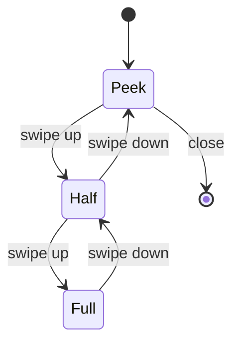
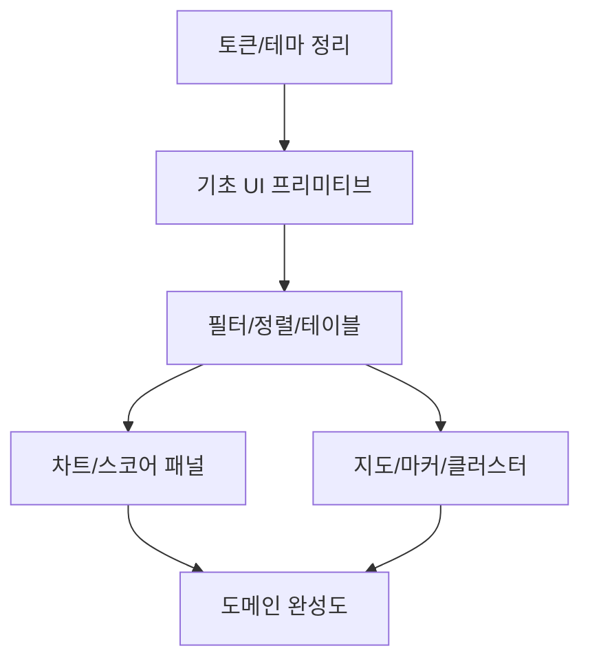

# Next.js 기반 프롭테크 서비스용 React 컴포넌트 라이브러리와 구현 전략 리서치

## Executive Summary

본 리서치는 **Next.js(App Router) + Tailwind CSS v4 + shadcn/ui** 조합을 프롭테크 도메인(지도·가격·스코어링·비교 UI)에서 “확장 가능한 컴포넌트 시스템”으로 운용하기 위한 구현 전략을 정리한다. 내부 리서치 노트 기준, 스물여섯 개 신규 컴포넌트는 **shadcn/ui 그대로 사용 8개 / 커스터마이징 11개 / 도메인 특화 자체 구현 7개**로 분류되며, 이 분류는 개발 속도·품질·유지보수 비용의 균형점이 된다. fileciteturn0file4

Tailwind v4 환경에서 shadcn/ui는 **CSS 중심 테마(@theme) 워크플로**를 공식 문서로 안내하고 있으며, 토큰(OKLCH 기반)과 애니메이션 플러그인 전환 등 변경점이 존재한다. citeturn1search9 fileciteturn0file4  
차트는 shadcn/ui의 **Chart가 내부적으로 Recharts를 사용**하므로(테마·컴포넌트 결합이 자연스러움), **PriceHistoryChart(시계열)**와 **RadarChart(스코어/단지 비교)** 모두를 *Recharts 기반으로 단일화*하는 쪽이 통합 비용이 가장 낮다. citeturn1search0turn22search0turn24search6  
바텀시트는 shadcn/ui Drawer가 의존하는 **Vaul이 “unmaintained”를 선언**했고, 커뮤니티에서도 이 의존성 리스크가 지적된다. 따라서 “당장 Vaul로 구현하되, 추후 교체 가능한 추상화 레이어”를 두는 패턴이 현실적이다. citeturn26search3turn24search5  
지도는 **react-kakao-maps-sdk**가 Kakao Maps를 React 컴포넌트로 제공하며(스타 318), Next.js에서는 **SDK 스크립트가 실행 코드보다 먼저 로드되어야 한다**는 제약을 `next/script`(또는 라이브러리 로더 훅)로 해결하는 방식이 일반적이다. citeturn23search0turn23search24turn23search12  
마커 100+ 성능은 “뷰포트 제한 + 클러스터링 + 이벤트 디바운스 + 메모이제이션”이 핵심이며, 클러스터링은 **Supercluster(스타 2.3k)** 기반이 범용성과 커스텀 UI 자유도 측면에서 유리하다. citeturn25search0turn25search12turn25search8  

## shadcn/ui 기반 디자인 시스템 전략

### 스택 적합도와 호환성 핵심 포인트

- Tailwind v4는 테마 구성이 **CSS 중심(@theme)**으로 이동했고, shadcn/ui는 Tailwind v4 프로젝트에서의 적용 가이드를 별도 문서로 제공한다. citeturn1search9  
- 내부 리서치 노트 기준, Tailwind v4 환경에서 shadcn/ui는 **OKLCH 기반 토큰**, **tw-animate-css 중심 애니메이션**, **CSS 변수 기반 다크모드**로의 정리가 진행되어 있다(“tailwindcss-animate → tw-animate-css” 전환 포함). fileciteturn0file4  
- “컴포넌트는 복사해 소스코드로 소유한다”는 shadcn/ui 방식은, 프롭테크처럼 **도메인 컴포넌트(지도·가격·스코어) 비중이 큰 서비스**에서 장기적으로 **변형·조합·성능 최적화**를 자체 제어하기 유리하다. fileciteturn0file4  

### 커스터마이징 패턴 권장안

본 절은 “동일 스택(Tailwind v4 + shadcn/ui + Radix Primitives)에서 일관되게 확장”하기 위한 실전 패턴을 제안한다. (아래 패턴 자체는 실무 권장 설계이며, 라이브러리 기능/메타 데이터와 구분된다.)

- **컴포지션(Composition) 우선**: “도메인 로직”을 UI 프리미티브 밖으로 꺼내고, shadcn 컴포넌트는 *시각·상호작용 기본기*를 담당하게 둔다. 예: `Dialog`(표준 포커스/ARIA) + 도메인 콘텐츠(로그인 유도, 주의 메시지 등). fileciteturn0file4  
- **Slot / asChild 패턴**: Radix 계열 컴포넌트는 `asChild`를 통한 DOM 제어가 가능하므로, 버튼/링크/라우팅 컴포넌트 결합 시 *불필요한 wrapper DOM*을 피한다(내비게이션·CTA에서 특히 효과적).  
- **CVA 기반 Variant 표준화**: `class-variance-authority`로 변형(variant/size/state)을 정규화하고, `clsx + tailwind-merge`로 충돌을 제거해 “토큰 기반 변형”을 일관되게 만든다(예: Badge 등급, HighlightCell 상태 등). fileciteturn0file4  
- **Radix 프리미티브로 접근성 기본값 확보**: Drawer/Dialog/Popover/Tooltip 등은 포커스 트랩·키보드 네비게이션·ARIA가 핵심이므로 프리미티브 위에서 확장하는 편이 안정적이다. Radix Themes/Primitives는 “접근성 최적화”를 명시한다. citeturn23search10turn23search2  

### 토큰·테마 전략

- 내부 스코어카드 리서치에서는 “현재 수동 CSS 변수 + Tailwind v4 @theme 고도화”가 소규모 팀에 유리하다는 결론이 제시되어 있다. fileciteturn0file2  
- 실무적으로는 토큰을 다음처럼 **세 계층으로 구분**하면, 프롭테크에서 빈번한 “점수/안전/가격 강조” 요구가 깨끗하게 수용된다(숫자는 설명을 위한 예시).
  - **Primitive**: `--color-brand-*`, `--color-neutral-*`, `--color-score-*`
  - **Semantic**: `--color-surface`, `--color-on-surface`, `--color-border`, `--color-accent`, `--color-score-good` …
  - **Component Alias(필요 시)**: `--card-score-badge-bg`, `--table-highlight-bg` 등 제한적 도입  
- shadcn 토큰(`--background`, `--foreground` 등)과 커스텀 토큰이 병존하는 경우, 충돌을 피하기 위해 “한쪽을 Alias로 매핑”하는 방식을 추천한다(예: 커스텀 Semantic → shadcn semantic 변수로 위임). 이는 내부 토큰 리서치에서 “병렬 토큰 시스템 충돌 가능성”이 지적된 바와 같은 리스크를 줄인다. fileciteturn0file2  

### shadcn 버전 기준 마이그레이션 체크리스트

사용 중인 shadcn 3.8.4 기준, Tailwind v4 체계로 정리할 때의 실무 체크리스트는 다음이 핵심이다.

- Tailwind v4 문서 가이드라인(테마·설정)을 기준으로 shadcn 구조를 맞춘다. citeturn1search9  
- 애니메이션은 `tw-animate-css` 중심으로 정리(레거시 플러그인 의존 제거). fileciteturn0file4  
- OKLCH 기반 토큰으로 통일해 라이트/다크에서의 색상 일관성을 확보한다. fileciteturn0file4  

## 스물여섯 개 컴포넌트 구현 분류

### 구현 방식 삼분류 표

요청하신 형식(3열: shadcn 사용 가능 / 커스터마이징 / 자체 구현)으로 정리하면 다음과 같다. fileciteturn0file4

| shadcn 사용 가능 | 커스터마이징 | 자체 구현 |
|---|---|---|
| Button<br/>Modal/Dialog<br/>Badge<br/>Divider(Separator)<br/>Footer(레이아웃 조합)<br/>LoadMoreButton(Button variant)<br/>LoginPrompt(Dialog+Card 조합)<br/>ShareButton(Button+Popover 조합) | FormField(Field+Input+Label 래핑)<br/>SortChip(Toggle Group 확장)<br/>MetaTagBar(Badge/Scroll 조합)<br/>ProgressIndicator(Progress+Step 확장)<br/>FilterChipBar(Toggle Group+ScrollArea 확장)<br/>InfoBanner(Alert 확장)<br/>StickyHeader(스크롤 상태+레이아웃 확장)<br/>ComparisonTable(Table+ScrollArea 확장)<br/>HighlightCell(Table cell variant)<br/>EmptyState(Empty 확장)<br/>ImageCarousel(Carousel 확장) | SelectionCard(Card 기반 도메인 선택 UX)<br/>MapViewToggle(지도/리스트 상태 전환 로직)<br/>FavoriteButton(옵티미스틱/인증 연동)<br/>CommuteCard(통근 정보 도메인 UI)<br/>Icon 시스템(lucide-react 래핑+도메인 아이콘)<br/>PriceHistoryChart(도메인 시계열/툴팁/포맷)<br/>ScoreDetailPanel(레이더/스코어 설명 패널) |

### 컴포넌트별 우선순위와 구현 경로

내부 리서치에서의 구현 난이도/우선순위를 토대로, Must/Should/Could 및 구현 경로를 “컴포넌트 단위”로 다시 풀어쓴 표다. (요청 사항: 스물여섯 개 모두에 대해 ready/custom/custom 표시) fileciteturn0file4turn0file2

- **구현 분류**: (A) shadcn 준비됨, (B) shadcn 기반 커스터마이징, (C) 도메인 자체 구현  
- **노력 추정**: small/medium/large (명시 불가 시 unspecified)

| 컴포넌트 | MoSCoW | shadcn 분류 | 기반/레퍼런스 | 노력 |
|---|---|---|---|---|
| Button | Must | A | Button | small |
| FormField | Must | B | Field + Input + Label | small |
| Badge | Must | A | Badge | small |
| Modal/Dialog | Must | A | Dialog | small |
| EmptyState | Must | B | Empty | medium |
| FilterChipBar | Must | B | Toggle Group + Scroll Area | medium |
| SortChip | Must | B | Toggle Group | small |
| ProgressIndicator | Must | B | Progress | medium |
| SelectionCard | Must | C | Card(구조만) | medium |
| MapViewToggle | Must | C | Toggle Group(참고) | medium |
| FavoriteButton | Must | C | (도메인) | medium |
| CommuteCard | Must | C | Card(구조만) | medium |
| LoginPrompt | Must | A | Dialog + Card 구성 | small |
| MetaTagBar | Must | B | Badge(다수) + Scroll | small |
| Footer | Must | A | 레이아웃(조합) | small |
| Icon 시스템 | Must | C | lucide-react 기반 | medium |
| PriceHistoryChart | Must | C | Chart(참고) + Recharts | large |
| ComparisonTable | Must | B | Table + Scroll Area | medium |
| InfoBanner | Should | B | Alert | medium |
| StickyHeader | Should | B | 레이아웃 + 스크롤 상태 | medium |
| LoadMoreButton | Should | A | Button variant | small |
| ShareButton | Should | A | Button + Popover | small |
| ScoreDetailPanel | Should | C | Sheet(참고) + Radar | large |
| HighlightCell | Should | B | Table cell variant | medium |
| Divider | Should | A | Separator | small |
| ImageCarousel | Could | B | Carousel | medium |

## 차트 라이브러리 비교와 권장안

### 비교 대상과 메타 테이블

요청한 비교 대상은 **Recharts / Nivo / Victory / Tremor / Chart.js**이며, 각 항목은 “npm 패키지명, 번들(대략), Stars, 업데이트 일자”를 표로 제공한다. 번들 크기는 일반적으로 Bundlephobia가 “minified + gzip” 추정치를 제공한다. citeturn23search13  
다만 **tree-shaking/코드 스플리팅/사용 범위**에 따라 실제 페이지 청크는 달라질 수 있으므로, 표의 수치는 “대략적 비교 지표”로 취급한다.

| 라이브러리 | npm 패키지 | min+gzip(대략) | GitHub Stars | 최근 업데이트/릴리스 |
|---|---|---:|---:|---|
| entity["organization","Recharts","react chart library"] | `recharts` | 162.9 kB(패키지 기준) citeturn22search0 | 26.6k citeturn24search6 | 업데이트 2026-02-13, 릴리스 v3.7.0(2026-01-21) citeturn24search6turn24search9 |
| entity["organization","Nivo","react d3 chart library"] | `@nivo/line`, `@nivo/radar` | `@nivo/line` 33.6 kB, `@nivo/radar` 21.2 kB citeturn10search0turn10search14 | 13.5k(2025년 기사 기준) citeturn26search18 | 릴리스 v0.99.0(2025-05-23), 이슈 활동 2026-02-05 확인 citeturn26search5turn26search9 |
| entity["organization","Victory","react charting library"] | `victory` | 전체 패키지: unspecified (부분 패키지 예: `victory-pie` 62.8 kB) citeturn12search5 | 11.3k citeturn26search1 | 릴리스 v37.3.6(2025-01-14) citeturn26search1 |
| entity["organization","Tremor","dashboard ui library"] | `@tremor/react` | unspecified | 16.5k citeturn25search3 | 업데이트 2025-01-13(대표 레포 기준) citeturn25search3 |
| entity["organization","Chart.js","javascript chart library"] | `chart.js` + `react-chartjs-2` | `chart.js` 66.8 kB(4.4.3) citeturn12search0 | Chart.js 67,139 / react-chartjs-2 6.9k citeturn2search12turn10search16 | Chart.js 업데이트 2025-12-08(리포), react-chartjs-2 5.3.1(2025-10-27 publish) citeturn2search12turn14search6 |

### 프레임워크 관점 평가

#### React 버전과 Next.js(App Router)에서의 SSR 특성

- Nivo는 Next.js에서 “`use client` 없이 렌더 시 오류가 난다”는 이슈가 보고되어, App Router에서는 사실상 **클라이언트 전용 컴포넌트로 격리**하는 전제가 필요하다. citeturn24search15turn26search17  
- Victory는 Next.js에서 Hydration 이슈(Next 15 기준)가 보고된 사례가 있으며, “차트가 중요한 초기 랜딩 화면”에 무리하게 SSR을 섞는 설계는 리스크가 있다. citeturn26search24  
- Recharts는 활발히 업데이트되지만, React 19.x 업그레이드 후 “차트가 비어 보인다”는 이슈가 최근에도 제기되어 있어, React/Next 메이저 업그레이드 시 차트 회귀 테스트가 필요하다. citeturn24search18turn24search6  

#### 접근성과 커스터마이징

- SVG 기반(Recharts/Victory/Nivo)은 “DOM 기반 접근성”을 구성하기 쉬우나, 실무에서는 축/포인트/툴팁을 스크린리더에 의미 있게 전달하기 위한 추가 설계가 필요하다. Nivo에서도 aria 관련 기능(예: point aria label)이 논의되는 이슈가 존재한다. citeturn26search9  
- Canvas 기반(Chart.js)은 시각적으로 효율적일 수 있으나, 접근성 보강을 위해 보조 텍스트/테이블 동기화가 사실상 필수다(캔버스 자체가 의미론 DOM이 아니기 때문).  

### 권장 선택지

PriceHistoryChart(시계열)와 RadarChart를 함께 구현하는 프롭테크 요구 조건을 감안하면, 권장안은 다음과 같다.

- 1순위: **Recharts (shadcn/ui Chart 경유)**  
  - shadcn/ui의 Chart 컴포넌트가 Recharts를 기반으로 제공되므로, 테마(CSS 변수)·컴포넌트 스타일이 Tailwind/shadcn과 자연스럽게 결합된다. citeturn1search0turn24search6  
  - Recharts는 현재(2026-02 기준) 레포 및 릴리스 활동이 활발하며, 프롭테크에서 자주 필요한 라인/에어리어/레이더 조합을 동일 엔진으로 처리할 수 있다. citeturn24search6turn24search9  
  - 단, 패키지 전체 import 비용이 크다는 지적이 지속적으로 존재하므로, 페이지 단위 코드 스플리팅과 차트 컴포넌트의 지연 로딩은 기본 전략으로 둔다. citeturn22search0turn22search4  

### Next.js + shadcn/ui Chart 통합 코드 포인트

아래는 “필수 통합 지점(use client / lazy import / 테마 컨테이너)”만 보여주는 최소 스니펫이다.

```tsx
"use client";

import dynamic from "next/dynamic";

// 무거운 차트는 페이지/패널 단위로 지연 로딩 권장
const PriceHistoryChart = dynamic(() => import("./price-history-chart"), {
  ssr: false,
  loading: () => <div className="h-48 animate-pulse rounded-md bg-muted" />,
});

export function PricePanel() {
  return (
    <section className="rounded-xl border bg-card p-4">
      <header className="mb-3 flex items-center justify-between">
        <h3 className="text-base font-semibold">실거래가 추이</h3>
      </header>
      <PriceHistoryChart />
    </section>
  );
}
```

Recharts 자체 API를 사용할 때, 장기 유지보수 관점에서 “deprecated 경로 제거”도 함께 고려한다(예: `Cell` 제거 권고 및 v4 제거 예고). citeturn24search27  

## 세 단계 넌모달 바텀시트 전략

### 비교 메타 테이블

요구 조건은 “세 단계 스냅(예: 25%/50%/90%), 넌모달, 제스처, 접근성/포커스 관리”다. 내부 리서치와 공개 자료를 합쳐 비교하면 다음과 같다. fileciteturn0file4

| 옵션 | npm 패키지 | min+gzip(대략) | GitHub Stars | 최근 업데이트/릴리스 |
|---|---|---:|---:|---|
| entity["organization","Vaul","react drawer component"] 기반 shadcn Drawer | `vaul` | unspecified | 8.1k citeturn26search3 | 릴리스 2024-12-13, “unmaintained” 선언 citeturn26search7turn26search3 |
| entity["organization","@wldyslw/react-bottom-sheet","react bottom sheet library"] | `@wldyslw/react-bottom-sheet` | ~2.1kB gzip(레포 주장) citeturn14search8 | unspecified | npm 페이지 기준 2025-06경 publish(표기) citeturn14search4 |
| Custom CSS scroll-snap | - | 0 | - | - |

### 기능 관점 상세 비교

- **넌모달**  
  - Vaul은 Drawer를 넌모달로 둘 수 있는 옵션 구성이 존재하며, shadcn Drawer에서도 이를 활용해 요구 조건을 만족시키는 전략이 내부 리서치에서 제안된다. fileciteturn0file4  
  - @wldyslw/react-bottom-sheet는 “CSS transform 기반, 0 dependencies”를 내세워 웹에서 가벼운 bottom sheet 구현을 지향한다. citeturn14search8  

- **제스처/성능**  
  - Vaul은 모바일 drawer UX를 목표로 만들어졌지만, 현재 레포가 유지보수 중단 상태이므로, 브라우저/React/Next의 변화에 대한 대응력이 약해질 수 있다. citeturn26search3turn24search5  
  - 커뮤니티에서도 shadcn Drawer가 Vaul에 의존하는 구조적 리스크가 언급된다(“maintained dependency로 전환” 요청). citeturn24search5  

- **접근성/포커스 관리**  
  - 실무 관점에서는 바텀시트가 “모달인지, 넌모달인지”에 따라 포커스 정책이 달라진다.  
  - Vaul 계열은 drawer를 “대화상자 계열”로 다루는 경우가 많아(포커스 관리가 비교적 내장), 자체 구현 대비 기본점이 유리하나, 넌모달일 때는 “배경과 상호작용 허용 + 키보드 포커스 흐름”을 명확히 설계해야 한다. (이 부분은 구현 정책 이슈이므로 서비스 요구에 맞춘 테스트가 필요하다.)

### 권장 구현 패턴

**단기 권장안**: shadcn Drawer(Vaul)를 사용하되, **“BottomSheetAdapter” 추상화**로 감싼다. 핵심 이유는 “이미 스택에 포함된 UI 철학(shadcn)과 결합이 가장 자연스럽고, 요구 조건(스냅/제스처)을 충족”하기 때문이다. fileciteturn0file4  
다만 Vaul이 unmaintained이므로, adapter를 통해 “라이브러리 교체 비용”을 구조적으로 고정 상한으로 만든다. citeturn26search3turn24search5  



```tsx
"use client";

// 개념 코드: Drawer 구현체는 추후 교체 가능하도록 어댑터화
type Snap = "peek" | "half" | "full";

export function BottomSheetAdapter(props: {
  open: boolean;
  snap: Snap;
  onSnapChange: (s: Snap) => void;
  onOpenChange: (o: boolean) => void;
  children: React.ReactNode;
}) {
  // Vaul 구현체로 연결: snapPoints / modal={false} 등
  return (
    <div>{props.children}</div>
  );
}
```

## Kakao Maps 마커 오버레이 전략

### React 바인딩 vs 직접 SDK 래핑

| 접근 | 장점 | 단점 | 권장 사용 구간 |
|---|---|---|---|
| entity["organization","react-kakao-maps-sdk","react kakao maps bindings"] 사용 | React 컴포넌트로 Map/Marker/Overlay를 빠르게 구성 가능, 문서 제공 citeturn23search8 | 라이브러리 API 범위에 종속 | 초기 개발/기능 탐색, 지도 UI 빠른 구축 |
| Kakao JS SDK 직접 래핑 | SDK 전체 기능 활용, 성능/수명주기 제어가 매우 자유로움 | 초기 비용 높음(스크립트 로딩, 타입, 이벤트 브리지 등) | 장기적으로 지도 기능이 핵심 경쟁력이 될 때 |

react-kakao-maps-sdk는 GitHub 기준 **318 stars**이며, 공식 문서 사이트를 통해 튜토리얼/샘플/API를 제공한다. citeturn23search0turn23search8  
Next.js에서는 Kakao Maps SDK 스크립트가 **실행 코드보다 먼저 선언되어야 한다**는 조건이 중요하고, Next에서는 `layout`(또는 적절한 공통 레이어)에서 `Script`로 먼저 로딩하는 방식이 자주 사용된다. citeturn23search24turn23search12  

### 클러스터링 전략: Supercluster vs 커스텀

| 항목 | entity["organization","Supercluster","geospatial clustering library"] | 커스텀 구현 |
|---|---|---|
| 도입 난이도 | 중(인덱스/좌표계/줌 연동) | 중~상(알고리즘/최적화 직접) |
| 성능 확장성 | 대규모 포인트에 강함(목표: 고성능 클러스터링) citeturn25search12turn25search0 | 구현 품질에 따라 편차 큼 |
| 커스텀 UI | 클러스터 렌더링을 앱에서 자유롭게 구성 | 자유 |
| 메타 | 2.3k stars, v8 릴리스(2023-04) citeturn25search0turn25search8 | - |

Supercluster는 “브라우저/Node에서의 고성능 포인트 클러스터링”을 목표로 하며, Mapbox에서도 이를 소개한다. citeturn25search0turn25search12  

### 마커 100+ 성능 최적화 체크리스트

아래는 “Next.js + React 지도 UI”에서 흔히 병목이 되는 지점을 기준으로, 실무에서 효과가 큰 순으로 정리한 전략이다(내부 리서치의 권장 항목을 기반으로 재구성). fileciteturn0file4  

- **뷰포트 기반 렌더링**: 현재 지도 bounds 내부 포인트만 렌더링(나머지는 클러스터/비가시로 유지).  
- **클러스터링**: 확대/축소에 따라 마커 수를 상수 수준으로 제한(클러스터 → 개별 마커). citeturn25search0turn25search8  
- **이벤트 디바운스/스로틀**: `onBoundsChanged`, `onZoomChanged` 같은 지도 이벤트는 빈도가 매우 높아, 즉시 상태 업데이트하면 React가 과도하게 렌더링한다.  
- **데이터 메모이제이션**: `useMemo`로 “포인트 → GeoJSON 변환”, “클러스터 계산 입력”을 안정화하고, `useCallback`으로 핸들러 재생성 최소화.  
- **오버레이 렌더링 전략 분리**:  
  - 밀집 구간: 단순 DOM(또는 canvas 유사) 표현  
  - 상호작용 구간: CustomOverlayMap(React 컴포넌트)  

### Next.js 통합 코드 포인트

Kakao Maps SDK는 “스크립트 선로딩”이 선행 조건이므로, Next.js에서는 다음 패턴이 기본이 된다(개념 예시).

```tsx
// app/layout.tsx (개념 코드)
import Script from "next/script";

export default function RootLayout({ children }: { children: React.ReactNode }) {
  return (
    <html lang="ko">
      <body>
        <Script
          src={`//dapi.kakao.com/v2/maps/sdk.js?appkey=${process.env.NEXT_PUBLIC_KAKAO_JS_KEY}`}
          strategy="beforeInteractive"
        />
        {children}
      </body>
    </html>
  );
}
```

“Kakao 지도 Web API 스크립트 태그 예시”는 타입 정의 레포에서도 안내된다. citeturn23search12  

## 오픈소스 레퍼런스와 구현 로드맵

### 프롭테크/핀테크 관점에서 참고할 OSS 디자인 시스템

아래는 “Tailwind 중심(shadcn) + 데이터 밀집(프롭테크/핀테크)”이라는 조건에서 직접 참고 가치가 큰 레퍼런스다.

| 프로젝트 | repo/npm | Stars | 최근 업데이트 | 왜 참고할 만한가 |
|---|---|---:|---|---|
| entity["organization","Radix Themes","react component library"] | `@radix-ui/themes` | 8.1k citeturn23search10 | npm 3.3.0(2026-01-31 publish) citeturn23search6 | “접근성/유지보수/빠른 개발”을 목표로 한 고품질 컴포넌트 레이어(정책/토큰 구조 참고에 유리) citeturn23search2turn23search6 |
| Radix Primitives | `@radix-ui/*` | 18.5k citeturn23search10 | unspecified | shadcn/ui가 기대는 접근성 프리미티브(패턴 이해에 유리) citeturn23search10 |
| entity["organization","Mantine","react component library"] | `@mantine/core` | unspecified | npm 8.3.14(2026-02-01 publish) citeturn23search34 | “완성형 UI 라이브러리”의 설계(컴포넌트 범위/상태관리/접근성 정책) 참고; 단, Tailwind 기반이 아니므로 직접 도입보단 레퍼런스 적합 citeturn23search34turn23search27 |
| entity["organization","Ark UI","headless component library"] | `chakra-ui/ark` | unspecified | 릴리스(2026-02-04) citeturn25search18 | “헤드리스 + 상태머신(Zag)” 접근(복잡한 상호작용 컴포넌트 설계 참고) citeturn25search2turn25search18 |
| entity["organization","Park UI","component presets"] | `chakra-ui/park-ui` | 2.3k citeturn25search30 | 업데이트 2026-01-28 citeturn25search6 | Ark UI 위에 “디자인된 프리셋”을 얹는 방식(디자인 시스템 제품화 관점 참고) citeturn25search30turn25search6 |
| Tremor(NPM 레포) | `tremorlabs/tremor-npm` | 16.5k citeturn25search3 | 업데이트 2025-01-13 citeturn25search3 | “대시보드/차트 중심 UI”의 구성/레이아웃/정보 계층 구조를 빠르게 참고하기 좋음(다만 도입 시 Recharts 의존 등 확인 필요) citeturn25search11turn25search3 |
| Chakra UI | `@chakra-ui/react` | unspecified | 블로그 기준 2026-02-09 업데이트 citeturn25search22 | Next.js RSC 호환·접근성 철학·마이그레이션 도구 등 “제품형 디자인 시스템 운영” 참고 citeturn25search10turn25search22 |

### 최종 권장안과 우선 구현 계획

내부 리서치 결과를 기반으로, “가장 빨리 서비스 품질을 끌어올리는 순서”로 구현을 배치한다. fileciteturn0file4turn0file2  

#### 우선순위 원칙

- **P0(즉시)**: 앱 전반에 파급되는 “입력/대화상자/상태표현” 기초 레이어  
- **P1(핵심 도메인)**: 가격·스코어·지도  
- **P2(경험 개선)**: sticky 헤더, 배너, 캐러셀 등



#### 컴포넌트별 구현 착수 제안

- **첫 주(기초 체력)**: Button, FormField, Modal/Dialog, Badge, Divider, EmptyState, LoadMoreButton  
  - 목적: “폼/상태/피드백”을 표준화해 이후 도메인 UI가 흔들리지 않게 한다. fileciteturn0file4  
- **둘째 주(검색·탐색 UI)**: FilterChipBar, SortChip, MetaTagBar, ComparisonTable, HighlightCell  
  - 목적: 프롭테크 핵심 UX인 “조건 탐색 → 결과 비교” 흐름을 먼저 완성한다. fileciteturn0file4  
- **셋째 주(도메인 하이라이트)**: PriceHistoryChart, ScoreDetailPanel(+Radar), FavoriteButton(옵티미스틱), CommuteCard  
  - 목적: “데이터 신뢰/설명 가능성(Explainability)”을 강화한다. fileciteturn0file4turn1search0turn24search6  
- **넷째 주(지도 통합)**: MapViewToggle, 지도 마커/오버레이, 클러스터링  
  - 목적: 지도는 성능/이벤트/데이터 흐름이 복잡하므로, 앞 단계 UI 표준화 후 통합하는 편이 안정적이다. citeturn23search0turn25search0turn23search24  
- **마지막(저우선)**: ImageCarousel(Could)  
  - 목적: 기능적 ROI가 상대적으로 낮으므로 후순위로 미룬다. fileciteturn0file4  

### 리스크 요약과 대응

- Vaul이 unmaintained이므로, Drawer/BottomSheet 사용부는 반드시 어댑터로 감싸 교체 비용을 낮춘다. citeturn26search3turn24search5  
- Recharts는 활발하지만 React 19.x 조합에서 회귀 이슈가 제기된 바 있어, React/Next 업그레이드 시 차트 회귀 테스트를 릴리스 체크리스트에 포함한다. citeturn24search18turn24search6  
- Kakao Maps는 스크립트 로딩 순서 제약이 명확하므로, 레이아웃 레벨에서 SDK 로딩을 표준화하고(MapProvider), 페이지별로 임의 로딩을 금지한다. citeturn23search24turn23search12  

