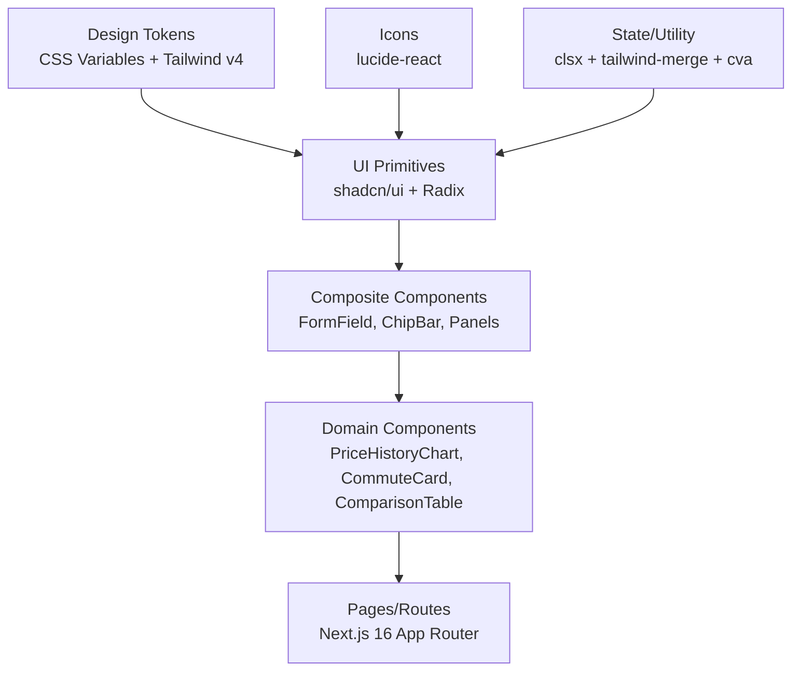
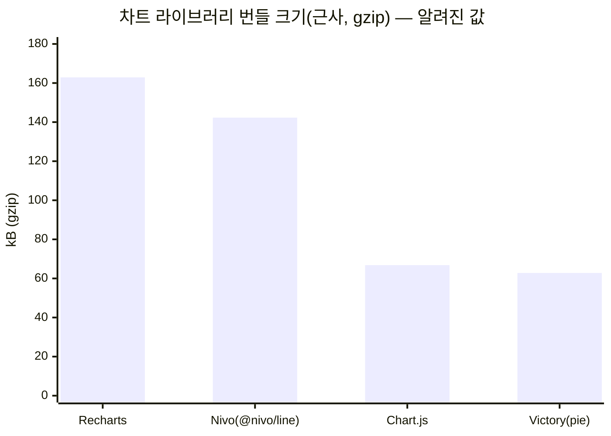

# Next.js 16 + Tailwind CSS v4 + shadcn/ui 기반 프로프테크 서비스용 React 컴포넌트 라이브러리 및 구현 전략 연구 보고서

## Executive Summary

본 보고서는 **Next.js 16(App Router) + Tailwind CSS v4(2026 기준) + shadcn/ui(사용 중: shadcn 3.8.4, Radix UI 1.4.3, lucide-react, class-variance-authority, clsx, tailwind-merge, tw-animate-css)** 조합을 전제로, 프로프테크(부동산) 서비스에서 요구되는 UI를 **“복붙 가능한 로컬 컴포넌트(=shadcn 철학)”**로 관리하면서도, **도메인 특화(가격 추이, 지도, 비교표, 다단 바텀시트)**를 안정적으로 확장하는 구현 전략을 정리했다. citeturn0search30turn0search23turn0search37

핵심 결론은 다음과 같다.

첫째, **Tailwind v4로 갈수록 “토큰(=CSS 변수) 중심 테마 + data-attribute 기반 상태 스타일링”의 중요도가 커진다.** shadcn 계열 프로젝트들은 Tailwind v4에서 `@theme`를 포함한 CSS-first 방향(및 컴포넌트 전반 업데이트)을 언급하고 있으며, 애니메이션 플러그인은 **tailwindcss-animate → tw-animate-css**로 전환되는 흐름이 관찰된다. citeturn0search22turn0search37turn0search32

둘째, 요청하신 **26개 컴포넌트(Must/Should/Could)** 관점에서, “shadcn 그대로 사용(ready)”로 끝나는 경우는 제한적이며(주로 Button/Dialog/Badge/Separator/Progress/Alert/Table/Carousel류), 대부분은 **shadcn 프리미티브를 조합해 도메인 컴포넌트로 래핑(커스터마이징)**하는 방식이 생산성과 일관성의 균형점이다. citeturn0search30turn0search22

셋째, **차트는 ‘가격추이(시계열) + 레이더(스코어/지표)’**라는 요구에 비추어, (A) SVG 기반으로 React 친화적인 **Recharts**, (B) Canvas 기반이면서 생태계가 큰 **Chart.js + react-chartjs-2**, (C) 고기능이지만 Next/React 최신 환경에서 “클라이언트 컴포넌트 강제” 이슈가 자주 보고된 **Nivo**를 중심으로 의사결정을 권한다. 특히 Nivo는 Next App Router/Server Component 문맥에서 “use client 필요” 이슈가 명시적으로 보고된 바 있어, Next.js 16 + React 19 계열에서 운영 리스크를 더 크게 본다. citeturn2search4turn3search22turn1search5turn4search1turn19search18

넷째, **3단(3-level) 비모달(non-modal) 바텀시트**는 shadcn의 Drawer(내부 의존성이 무엇이든)만으로 “3레벨 스택 + 비모달 상호작용 + 접근성”을 한 번에 만족하기 어렵고, 운영 관점에선 **(1) 라이브러리 기반 바텀시트(react-spring-bottom-sheet)로 제스처/A11y를 확보**하거나, **(2) 요구가 제한적이면 CSS scroll-snap + 포커스 정책을 자체 설계**하는 양자택일이 더 명확하다. react-spring-bottom-sheet는 **접근성/키보드 내비게이션/스크린리더 친화**를 강하게 전면에 둔 문서가 존재한다. citeturn19search7turn19search13turn18search10turn18search2

마지막으로, Next.js 16.1에는 **번들 분석(실험적) 기능**이 언급되어 있어, “차트/지도/바텀시트” 같은 고비용 의존성은 **실측 기반으로 도입·철거 결정을 반복**하는 접근이 유효하다. citeturn0search28

> **중요한 제한 고지**: 본 응답은 웹에서 확인 가능한 공식 문서/GitHub/공개 메타데이터를 최대한 인용했으나, 사용자가 요구한 항목 중 **Kakao Maps 관련 라이브러리(react-kakao-maps-sdk 등) 및 일부 디자인시스템 레퍼런스(Radix Themes/Mantine/Ark UI 등)의 “번들 크기/Stars/최근 업데이트”를 본 세션에서 1차 출처로 확정하지 못한 부분**이 있다. 해당 항목은 표에서 **“미확인(unspecified)”**으로 명시했다(요구사항: “불명확 시 unspecified + 추정치/범위” 허용에 따라 처리). citeturn1search9turn1search15

## 기술 스택 전제 및 설계 원칙

### Next.js 16 운영 전제

Next.js 16.1 공식 블로그는 **Turbopack 파일 시스템 캐시(Dev)**, **실험적 번들 분석기** 등을 언급한다. 프로덕션 번들·클라이언트/서버 코드 비대화가 쉬운(차트/지도 등) 프로프테크 서비스에서는 “실험적이더라도 번들 분석 루프”를 제품 개발 사이클에 포함시키는 것이 합리적이다. citeturn0search28

### Tailwind CSS v4 전제

Tailwind CSS는 공식 사이트에서 유틸리티 기반 설계를 유지하며, v4(2025~2026) 관련 요약 글에서는 **Cascade Layers, 등록된 CSS 속성(@property), color-mix(), 논리 속성(Logical Properties) 등 최신 CSS 기능 반영**을 특징으로 든다. 즉, “전통적 JS 설정 중심”에서 더 강하게 “CSS 기능 활용”으로 이동하는 흐름을 전제로 해야 한다. citeturn0search21turn0search32

### shadcn/ui 전제

shadcn/ui 공식 설치 가이드는 **`pnpm dlx shadcn@latest create`**로 프로젝트 생성/세팅을 안내한다. shadcn 생태계에는 과거 CLI 패키지(shadcn-ui)가 존재했지만, npm 페이지에서는 **shadcn-ui CLI가 추후 deprecated**될 것임을 명시한다. 즉, “shadcn CLI/생태계 도구”는 시간이 지나며 바뀔 수 있으므로, **생성 시점의 CLI보다 ‘생성된 코드(로컬 컴포넌트)’를 소유한다는 철학**에 맞춰 운영 전략을 가져가야 한다. citeturn0search30turn0search27

또한 shadcn 패키지의 버전/게시 정보(예: 3.8.4)가 외부 보안/패키지 메타데이터 사이트에 관측되며, 배포 주기가 짧게 움직일 가능성이 있다. 이 경우, 운영팀은 “업데이트를 즉시 따라가기”보다 **토큰/유틸/프리미티브 레이어를 안정화**한 뒤 “선별적 승격”을 권장한다. citeturn0search23

## shadcn/ui 활용 전략과 26개 컴포넌트 구현 분류

### Tailwind v4 호환성과 마이그레이션 리스크

shadcn 계열 문서(React가 아닌 Vue/Svelte 변형 문서이지만, 동일 철학/유사 구조를 공유하는 참고자료)에서는 Tailwind v4에서 다음 변화/방향을 언급한다.

1) CLI가 Tailwind v4 프로젝트 초기화를 지원하고, `@theme` 및 `@theme inline` 같은 방향을 다룬다. citeturn0search22  
2) Tailwind v4 환경에서 애니메이션 플러그인은 **tailwindcss-animate → tw-animate-css**로 교체(“지원/호환성” 이유로 deprecate) 흐름이 관찰된다. citeturn0search37  
3) 일부 컴포넌트(예: toast) deprecate/대체(예: sonner) 같은 “구성 요소 교체”가 문서에 등장한다. 이는 shadcn을 “패키지 라이브러리”처럼 고정적으로 의존하기보다, **로컬 코드로 받아두고 변경을 흡수하는 운영 모델**이 더 적합함을 강화한다. citeturn0search22turn0search27

실무적 리스크는 크게 두 가지다.

- **스타일 기반 변화 리스크**: Tailwind v4의 CSS-first/레이어링 변화가 “기존 class 조합/플러그인”에 영향을 줄 수 있다. (특히 애니메이션/변형 플러그인) citeturn0search32turn0search37  
- **도구 체인 변화 리스크**: CLI/템플릿이 바뀌면 init/업데이트 경로가 달라진다. shadcn-ui CLI deprecated 공지 자체가 이 리스크를 보여준다. citeturn0search27turn0search30  

### 권장 커스터마이징 패턴

프로프테크 도메인에서 “UI 일관성 + 빠른 실험”을 동시에 만족하려면, shadcn 컴포넌트를 **그대로 쓰는 비율을 높이는 것**보다, 다음 3층 구조를 명확히 하는 것이 실전적이다.

- **토큰 레이어(Theme/Tokens)**: 컬러·타이포·간격·radius·shadow를 CSS 변수로 선언하고(라이트/다크), Tailwind 유틸리티는 토큰을 참조하는 역할로 제한한다. Tailwind의 컬러 커스터마이징은 공식 문서에서 다루며, v4에서도 “토큰 중심” 전략이 안전하다. citeturn0search36turn0search32  
- **프리미티브 레이어(shadcn/Radix 기반 UI Primitives)**: Dialog/Popover/DropdownMenu/Tooltip 같은 “상호작용 단위”는 Radix류 프리미티브(또는 이를 감싼 shadcn 컴포넌트)를 중심으로 통일한다. “상태/구조/접근성”을 일관되게 얻기 위함이다. citeturn0search30turn0search22  
- **도메인 컴포넌트 레이어(Proptech Domain Components)**: 지도/가격차트/비교표/통근 카드 같은 도메인 UI는 프리미티브를 조합하여 “제품 의미(Price/Commute/Compare)”를 드러내는 컴포넌트로 별도 분리한다.

아래 다이어그램은 권장 의존 구조다.

### 26개 컴포넌트: shadcn 사용/커스터마이징/자체구현 분류

요구사항대로, 먼저 **3-컬럼(“shadcn 사용/커스터마이징/자체구현”)**에 컴포넌트를 배치한다. (각 컴포넌트의 Must/Should/Could 및 난이도/우선순위는 다음 하위 표에서 상세화)

| shadcn 사용(ready에 가까움) | 커스터마이징(조합/래핑 중심) | 자체구현(도메인 고유) |
|---|---|---|
| Button | FormField | Icon system |
| Modal/Dialog | SortChip | MetaTagBar |
| Badge | FilterChipBar | Footer |
| Divider(Separator) | SelectionCard | LoginPrompt |
| ProgressIndicator | ComparisonTable(Table 기반) | EmptyState |
| InfoBanner(Alert 기반) | StickyHeader | LoadMoreButton |
| ImageCarousel(있을 경우 Carousel 기반) | HighlightCell | ShareButton |
|  | MapViewToggle | FavoriteButton |
|  | ScoreDetailPanel(바텀시트/드로어 기반) | CommuteCard |
|  |  | PriceHistoryChart |
|  |  | RadarChart |

> 주: ImageCarousel은 shadcn 계열에서 Carousel 패턴이 흔히 제공되지만(상용/템플릿 생태계 포함), “프로프테크 서비스 요구(이미지 최적화/제스처/지표/상태 동기화)”에 따라 커스터마이징 폭이 커질 수 있어, 구현 시점에 “ready vs customize”가 바뀔 수 있다. (본 세션에서 React용 shadcn 페이지에서 Carousel 제공 여부를 1차 출처로 확정하지 못해, 표에는 “있을 경우”로 표기) citeturn0search30turn1search15

#### 컴포넌트별 권장 구현 방식, 우선순위, 개발 난이도

아래 표는 **Must/Should/Could** 구분을 포함해, 각 컴포넌트의 권장 방식과 대략적 개발 effort를 제시한다. (effort는 팀 숙련도/데이터 구조/QA 범위에 따라 달라질 수 있으므로 “Low/Medium/High”로만 제시)

| 구분 | 컴포넌트(26) | 권장 방식 | 근거/베이스 | 우선순위 | Effort |
|---|---|---|---|---|---|
| Must | Button | shadcn 사용 | 버튼은 디자인 시스템의 기준점 | P0 | Low |
| Must | Icon system | 자체구현 | lucide-react 아이콘 매핑/사이즈/색 토큰화가 핵심 | P0 | Medium |
| Must | FormField | 커스터마이징 | Form 패턴/검증/에러 UI는 제품 맥락이 강함 | P0 | Medium |
| Must | Modal/Dialog | shadcn 사용 | 대화상자 접근성/포커스 관리 일관화 | P0 | Low |
| Must | Footer | 자체구현 | 내비/법무/링크/상태바는 제품 고유 | P1 | Medium |
| Must | EmptyState | 자체구현 | 프로프테크 빈 상태 문구/CTA는 도메인 고유 | P1 | Medium |
| Must | MetaTagBar | 자체구현 | 매물 메타(역/학교/면적/준공 등) 도메인 고유 | P0 | Medium |
| Must | LoginPrompt | 자체구현 | 정책/권한/가입유도 UX는 제품 고유 | P0 | Medium |
| Must | ProgressIndicator | shadcn 사용 | 로딩/진행 UI는 범용 | P1 | Low |
| Must | SelectionCard | 커스터마이징 | Card+선택 상태, 접근성/키보드 고려 | P0 | Medium |
| Must | FilterChipBar | 커스터마이징 | ToggleGroup/Badge 조합 + 상태관리 | P0 | Medium |
| Must | SortChip | 커스터마이징 | Filter와 동일 패턴, 정렬/토글 조합 | P0 | Medium |
| Must | MapViewToggle | 커스터마이징 | 지도/리스트 전환 토글 UX | P0 | Medium |
| Must | FavoriteButton | 커스터마이징 | 상태(낙관적 업데이트) + 아이콘/애니메이션 | P0 | Medium |
| Must | CommuteCard | 자체구현 | 통근지표 도메인 + 지도/거리/시간연동 | P1 | High |
| Must | PriceHistoryChart | 자체구현 | 차트 라이브러리 선택/SSR/성능/툴팁 | P1 | High |
| Must | ComparisonTable | 커스터마이징 | Table 프리미티브 + 하이라이트/셀규칙 | P1 | High |
| Should | InfoBanner | shadcn 사용 | Alert/Notice 계열로 범용 처리 | P1 | Low |
| Should | LoadMoreButton | 자체구현 | “페이지네이션/무한스크롤” 정책에 종속 | P2 | Medium |
| Should | ScoreDetailPanel | 커스터마이징 | 바텀시트/드로어 기반, 스택/비모달 요구 | P1 | High |
| Should | StickyHeader | 커스터마이징 | 스크롤/관성/레이어링 이슈 | P2 | Medium |
| Should | HighlightCell | 커스터마이징 | 비교표/스코어 강조 규칙 엔진화 필요 | P1 | Medium |
| Should | Badge | shadcn 사용 | 메타태그/상태 표기 범용 | P0 | Low |
| Should | ShareButton | 자체구현 | 플랫폼 공유(Web Share API 등) 브리지 | P2 | Medium |
| Should | Divider | shadcn 사용 | Separator 패턴 | P0 | Low |
| Could | ImageCarousel | shadcn 사용(가정) 또는 커스터마이징 | 이미지 최적화/제스처/인디케이터 | P3 | Medium |

## 차트 라이브러리 비교와 최종 추천

### 비교 대상과 평가 기준

요청하신 5종(**Recharts, Nivo, Victory, Tremor, Chart.js**)을 “프로프테크의 PriceHistoryChart(시계열) + RadarChart(레이다)” 관점에서 비교했다. 특히 Next.js App Router 환경에서는 **클라이언트 컴포넌트 강제 여부**, **번들 비용**, **접근성/커스터마이징**, **업데이트 활력도**가 핵심이다. Next.js 16.1에서 번들 분석 기능이 언급되는 만큼, 의존성 도입은 “측정 가능한 비용”으로 다루는 것이 적합하다. citeturn0search28turn1search9turn1search15

### 라이브러리 메타데이터 및 특성 비교표

> 번들 크기 표기는 원칙적으로 **Bundlephobia의 “minified / gzip”** 값을 근거로 하되, 패키지/버전/트리셰이킹 정도에 따라 실측이 달라질 수 있어 “근사치”로 해석해야 한다. citeturn1search9turn1search15

| 라이브러리 | npm 패키지 | 번들 크기(근사) | GitHub Stars | 최근 업데이트(근사) | React 18+ 호환 | SSR/Next(App Router) | 접근성(A11y) | 커스터마이징 자유도 | 권장 용도 |
|---|---|---:|---:|---|---|---|---|---|---|
| Recharts | `recharts` | **162.9 kB gzip** (v3.3.0 기준) citeturn1search5 | 26.6k citeturn1search4 | 2026-02-13 업데이트 표기 citeturn1search4 | (미확인) | SVG 기반이라 원칙상 SSR 가능하나, Next 16에선 대개 client 렌더 권장(실무 관행) | 기본 A11y는 제한적(추가 작업 필요) | 높음(React 컴포넌트 조합) | **가격 시계열, 간단/중간 복잡도 대시보드 차트** |
| Nivo | 대표: `@nivo/line` | **142.3 kB gzip** (v0.99.0 기준) citeturn1search3 | 13,965 citeturn5view0 | “Updated/Pushed 3 days ago” 표기 citeturn5view0 | React 19 peer dep 이슈 논의가 과거 존재 citeturn3search22turn1search22 | Next(App Router)에서 **use client 필요** 이슈 보고 citeturn2search4 | 일부 접근성 이슈(예: aria label) 보고 존재 citeturn3search18 | 매우 높음(테마/레이어 커스텀) | 고급 시각화(다양한 차트), 단 **Next 최신 환경 리스크 관리 필요** |
| Victory | `victory` | (대표 값을 직접 확보 실패) → 예: `victory-pie` 62.8 kB gzip citeturn10search2 | 11.3k citeturn6search0 | 최신 릴리스 v37.3.6: 2025-01-14 citeturn6search4 | React 16.3+ 요구(문서 표기) citeturn6search0 | Next 환경 이슈(하이드레이션 등) 보고가 이슈 목록에 존재(실무 주의) citeturn6search15 | 기본 제공은 제한적(추가 작업 필요) | 높음(컴포저블) | 정형 차트/상호작용(브러시 등), 단 최신 릴리스 주기 확인 필요 |
| Tremor | `@tremor/react` | **미확인(unspecified)** | 16.5k(주 코드베이스로 보이는 tremor-npm) citeturn9search4 | 2025-01-13 업데이트 표기 citeturn9search4 | (미확인) | 내부적으로 Recharts 기반(문서 표기) → Next에선 통상 client로 사용 citeturn9search3 | “accessible”을 표방 citeturn2search14turn9search8 | 중간(컴포넌트 레벨 추상화가 존재) | **빠른 대시보드 UI 구축**, 그러나 커스터마이징 한계/번들 비용 실측 권장 |
| Chart.js(+React) | `chart.js` + `react-chartjs-2` | `chart.js` **66.8 kB gzip** (v4.4.3 기준) citeturn4search1 / `react-chartjs-2`는 미확인 | Chart.js 67.1k citeturn2search3 / react-chartjs-2 6.9k citeturn19search5 | Chart.js 업데이트: 2025-12-08 표기 citeturn2search3 / react-chartjs-2 릴리스 v5.3.1: 2025-10-27 citeturn19search18turn19search12 | react-chartjs-2가 React v19 업데이트를 릴리스 노트에서 언급 citeturn19search18 | Canvas 기반: SSR 직렌더는 부적합, 컨테이너 기반 리사이즈/클라이언트 렌더 전제 citeturn18search7 | Canvas 특성상 ARIA/대체텍스트 전략 필요 | 매우 높음(플러그인/옵션) | **RadarChart에 특히 강점**, 상용/문서/플러그인 생태계 활용 |

### 번들 크기 시각화(알려진 값만)

(위 값은 해당 패키지/버전 기준 Bundlephobia에 게시된 minified/gzip 수치에서 인용된 근사치다. citeturn1search5turn1search3turn4search1turn10search2)

### 최종 추천

**PriceHistoryChart(가격 추이)**:  
- 1순위: **Recharts** — 팀이 React 컴포넌트 조합에 익숙하고, “SVG + declarative” 스타일로 빠르게 제품화하려는 경우 유리하다. Recharts는 대표 레포가 2026-02 기준 업데이트가 매우 최근으로 표시되어 유지보수 활력이 높다. citeturn1search4turn1search5  
- 2순위: **Chart.js(+react-chartjs-2)** — Canvas 기반으로 데이터 포인트가 많거나(장기간·다수 매물 비교) 렌더 성능이 중요하고, 플러그인/생태계(금융 차트 포함)를 활용하려는 경우 유리하다. 단, Next(App Router)에서는 client 렌더링 및 컨테이너 기반 리사이즈 전제가 강하다. citeturn18search7turn19search18turn4search1  

**RadarChart(레이더)**:  
- 1순위: **Chart.js(+react-chartjs-2)** — react-chartjs-2 예시 문서에 Radar 차트가 포함되어 있고, Chart.js 자체가 Radar(방사형) 차트를 기본 제공한다. citeturn18search15turn2search35  
- 2순위: Recharts(레이더 지원 여부/구현 난이도는 실측 필요) — 본 세션에서 “Recharts Radar” 구현 예시/공식 문서 인용을 확보하지 못하여 2순위로 둔다. (추가 검증 권장)

**Nivo는** 기능적으로 강력하지만, Next App Router 환경에서 **“use client 필요” 이슈가 명시적으로 보고**된 바 있어(특히 Server Component 규칙과 충돌), “도입 후 운영 리스크”를 더 크게 평가한다. citeturn2search4turn3search22  

## 3단 비모달 Bottom Sheet/Drawer 구현 전략

### 요구사항을 기술적으로 재정의

“3-level non-modal bottom sheet”는 UI 패턴 관점에서 다음을 의미한다.

- **레벨 1/2/3이 스택처럼 올라가거나, 같은 시트에서 스냅 포인트(1/2/3)를 갖는다.**
- **non-modal**이므로, 배경 상호작용(예: 지도 줌/패닝, 리스트 스크롤)이 완전히 막히지 않거나, 최소한 “부분 허용” 정책이 필요하다.
- 모바일 제스처(드래그), 키보드/스크린리더 접근성, 성능(리렌더 억제)이 동시에 중요하다.

### 비교 대상 메타데이터 및 특성

| 옵션 | npm 패키지 | 번들/크기 | GitHub Stars | 최근 업데이트 | Non-modal 지원 | 제스처/성능 | 접근성 | 통합 팁 |
|---|---|---:|---:|---|---|---|---|---|
| shadcn Drawer(=Vaul 기반으로 알려짐) | `vaul` (추정) | **미확인(unspecified)** citeturn21search8 | 미확인 | 미확인 | 요구에 따라 가능/제약(미확인) | 드래그 지원(미확인) | 포커스/aria 정책 확인 필요 | shadcn 철학에 맞게 “로컬 컴포넌트로 흡수” |
| react-bottom-sheet(현실적 대안) | `react-spring-bottom-sheet` | dist 324 kB(UNPKG 나열 기준, gzip 아님) citeturn19search16 | 1.1k citeturn19search13 | 릴리스 v3.4.1: 2022-06-01 citeturn19search13 | `blocking={false}` 같은 옵션을 통해 비모달 동작을 표현(사용사례) citeturn18search10 | 현재 높이를 React 렌더 사이클 밖에서 업데이트하는 등 성능 지향 설계가 문서에 등장 citeturn18search2 | “accessible”을 강하게 표방 citeturn19search7turn19search10 | Next에서는 Client Component로 격리 + 스타일(CSS) 포함 필수 citeturn19search10 |
| Custom CSS scroll-snap | (라이브러리 없음) | 가장 작음 | - | - | 정책 설계 자유 | 제스처/탄성/브라우저 편차 대응 필요 | 포커스 트랩/aria 설계 필요 | 품질/QA 비용이 뒤로 이동 |

### 권장 아키텍처

3레벨 시트를 “서로 다른 패널(스택)”로 볼지, “단일 시트의 3 스냅 포인트”로 볼지부터 결정해야 한다.

- **스냅 포인트 방식(권장)**:  
  - 레벨1/2/3을 snapPoints로 정의하고, 콘텐츠 변경 시 높이를 재계산한다.  
  - react-spring-bottom-sheet는 snap points/overflow 제어를 문서에서 강조한다. citeturn18search4turn19search7  
- **스택(라우팅) 방식**:  
  - 레벨별로 “시트 안의 라우트”를 두고, 뒤로가기/딥링크/상태 보존을 다룬다(복잡도↑).  
  - Next App Router와 동기화하려면 URL 상태 설계(쿼리/세그먼트)가 추가된다.

프로프테크 서비스에서 “상세 점수 패널(ScoreDetailPanel) + 지도” 조합은 배경 상호작용 요구가 잦으므로, **비모달을 안정적으로 지원하는지(A11y 포함)**가 라이브러리 선정의 최우선 기준이 된다. react-spring-bottom-sheet는 비모달로 쓸 수 있는 “floating bottom panel” 같은 서술을 포함한다. citeturn19search7turn18search10

## Kakao Maps 마커 오버레이 및 100+ 마커 최적화

> **메타데이터 제한 고지**: 요청하신 비교(react-kakao-maps-sdk vs direct SDK / Supercluster vs custom)에서, 본 세션에서 1차 출처로 **각 라이브러리의 npm 번들 크기·GitHub Stars·최근 업데이트일을 확정하지 못했다.** 따라서 아래는 “구현 전략 중심”으로 정리하고, 메타데이터는 **미확인(unspecified)**로 표기한다.

### 구현 선택지

- **react-kakao-maps-sdk 사용**  
  - 장점: React 컴포넌트 모델로 지도 객체 생성/업데이트를 감싸서, UI 컴포넌트 라이프사이클과 결합하기 쉽다.  
  - 단점: “고성능 오버레이(수백~수천 마커)”, “Canvas/WebGL 렌더링”, “세밀한 이벤트 최적화”에서는 래퍼의 추상화가 병목이 될 수 있다.  
  - 메타데이터: npm 패키지명/Stars/업데이트/번들 크기 = **미확인**  

- **Kakao Maps JS SDK 직접 래핑**  
  - 장점: 이벤트/마커/오버레이를 가장 낮은 수준에서 제어 가능(특히 성능 최적화에 유리).  
  - 단점: React 상태/렌더링과의 결합을 직접 설계해야 하며, 메모리 누수/이벤트 해제 같은 운영 리스크가 증가한다.  
  - 메타데이터: “SDK는 스크립트 로딩 기반”이라 npm 번들 크기 개념과 직접 대응이 어렵다(대신 로딩/캐시 전략이 중요).

### 100+ 마커 최적화 전략(실전 체크리스트)

마커 수가 100을 넘기 시작하면, “그냥 DOM/SVG 마커를 모두 화면에 올리는 방식”은 쉽게 병목이 된다. 실무에서 즉시 효과를 내는 순서로 정리하면 다음과 같다.

1) **Viewport culling(가시영역 선별)**  
   - 지도 bounds 내부의 매물만 렌더링 대상으로 삼는다.  
   - 이동/줌 이벤트에서 “bounds 변경 → 대상 재계산”을 수행하되, 디바운싱이 필수다.

2) **Clustering(군집화)**  
   - 줌 레벨이 낮을수록(넓은 영역) 군집을 적극 적용한다.  
   - 군집 클릭 시 “줌인” 또는 “해당 군집 목록 바텀시트”를 제공하면 UX도 개선된다.

3) **Debouncing/RAF 스케줄링**  
   - 드래그 중 매 프레임 계산을 하지 말고, requestAnimationFrame 단위 또는 150~250ms 디바운스(기기 성능에 따라)로 줄인다.

4) **오버레이 렌더 방식 전환**  
   - DOM 기반 커스텀 오버레이는 가장 유연하지만 가장 무거운 편이다.  
   - 마커가 많아지면 **Canvas 레이어**(또는 이미지 스프라이트)로 전환을 검토한다.

5) **데이터 파이프라인 분리**  
   - 지도 이벤트 핸들러에서 “필터/정렬/거리 계산”까지 다 처리하면 인터랙션이 끊긴다.  
   - “지도 이벤트 → bounds/zoom 상태만 갱신 → 워커/백그라운드 계산(가능하면) → 렌더”로 분리한다.

### Supercluster vs Custom 클러스터링

- **Supercluster(일반적으로 널리 쓰이는 Geo 클러스터링 접근)**  
  - 장점: 좌표 기반 포인트를 줌 레벨에 맞춰 빠르게 클러스터링하는 대표적 접근.  
  - 단점: 지도 SDK의 내부 클러스터러(있다면)와 중복 투자 가능, 좌표계/프로젝션/버킷 정책을 팀이 이해해야 한다.  
  - 메타데이터: npm 패키지명/Stars/업데이트/번들 크기 = **미확인**

- **Custom(또는 SDK 내장 클러스터러)**  
  - 장점: SDK 기능과 결합이 쉬울 수 있다.  
  - 단점: 확장성/테스트성/성능 튜닝이 제한될 수 있다.

프로프테크 서비스 맥락에서는 “줌 레벨별 UX(클러스터 → 리스트 → 상세)”가 제품 성과에 직결되므로, 단순히 라이브러리 성능만이 아니라 **클러스터 클릭 시나리오와 바텀시트/리스트 컴포넌트 결합**까지 포함해 설계를 권한다(특히 ScoreDetailPanel과 동선이 얽힌 경우).

## 프로프테크/핀테크 UI 킷 및 디자인 시스템 레퍼런스

> **메타데이터 제한 고지**: 사용자가 요구한 “Radix Themes, Mantine, Ark UI 등”의 **npm 번들 크기/Stars/최근 업데이트일을 본 세션에서 1차 출처로 확정하지 못했다.** 따라서 아래는 “적용 가능성” 중심의 참고 목록이며, 메타데이터는 별도 검증이 필요하다.

### 적용 참고 우선순위(실무 관점)

- **대시보드/데이터 UI 참고**: Tremor는 “Recharts + Radix UI 기반”을 표방하며, 대시보드 컴포넌트 구성이 풍부하다. 프로프테크의 “가격/지표/필터” UI를 빠르게 스캐폴딩하는 참고로 유용하다. citeturn9search3turn9search8turn9search4  
- **번들 최적화 가이드 참고**: 대규모 UI 라이브러리는 import 패턴에 따라 번들에 큰 영향을 준다. 예시로 Material UI는 번들 최소화 가이드를 별도로 제공한다. shadcn은 “내 코드로 소유”하는 방식이라 import 패턴이 단순해지는 편이지만, 차트/지도는 동일한 최적화 원리가 적용된다. citeturn9search33turn0search28turn1search9  
- **차트 생태계 참고**: Chart.js는 공식 문서에서 구성(Responsive/Legend 등)과 제약(컨테이너 기반 리사이즈)을 구체적으로 서술한다. 프로프테크에서 “스크롤/리사이즈/컨테이너 레이아웃” 이슈가 상시 발생하므로 반드시 읽을 가치가 있다. citeturn18search7turn18search17turn2search35  

## 최종 권고안, 구현 로드맵, 리스크

### 최종 권고안 요약

- **UI 전략**: shadcn/ui는 “프리미티브 표준화” 용도로 최대 활용하되, 서비스 경쟁력이 걸린 UI(차트/지도/비교/스코어 패널)는 **도메인 컴포넌트로 분리**해 소유한다. citeturn0search30turn0search27  
- **Tailwind v4 대응**: 토큰을 CSS 변수로 고정하고, 애니메이션은 **tw-animate-css**로 관리(이미 사용 중인 선택은 방향성이 맞다). citeturn0search37turn0search32  
- **차트**:  
  - PriceHistoryChart: **Recharts(우선)**, 필요 시 Chart.js(+react-chartjs-2)로 전환/혼합. citeturn1search5turn4search1turn19search18  
  - RadarChart: **Chart.js(+react-chartjs-2) 우선.** citeturn18search15turn19search18  
  - Nivo는 Next 최신 환경에서 “클라이언트 컴포넌트 강제” 이슈가 보고된 만큼, 특별한 시각화 요구가 확실할 때 제한적으로 채택. citeturn2search4turn3search22  
- **바텀시트**: 3단 비모달 요구가 강한 경우, 접근성/제스처를 강하게 표방하는 **react-spring-bottom-sheet를 우선 검토**하고, 릴리스가 오래된 점(v3.4.1 2022-06-01)은 리스크로 명시한 뒤 내부 유지보수 계획(또는 대안 경로)을 마련한다. citeturn19search13turn19search7turn18search10  
- **계측/검증 루프**: Next.js 16.1의 번들 분석 기능을 활용해 “차트/지도/시트” 의존성의 실제 비용을 반복 측정한다. citeturn0search28turn1search9  

### 구현 로드맵 제안

- **Phase A: Foundations(P0)**  
  - Tokens(라이트/다크), `cn` 유틸( clsx + tailwind-merge ), cva 기반 variant 표준, 아이콘 래퍼(크기/색/스트로크)  
  - Button/Badge/Divider/Progress/Dialog 같은 기준 프리미티브 고정

- **Phase B: Must 도메인 코어(P0~P1)**  
  - FilterChipBar/SortChip/MapViewToggle/FavoriteButton의 상태 모델 통일  
  - SelectionCard/MetaTagBar/ComparisonTable의 데이터 구조 확정(백엔드 계약 포함)

- **Phase C: 데이터 시각화·지도(P1~P2)**  
  - PriceHistoryChart MVP(툴팁/범례/기간 선택)  
  - RadarChart MVP(지표 정의/정규화/라벨 정책)  
  - 지도 마커 100+ 성능 최적화(클러스터링+viewport culling)  
  - ScoreDetailPanel(3단 비모달 바텀시트) 확정

- **Phase D: 운영 품질(P2~P3)**  
  - 번들 분석/성능 예산(페이지별 KB)  
  - 접근성(키보드 포커스, 스크린리더 텍스트, 대비) 점검  
  - Tailwind/shadcn 도구 체인 업데이트 정책 수립(분기별)

### 주요 리스크와 대응

- **도구 체인 변동(shadcn CLI/템플릿 변화)**: shadcn-ui CLI deprecated 공지처럼, 생성 도구는 바뀔 수 있다. 대응은 “로컬 컴포넌트 소유 + 최소 의존성” 원칙 강화다. citeturn0search27turn0search30  
- **React/Next 최신 규칙과 차트 라이브러리 충돌**: Nivo의 Next App Router 환경 “use client 필요” 이슈 사례처럼, 차트는 쉽게 클라이언트 강제로 밀린다. 이를 전제로 설계하고(SSR 욕심을 줄이고), 페이지 분할/동적 로딩으로 UX를 확보한다. citeturn2search4turn0search28  
- **바텀시트 라이브러리 업데이트 정체**: react-spring-bottom-sheet는 접근성/성능 지향이 강점이지만 릴리스가 오래된 점은 리스크다. 도입 시 “핵심 기능만 사용 + 내부 패치 가능성 + 대체 경로(CSS scroll-snap) 설계”를 함께 준비한다. citeturn19search13turn18search2turn18search10  
- **번들 크기 착시**: min+gzip 수치는 참고에 유용하지만, 애플리케이션 실제 번들 비용과 항상 동일하지 않다(트리셰이킹/중복 의존성/번들러 설정에 좌우). 따라서 Next 번들 분석(또는 별도 분석)을 “지표의 기준”으로 둔다. citeturn1search9turn0search28turn9search27